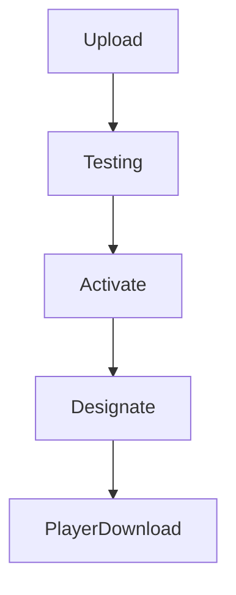

# `ota-updates` — Atualizações OTA

| Campo | Valor |
|-------|-------|
| **Slug** | `ota-updates` |
| **Modos** | Pro (preset); capacidade ligada a player-apk |
| **Atores** | owner/admin |
| **UI** | `/ota-updates, /history; Settings APK` |
| **API** | `/api/ota-updates` |
| **Status** | active |
| **Última revisão** | 2026-08-09 |

---

## 1. Visão e escopo

### Propósito
Upload, activação e distribuição remota de APKs do Player.

### Dentro do escopo
- Upload metadados
- Activate
- Disponível no heartbeat
- Designação production

### Fora do escopo
- Instalar por ADB local

### Vocabulário
| Termo | Significado |
|-------|-------------|
| versionCode | build Android |
| active | pacote activo |

---

## 2. Requisitos (EARS)

| ID | Tipo | Requisito |
|----|------|-----------|
| REQ-OTA-001 | Event-driven | Ao activar update Android, designar canal production. |
| REQ-OTA-002 | Ubiquitous | Heartbeat Android consulta a versão designada. |

---

## 3. Regras de negócio

### RN-OTA-001 — Fonte única

```text
RN-OTA-001 — Fonte única
Quando: getAvailableUpdate android
Se: sempre
Então: priorizar player_release_channels
Excepto: —
Motivo: Evitar divergência
```

### RN-OTA-002 — Preset Lite/Direct

```text
RN-OTA-002 — Preset Lite/Direct
Quando: mode off/lite
Se: módulo ota
Então: off no preset (Pro on)
Excepto: —
Motivo: Complexidade
```

---

## 4. Fluxos



---

## 5. Estados

| Estado | Significado | Transições típicas |
|--------|-------------|--------------------|
| testing | não produção | → active |
| active | designável/designado | → completed/inactive |

---

## 6. Critérios de aceite

### AC-OTA-001 (P0)

```text
DADO activar APK Android
QUANDO abrir Settings APK
ENTÃO mostra essa versão como designada
```

---

## 7. Dependências e referências

### Módulos relacionados
- [`player-apk-settings`](../player-apk-settings/MODULO.md)
- [`player-ad`](../player-ad/MODULO.md)

### Referências
- `docs/instalacao/04-PLAYER-AD.md`
