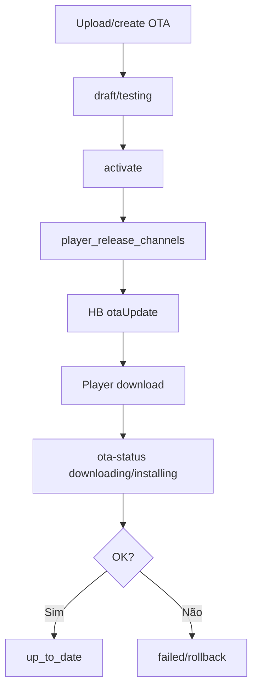

# `ota-updates` — Atualizações OTA

| Campo | Valor |
|-------|-------|
| **Slug** | `ota-updates` |
| **Modos** | Pro (`flag_smart_1` / módulo OTA) |
| **Atores** | admin*; Player consome |
| **UI** | `/ota-updates`, `/ota-updates/history` |
| **API** | `/api/ota-updates`; Player `/api/player/ota-download/:id`, `/ota-status` |
| **Status** | active |
| **Profundidade** | L2 |
| **Última revisão** | 2026-08-09 |

---

## 1. Visão e escopo

### Propósito
Gerir builds OTA (draft→active), rollout, e entrega ao Player via heartbeat + download autenticado de dispositivo.

### Dentro do escopo
- CRUD/activate/pause/cancel OTA
- Stats e totems
- Designação automática do canal production no activate Android
- Report de progresso por totem

### Fora do escopo
- UI Settings “Central APK” (espelho de designation — `player-apk-settings`)
- Assinatura de código Play Store

### Vocabulário
| Termo | Significado |
|-------|-------------|
| ota_updates.status | draft/testing/active/paused/completed/cancelled |
| totem_update_status | up_to_date…rollback |
| rollout % | percentagem de elegíveis |
| version_code | inteiro Android |

---

## 2. Requisitos (EARS)

| ID | Tipo | Requisito |
|----|------|-----------|
| REQ-OTA-001 | Event-driven | Quando se activa OTA Android, deve designar `player_release_channels` production. |
| REQ-OTA-002 | State-driven | Enquanto update active, o HB Android deve poder oferecer `otaUpdate`. |
| REQ-OTA-003 | Event-driven | Quando o Player reporta progresso, deve actualizar `totem_update_status`. |
| REQ-OTA-004 | Unwanted | Builds cancelled/paused não devem ser oferecidos como update disponível. |
| REQ-OTA-005 | Optional | Rollout percentual deve limitar elegibilidade. |

---

## 3. Regras de negócio

### RN-OTA-001 — Activate designa production

```text
RN-OTA-001 — Activate designa production
Quando: activateUpdate Android
Se: sucesso
Então: UPSERT player_release_channels (production)
Excepto: —
Motivo: Alinhar Central APK e OTA
```

### RN-OTA-002 — HB prioriza canal

```text
RN-OTA-002 — HB prioriza canal
Quando: getAvailableUpdate Android
Se: designation existe
Então: preferir canal designado
Excepto: fallback regras legacy se aplicável
Motivo: Fonte única
```

### RN-OTA-003 — Report status

```text
RN-OTA-003 — Report status
Quando: POST /api/player/ota-status
Se: payload válido
Então: upsert totem_update_status
Excepto: —
Motivo: Observabilidade de rollout
```

### RN-OTA-004 — Lifecycle

```text
RN-OTA-004 — Lifecycle
Quando: transições admin
Se: draft→testing→active⇄paused→completed|cancelled
Então: só estados CHECK
Excepto: —
Motivo: Integridade
```

### RN-OTA-005 — Player rollback store

```text
RN-OTA-005 — Player rollback store
Quando: OTA no dispositivo
Se: backup local disponível
Então: permitir tentativa de rollback conforme coordinator
Excepto: ambientes sem backup
Motivo: Recuperação
```

---

## 4. Fluxos



---

## 5. Estados

**OTA:** `draft → testing → active ⇄ paused → completed|cancelled`  
**Totem:** `up_to_date → update_available → downloading → installing → failed|rollback`

---

## 6. Critérios de aceite

### AC-OTA-001 (P0)

```text
DADO OTA Android activate
QUANDO consultar designated production
ENTÃO aponta para esse update
```

### AC-OTA-002 (P0)

```text
DADO update active
QUANDO Player HB elegível
ENTÃO recebe metadados otaUpdate
```

### AC-OTA-003 (P0)

```text
DADO install falhou
QUANDO ota-status failed
ENTÃO totem_update_status=failed
```

---

## 7. Dependências e referências

### Módulos
- [`player-apk-settings`](../player-apk-settings/MODULO.md), [`player-ad`](../player-ad/MODULO.md)
- [`product-modes`](../product-modes/MODULO.md) — Pro

### Código de referência
- `backend/src/routes/ota-updates.ts`
- `backend/src/services/otaUpdateService.ts`, `otaHeartbeatHelper.ts`
- `frontend/src/components/OTAUpdates/OTAUpdates.tsx`
- `Player-AD/.../ota/*.kt`
