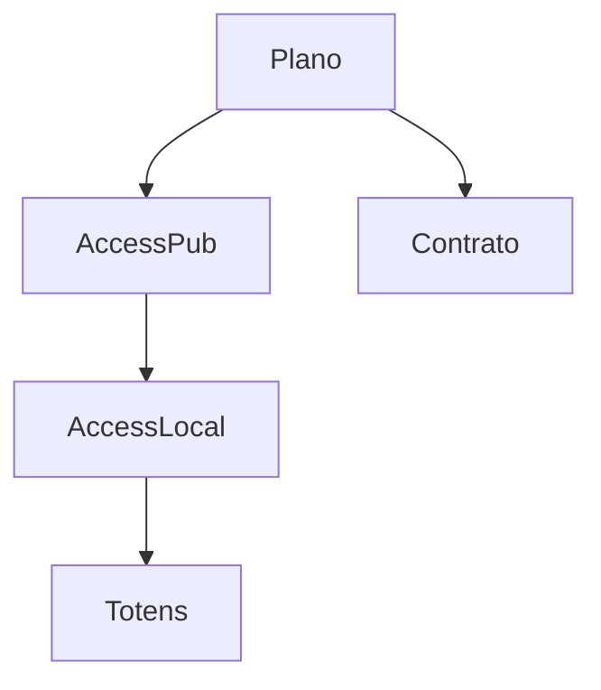

# `plans` — Planos e acessos

| Campo | Valor |
|-------|-------|
| **Slug** | `plans` |
| **Modos** | Pro |
| **Atores** | owner/admin, comercial, faturamento |
| **UI** | `/plan-publisher-access, /expired` |
| **API** | `/api/plans` |
| **Status** | active |
| **Última revisão** | 2026-08-09 |

---

## 1. Visão e escopo

### Propósito
Planos comerciais com acessos a publishers/locais e limites de rede.

### Dentro do escopo
- CRUD plano
- plan_publisher_access
- plan_local_access

### Fora do escopo
- SPA Lite

### Vocabulário
| Termo | Significado |
|-------|-------------|
| plan_id | plano comercial |

---

## 2. Requisitos (EARS)

| ID | Tipo | Requisito |
|----|------|-----------|
| REQ-PLN-001 | State-driven | Módulo plans só disponível em mode=full. |
| REQ-PLN-002 | Ubiquitous | Contrato Pro referencia plan_id para execução. |

---

## 3. Regras de negócio

### RN-PLN-001 — Lite bloqueado

```text
RN-PLN-001 — Lite bloqueado
Quando: mode=lite
Se: API /plans
Então: 403 MODULE_DISABLED
Excepto: —
Motivo: Preset Lite
```

### RN-PLN-002 — Limites de rede

```text
RN-PLN-002 — Limites de rede
Quando: plano com limites
Se: exceder
Então: impedir novos acessos/publicações conforme regra do plano
Excepto: —
Motivo: Comercial
```

---

## 4. Fluxos



---

## 5. Estados

| Estado | Significado | Transições típicas |
|--------|-------------|--------------------|
| active | vendável/associável | → expired/inactive |

---

## 6. Critérios de aceite

### AC-PLN-001 (P0)

```text
DADO mode lite
QUANDO GET /api/plans
ENTÃO 403
```

---

## 7. Dependências e referências

### Módulos relacionados
- [`contracts`](../contracts/MODULO.md)
- [`organization`](../organization/MODULO.md)
- [`locals`](../locals/MODULO.md)

### Referências
- `docs/manuais/03-MODULOS-E-FORMAS-DE-TRABALHO.md`
