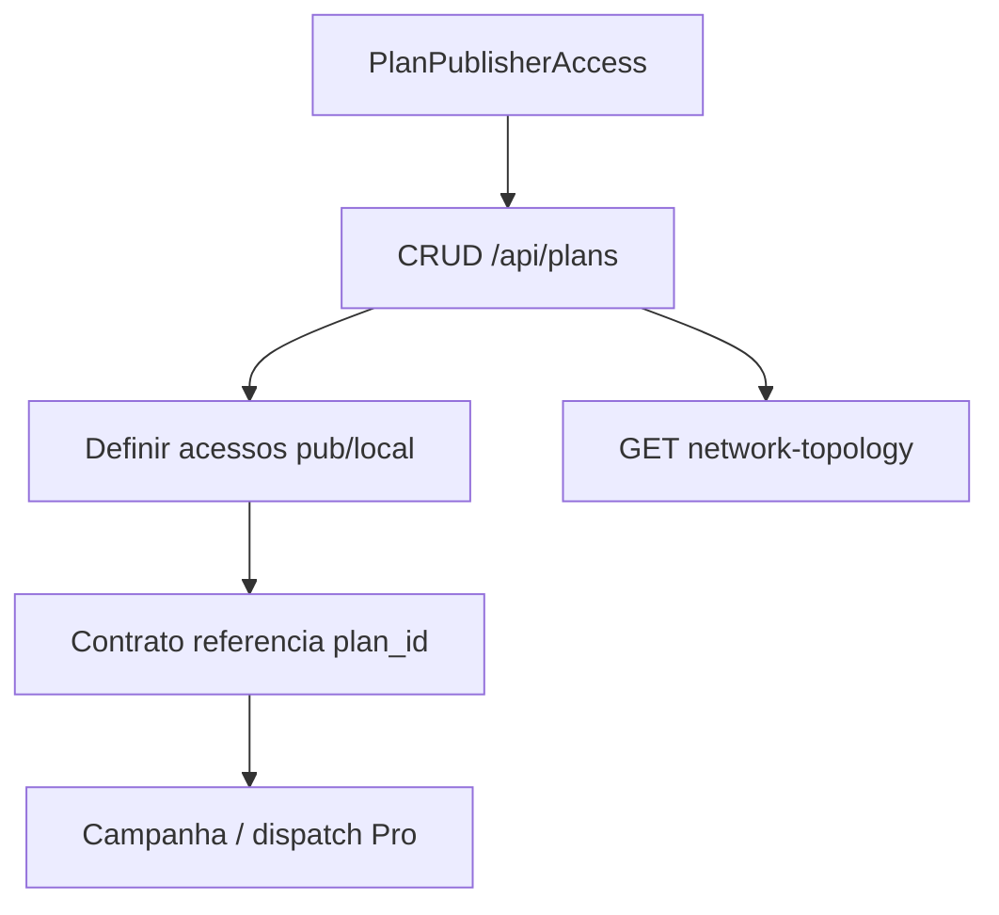

# `plans` — Planos e acessos

| Campo | Valor |
|-------|-------|
| **Slug** | `plans` |
| **Modos** | Pro |
| **Atores** | owner/admin, comercial, faturamento |
| **UI** | `/plan-publisher-access (+ Billing ?view=plans)` |
| **API** | `/api/plans` |
| **Status** | active |
| **Profundidade** | L2 |
| **Última revisão** | 2026-08-09 |

---

## 1. Visão e escopo

### Propósito
Planos comerciais com intervalos de billing, flags default/popular, e acessos de rede (`plan_publisher_access` / locais) usados por contratos Pro.

### Dentro do escopo
- CRUD `/api/plans` (`requireModule('plans')`)
- Topologia do plano
- Subscriptions publisher↔plan
- UI principal em PlanPublisherAccess (não há `/plans` dedicado)

### Fora do escopo
- SPA Lite (paralelo)
- Emissão de fatura (billing)

### Vocabulário
| Termo | Significado |
|-------|-------------|
| plan | registo em `plans` |
| billing_interval | `month` \| `four_month` \| `semester` \| `year` |
| subscription.status | `active` \| `cancelled` \| `past_due` \| … |

---

## 2. Requisitos (EARS)

| ID | Tipo | Requisito |
|----|------|-----------|
| REQ-PLN-001 | State-driven | Módulo plans só em mode=full (preset Pro). |
| REQ-PLN-002 | Ubiquitous | Contrato Pro referencia `plan_id` para execução. |
| REQ-PLN-003 | Unwanted | Em mode lite, GET /api/plans deve falhar MODULE_DISABLED. |
| REQ-PLN-004 | Event-driven | Quando plano fica inactivo, novos vínculos devem ser bloqueados. |
| REQ-PLN-005 | Optional | Plan com limites de rede deve impedir acessos acima do teto. |
| REQ-PLN-006 | Ubiquitous | `is_default` no máximo um plano default activo por política da app. |

---

## 3. Regras de negócio

### RN-PLN-001 — Lite bloqueado

```text
RN-PLN-001 — Lite bloqueado
Quando: API /plans
Se: mode=lite
Então: 403 MODULE_DISABLED
Excepto: —
Motivo: Preset Lite
```


### RN-PLN-002 — Limites de rede

```text
RN-PLN-002 — Limites de rede
Quando: conceder access além do plano
Se: excede limite
Então: impedir
Excepto: —
Motivo: Comercial
```


### RN-PLN-003 — Inactivo não vendável

```text
RN-PLN-003 — Inactivo não vendável
Quando: associar contrato/subscription
Se: is_active=false
Então: rejeitar
Excepto: —
Motivo: Catálogo
```


### RN-PLN-004 — Intervalo CHECK

```text
RN-PLN-004 — Intervalo CHECK
Quando: POST/PUT
Se: billing_interval inválido
Então: rejeitar
Excepto: —
Motivo: Schema
```


### RN-PLN-005 — Topology subset

```text
RN-PLN-005 — Topology subset
Quando: GET :id/network-topology
Se: plano válido
Então: só publishers/locais do plano
Excepto: —
Motivo: Visão comercial
```


---

## 4. Fluxos



---

## 5. Estados

| Campo | Valores |
|-------|---------|
| `is_active` / `is_popular` / `is_default` | bool |
| `billing_interval` | `month`, `four_month`, `semester`, `year` |
| subscription.status | `active`, `cancelled`, `past_due`, `unpaid`, `trialing`, `paused` |

---

## 6. Critérios de aceite

### AC-PLN-001 (P0)

```text
DADO mode lite
QUANDO GET /api/plans
ENTÃO 403 MODULE_DISABLED
```


### AC-PLN-002 (P0)

```text
DADO plano is_active=false
QUANDO criar vínculo/contrato novo
ENTÃO rejeitado
```


### AC-PLN-003 (P0)

```text
DADO plano com 1 publisher autorizado
QUANDO GET network-topology
ENTÃO não lista publishers fora do plano
```


---

## 7. Dependências e referências

### Módulos
- [`contracts`](../contracts/MODULO.md), [`organization`](../organization/MODULO.md), [`locals`](../locals/MODULO.md), [`network-topology`](../network-topology/MODULO.md), [`billing`](../billing/MODULO.md)

### Código de referência
- `backend/src/routes/plans.ts`
- `backend/src/services/planService.ts`
- `frontend/src/pages/PlanPublisherAccess/PlanPublisherAccess.tsx`
- schema part2 `plans`; part5 `subscriptions`

### Lacunas conhecidas
- ~~Sem rota `/plans`~~ — **resolvido** (redirect → `/plan-publisher-access`).
- FE pode chamar `/plans/default` além das rotas documentadas no backend.
