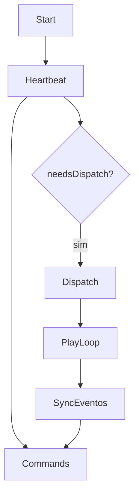

# `player-ad` — Player-AD

| Campo | Valor |
|-------|-------|
| **Slug** | `player-ad` |
| **Modos** | all |
| **Atores** | técnico de campo, admin; processo no TV Box |
| **UI** | `App Android; docs/instalação; sem menu próprio` |
| **API** | `/api/player/*` |
| **Status** | active |
| **Última revisão** | 2026-08-09 |

---

## 1. Visão e escopo

### Propósito
Cliente Android TV Box: reproduz fila, heartbeat/sync, OTA, comandos remotos e telemetria.

### Dentro do escopo
- Playback
- Cache
- Agenda de tela
- Sync/comandos
- OTA client

### Fora do escopo
- UI administrativa web

### Vocabulário
| Termo | Significado |
|-------|-------------|
| DispatchPlan | plano de mídias |
| EMPTY_PLAN | plano vazio intencional |
| displayIdle | tela off por agenda |

---

## 2. Requisitos (EARS)

| ID | Tipo | Requisito |
|----|------|-----------|
| REQ-PAD-001 | Ubiquitous | Player deve autenticar com UIN e deviceId canónico. |
| REQ-PAD-002 | State-driven | Em displayIdle o Player não reproduz mídias mas mantém presença/comandos. |
| REQ-PAD-003 | Unwanted | Comandos destrutivos não devem ser reexecutados automaticamente após reboot sem recibo. |
| REQ-PAD-004 | Event-driven | Troca vídeo→vídeo deve preservar último frame durante prepare quando possível. |

---

## 3. Regras de negócio

### RN-PAD-001 — EMPTY_PLAN passivo

```text
RN-PAD-001 — EMPTY_PLAN passivo
Quando: servidor devolve plano vazio válido
Se: sempre
Então: não reiniciar agressivamente; aguardar nova versão
Excepto: —
Motivo: Poupar I/O
```

### RN-PAD-002 — Recibo antes de reboot

```text
RN-PAD-002 — Recibo antes de reboot
Quando: comando reboot/restart/config destrutiva
Se: antes do efeito
Então: persistir ID em disco
Excepto: —
Motivo: At-most-once
```

### RN-PAD-003 — Thread UI

```text
RN-PAD-003 — Thread UI
Quando: mexer ExoPlayer
Se: sempre
Então: Dispatchers.Main
Excepto: —
Motivo: Crash wrong thread
```

### RN-PAD-004 — Agenda off

```text
RN-PAD-004 — Agenda off
Quando: entra idle
Se: sempre
Então: index=0 para retomar na primeira mídia
Excepto: —
Motivo: Previsibilidade
```

---

## 4. Fluxos



---

## 5. Estados

| Estado | Significado | Transições típicas |
|--------|-------------|--------------------|
| ACTIVE | reproduzindo | → EMPTY/IDLE/OFF |
| EMPTY_PLAN | sem mídias | → ACTIVE |
| displayIdle | tela off | → playing |
| ERROR | falha média/rede | → retry |

---

## 6. Critérios de aceite

### AC-PAD-001 (P0)

```text
DADO agenda off
QUANDO passar horário
ENTÃO para reprodução e mantém heartbeat
```

### AC-PAD-002 (P0)

```text
DADO mesmo reboot command reentregue
QUANDO após reboot com recibo
ENTÃO não reinicia de novo
```

---

## 7. Dependências e referências

### Módulos relacionados
- [`telemetry-heartbeat`](../telemetry-heartbeat/MODULO.md)
- [`remote-control`](../remote-control/MODULO.md)
- [`ota-updates`](../ota-updates/MODULO.md)
- [`dispatcher`](../dispatcher/MODULO.md)

### Referências
- `docs/instalacao/04-PLAYER-AD.md`
- `docs/HISTORICO-TECNICO-2026-08-08.md`
