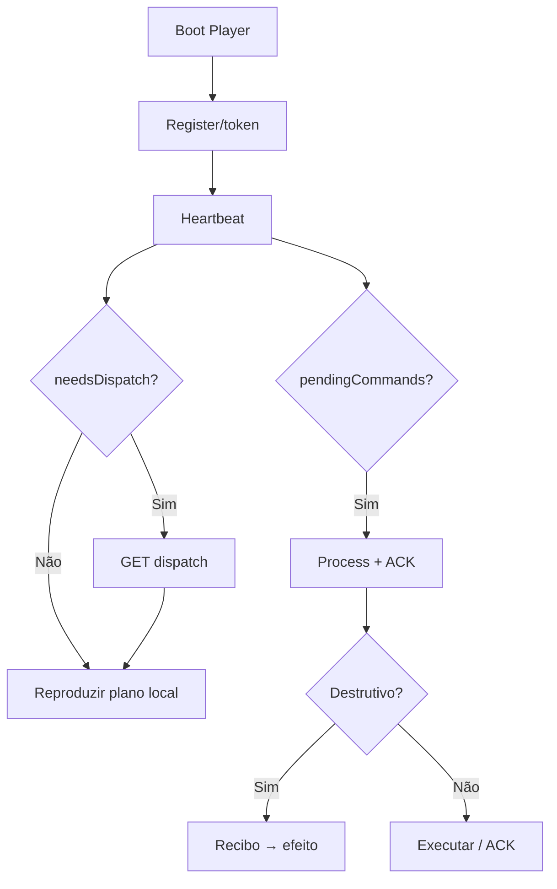

# `player-ad` — Player-AD

| Campo | Valor |
|-------|-------|
| **Slug** | `player-ad` |
| **Modos** | all |
| **Atores** | dispositivo (UIN/token); ops via UI totens |
| **UI** | App Android; DebugConfig (5 toques); sem rota web própria |
| **API** | `/api/player/*` (heartbeat, sync, dispatch, command-result, ota) |
| **Status** | active |
| **Profundidade** | L2 |
| **Última revisão** | 2026-08-09 |

---

## 1. Visão e escopo

### Propósito
Cliente Android de reprodução: plano de conteúdo, heartbeat/sync, comandos remotos, telemetria e OTA.

### Dentro do escopo
- Reprodução ExoPlayer / plano ACTIVE|EMPTY
- Poll adaptativo HB/dispatch
- Processamento de `pendingCommands`
- Eventos de playback + observation samples
- OTA download/install report

### Fora do escopo
- UI de inventário web
- Política de reentrega no servidor (`remote-control`)
- Designação APK (`player-apk-settings` / `ota-updates`)

### Vocabulário
| Termo | Significado |
|-------|-------------|
| planVersion | versão do plano; se conhecida ⇒ needsDispatch=false |
| EMPTY_PLAN | plano válido sem itens (não é falha) |
| NON_RETRYABLE | tipos destrutivos com recibo pré-efeito |
| displayIdle | agenda off / ecrã idle |
| device_id | TRIM+UPPER |

---

## 2. Requisitos (EARS)

| ID | Tipo | Requisito |
|----|------|-----------|
| REQ-PAD-001 | Ubiquitous | O Player deve reportar presença via heartbeat (e sync quando aplicável). |
| REQ-PAD-002 | Event-driven | Quando recebe pendingCommands, deve processar com ACK via command-result (2xx). |
| REQ-PAD-003 | Unwanted | Comandos destrutivos já processados não devem reexecutar. |
| REQ-PAD-004 | State-driven | Enquanto EMPTY_PLAN, não deve reiniciar agressivamente. |
| REQ-PAD-005 | Event-driven | Quando lease de observação activo, deve enviar `player.observation.sample`. |
| REQ-PAD-006 | Optional | Onde OTA disponível no HB, deve poder descarregar/reportar status. |

---

## 3. Regras de negócio

### RN-PAD-001 — EMPTY_PLAN válido

```text
RN-PAD-001 — EMPTY_PLAN válido
Quando: dispatch devolve plano sem itens
Se: planState EMPTY
Então: estado estável; wake no heartbeat; sem reboot loop
Excepto: UNAVAILABLE (erro de plano)
Motivo: Totem sem mídia é operação normal
```

### RN-PAD-002 — Recibo antes do efeito

```text
RN-PAD-002 — Recibo antes do efeito
Quando: reboot/restart/config/purge/invalidate/screenshot
Se: comando novo
Então: persistir recibo (SharedPreferences commit) ANTES do efeito
Excepto: —
Motivo: At-most-once após reboot
```

### RN-PAD-003 — Duplicata = ACK sem reexecutar

```text
RN-PAD-003 — Duplicata = ACK sem reexecutar
Quando: comando já em recibos
Se: sempre
Então: ACK completed + duplicate/alreadyProcessed
Excepto: —
Motivo: Idempotência cliente
```

### RN-PAD-004 — Display idle

```text
RN-PAD-004 — Display idle
Quando: agenda off
Se: entrar idle
Então: displayIdle; index=0 ao entrar
Excepto: force display commands
Motivo: Política de ecrã
```

### RN-PAD-005 — Dispatch sob condição

```text
RN-PAD-005 — Dispatch sob condição
Quando: ciclo de poll
Se: needsDispatch ou refresh comando; safety poll raro
Então: GET /api/player/dispatch
Excepto: knownPlanVersion == planVersion → skip
Motivo: Reduzir carga e jank
```

### RN-PAD-006 — HB fora do caminho crítico

```text
RN-PAD-006 — HB fora do caminho crítico
Quando: transição entre mídias
Se: sempre
Então: não bloquear render por HB/dispatch
Excepto: —
Motivo: UX de playback
```

### RN-PAD-007 — Device ID canónico

```text
RN-PAD-007 — Device ID canónico
Quando: registo/sync
Se: sempre
Então: trim+uppercase
Excepto: —
Motivo: Match com totems.device_id
```

---

## 4. Fluxos



---

## 5. Estados

| Estado | Significado |
|--------|-------------|
| ACTIVE | plano com itens |
| EMPTY_PLAN | plano válido vazio |
| displayIdle | fora de agenda |
| ONLINE / PERSISTED / FALLBACK_LOCAL | fonte de plano |
| ERROR | falha download/playback |

---

## 6. Critérios de aceite

### AC-PAD-001 (P0)

```text
DADO totem sem mídias (EMPTY_PLAN)
QUANDO Player recebe plano vazio
ENTÃO permanece estável sem reboot loop
```

### AC-PAD-002 (P0)

```text
DADO comando reboot
QUANDO processar
ENTÃO recibo gravado antes do reboot e reentrega não reexecuta
```

### AC-PAD-003 (P0)

```text
DADO comando já processado reaparece
QUANDO processPendingCommands
ENTÃO ACK duplicate sem segundo efeito
```

### AC-PAD-004 (P1)

```text
DADO lease observação activo no HB
QUANDO intervalo decorre
ENTÃO envia observation.sample
```

---

## 7. Dependências e referências

### Módulos
- [`dispatcher`](../dispatcher/MODULO.md), [`remote-control`](../remote-control/MODULO.md)
- [`telemetry-heartbeat`](../telemetry-heartbeat/MODULO.md), [`ota-updates`](../ota-updates/MODULO.md)
- [`totems`](../totems/MODULO.md)

### Código de referência
- `Player-AD/.../playback/PlayerController.kt`
- `Player-AD/.../api/DispatcherApiClient.kt`, `PlayerEventsClient.kt`
- `Player-AD/.../ota/OtaUpdateCoordinator.kt`
- `backend/src/routes/player.ts`

### ADR
- `docs/adr/0003-entrega-hibrida-comandos.md`
