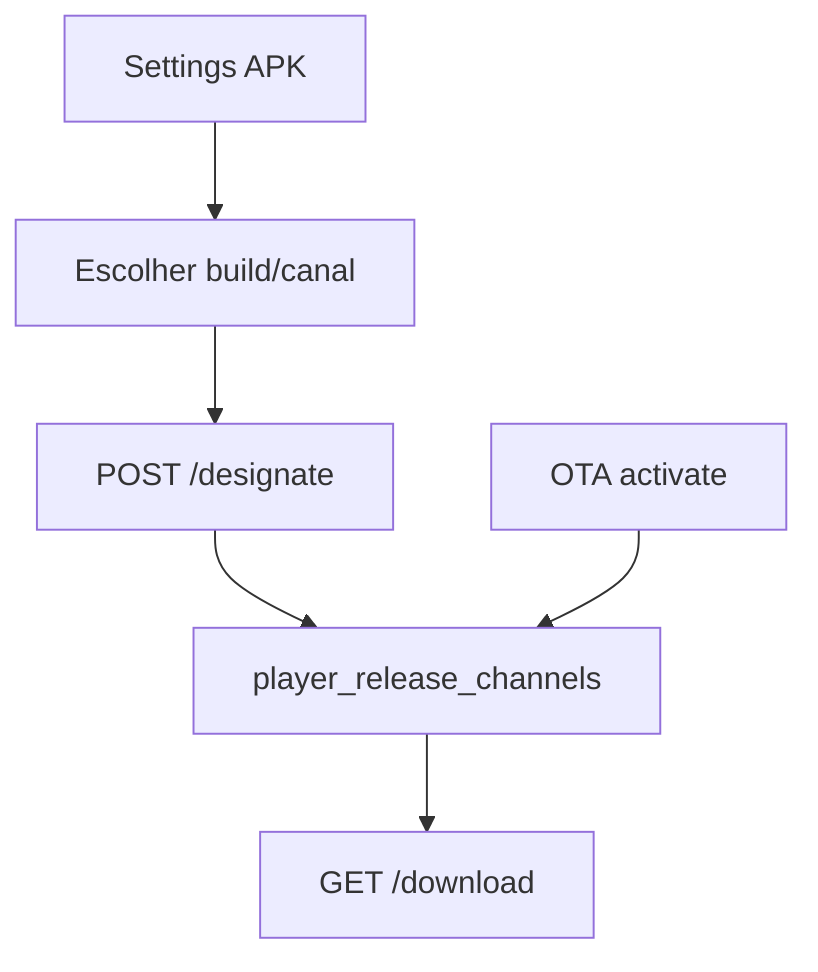

# `player-apk-settings` — Central APK

| Campo | Valor |
|-------|-------|
| **Slug** | `player-apk-settings` |
| **Modos** | all |
| **Atores** | designate: owner/admin_sql/admin; download: + operator/operador_tecnico; docs: + publisher/subscriber |
| **UI** | `/settings` → aba APK (`PlayerApkSettings`) |
| **API** | `/api/player-apk` |
| **Status** | active |
| **Profundidade** | L2 |
| **Última revisão** | 2026-08-13 |

---

## 1. Visão e escopo

### Propósito
Designar o APK oficial por canal (`production`|`testing`), download autenticado e documentos do Player.

### Dentro do escopo
- GET designated / POST designate / GET candidates / POST upload
- Download do APK designado
- Documentos markdown (`docs/player-apk`)
- Em **Direct**, o módulo OTA está off: a aba Settings → APK é a via oficial (upload + designar)

### Fora do escopo
- Ciclo de vida completo OTA admin (`ota-updates`)
- Instalação no dispositivo (Player / ADB)

### Vocabulário
| Termo | Significado |
|-------|-------------|
| channel | `production` \| `testing` |
| designation | linha em `player_release_channels` |
| platform | tipicamente `android` |

---

## 2. Requisitos (EARS)

| ID | Tipo | Requisito |
|----|------|-----------|
| REQ-APK-001 | Ubiquitous | Deve existir no máximo uma designação por (platform, channel). |
| REQ-APK-002 | Event-driven | Quando se designa um build, o canal deve apontar para esse `ota_updates` id. |
| REQ-APK-003 | Unwanted | Subscriber não deve descarregar o APK. |
| REQ-APK-004 | Ubiquitous | Download e docs exigem JWT + role adequada. |
| REQ-APK-005 | Optional | Canal omitido deve defaultar a `production`. |
| REQ-APK-006 | Ubiquitous | Em Direct, owner/admin deve poder designar o APK sem o módulo OTA. |
| REQ-APK-007 | Unwanted | Schema em falta (`player_release_channels`) não deve devolver 500 no GET designated. |

---

## 3. Regras de negócio

### RN-APK-001 — Unicidade canal

```text
RN-APK-001 — Unicidade canal
Quando: designate
Se: (platform, channel) já existe
Então: UPSERT substitui designação
Excepto: —
Motivo: Uma “oficial” por canal
```

### RN-APK-002 — Download roles

```text
RN-APK-002 — Download roles
Quando: GET /download
Se: role ∉ DOWNLOAD_ROLES
Então: 403
Excepto: —
Motivo: Binário sensível
```

### RN-APK-003 — Docs com JWT

```text
RN-APK-003 — Docs com JWT
Quando: GET /documents
Se: autenticado VIEW_ROLES
Então: servir markdown
Excepto: anónimo → 401
Motivo: Docs operacionais internos
```

### RN-APK-004 — Default production

```text
RN-APK-004 — Default production
Quando: channel omitido
Se: sempre
Então: production
Excepto: —
Motivo: Segurança operacional
```

### RN-APK-005 — OTA activate espelha

```text
RN-APK-005 — OTA activate espelha
Quando: activate OTA Android
Se: sucesso
Então: UPSERT player_release_channels production
Excepto: —
Motivo: Uma fonte de verdade de build
```

---

## 4. Fluxos



---

## 5. Estados

| Estado | Significado |
|--------|-------------|
| no_designation | canal sem APK |
| designated | aponta para ota_updates |
| replaced | novo designate |

---

## 6. Critérios de aceite

### AC-APK-001 (P0)

```text
DADO admin
QUANDO designate production
ENTÃO GET designated?channel=production devolve esse build
```

### AC-APK-002 (P0)

```text
DADO subscriber autenticado
QUANDO GET /download
ENTÃO 403
```

### AC-APK-003 (P0)

```text
DADO operator
QUANDO GET /download com designation
ENTÃO recebe APK
```

---

## 7. Dependências e referências

### Módulos
- [`ota-updates`](../ota-updates/MODULO.md), [`player-ad`](../player-ad/MODULO.md), [`settings`](../settings/MODULO.md)

### Código de referência
- `backend/src/routes/player-apk.ts`
- `frontend/src/components/PlayerApkSettings/PlayerApkSettings.tsx`
- schema `player_release_channels`
- `docs/player-apk/`
