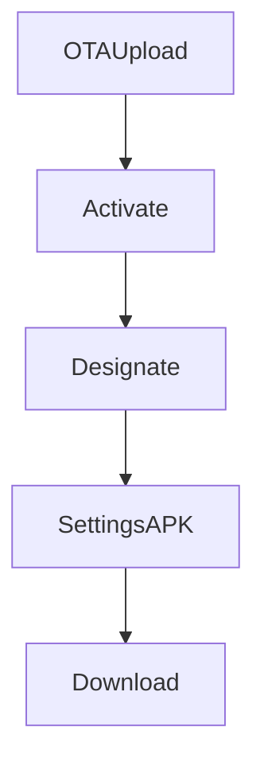

# `player-apk-settings` — Central APK

| Campo | Valor |
|-------|-------|
| **Slug** | `player-apk-settings` |
| **Modos** | all |
| **Atores** | owner/admin/técnico (download); admin OTA |
| **UI** | `/settings aba APK` |
| **API** | `/api/player-apk` |
| **Status** | active |
| **Última revisão** | 2026-08-09 |

---

## 1. Visão e escopo

### Propósito
Fonte oficial da versão Android designada, download autenticado e documentação do Player-AD.

### Dentro do escopo
- Versão designada
- Download
- Documentos
- Link OTA

### Fora do escopo
- Compilar APK no servidor

### Vocabulário
| Termo | Significado |
|-------|-------------|
| player_release_channels | ponteiro da versão oficial |
| designated | versão de produção/testing |

---

## 2. Requisitos (EARS)

| ID | Tipo | Requisito |
|----|------|-----------|
| REQ-APK-001 | Ubiquitous | Deve existir no máximo uma designação por plataforma/canal. |
| REQ-APK-002 | Ubiquitous | Download exige autenticação e role autorizada. |

---

## 3. Regras de negócio

### RN-APK-001 — Activar OTA designa

```text
RN-APK-001 — Activar OTA designa
Quando: activar update Android
Se: sempre
Então: actualiza player_release_channels production
Excepto: —
Motivo: Fonte única
```

### RN-APK-002 — Docs autenticados

```text
RN-APK-002 — Docs autenticados
Quando: abrir manual via API
Se: sem JWT
Então: 401
Excepto: —
Motivo: Não expor docs públicos sem controlo
```

---

## 4. Fluxos



---

## 5. Estados

| Estado | Significado | Transições típicas |
|--------|-------------|--------------------|
| no_designation | aviso na UI | → designated |
| designated | download disponível | → replaced |

---

## 6. Critérios de aceite

### AC-APK-001 (P0)

```text
DADO sem designação
QUANDO abrir aba APK
ENTÃO aviso para activar OTA
```

### AC-APK-002 (P0)

```text
DADO subscriber
QUANDO GET designated
ENTÃO negado se fora das roles
```

---

## 7. Dependências e referências

### Módulos relacionados
- [`ota-updates`](../ota-updates/MODULO.md)
- [`settings`](../settings/MODULO.md)

### Referências
- `docs/player-apk/`
- `docs/instalacao/04-PLAYER-AD.md`
