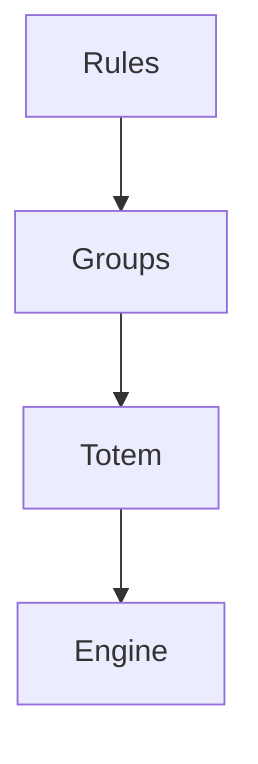

# `playlist-mix` — Playlist Mix

| Campo | Valor |
|-------|-------|
| **Slug** | `playlist-mix` |
| **Modos** | all (via dispatcher_admin); uso típico Pro/ops |
| **Atores** | owner/admin, operador técnico |
| **UI** | `/playlist-mix, /groups, /rules, /analytics` |
| **API** | `/api/playlist-mix` |
| **Status** | active |
| **Última revisão** | 2026-08-09 |

---

## 1. Visão e escopo

### Propósito
Mix por totem/grupos/regras e analytics de composição.

### Dentro do escopo
- Regras de mix
- Grupos
- Analytics de composição

### Fora do escopo
- Billing

### Vocabulário
| Termo | Significado |
|-------|-------------|
| mix rule | regra de composição |

---

## 2. Requisitos (EARS)

| ID | Tipo | Requisito |
|----|------|-----------|
| REQ-PMX-001 | Ubiquitous | Regras de mix devem ser aplicáveis por totem ou grupo. |

---

## 3. Regras de negócio

### RN-PMX-001 — Precedência

```text
RN-PMX-001 — Precedência
Quando: Conflito de regras
Se: sempre
Então: aplicar precedência documentada no engine
Excepto: —
Motivo: Determinismo
```

---

## 4. Fluxos



---

## 5. Estados

| Estado | Significado | Transições típicas |
|--------|-------------|--------------------|
| rule_active | aplica | → inactive |

---

## 6. Critérios de aceite

### AC-PMX-001 (P0)

```text
DADO duas regras conflitantes
QUANDO gerar mix
ENTÃO resultado segue precedência definida
```

---

## 7. Dependências e referências

### Módulos relacionados
- [`dispatcher`](../dispatcher/MODULO.md)
- [`playlists`](../playlists/MODULO.md)
- [`totems`](../totems/MODULO.md)

### Referências
- —
