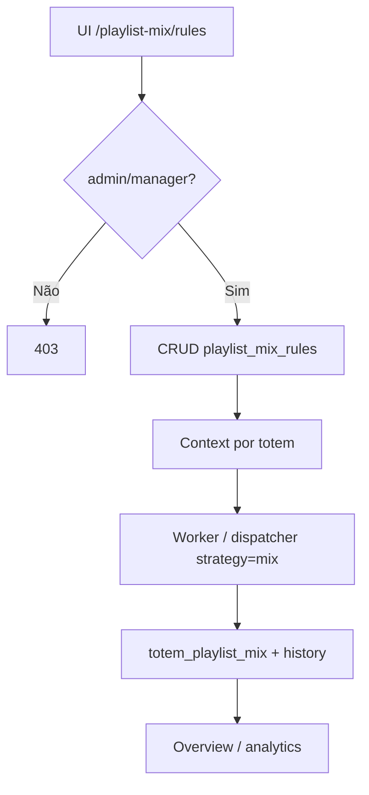
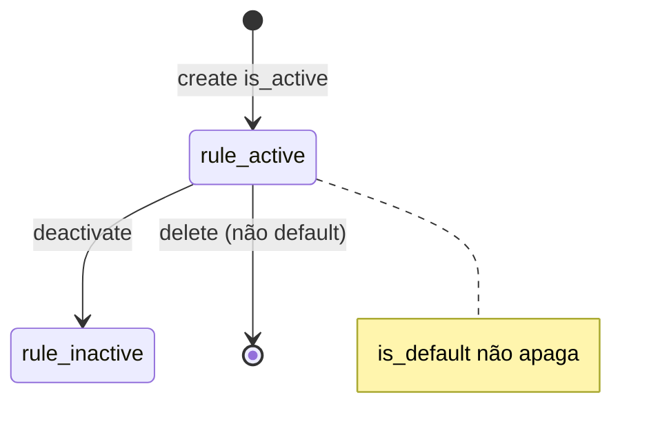

# `playlist-mix` — Playlist Mix

| Campo | Valor |
|-------|-------|
| **Slug** | `playlist-mix` |
| **Modos** | all ops (`requireModule('dispatcher_admin')`) |
| **Atores** | admin / `manager` (write API); UI: owner_system, admin_sql, operator, admin, operador_tecnico (+ `flag_smart_2`) |
| **UI** | `/playlist-mix`, `/playlist-mix/groups`, `/playlist-mix/rules`, `/playlist-mix/analytics` |
| **API** | `/api/playlist-mix` |
| **Status** | active |
| **Profundidade** | L2 |
| **Última revisão** | 2026-08-09 |

---

## 1. Visão e escopo

### Propósito
Regras, contexto AI, histórico, overview e analytics da mixagem por totem; alimenta a estratégia `mix` do dispatcher e workers de regeneração.

### Dentro do escopo
- CRUD de `playlist_mix_rules` (bloqueio de delete em `is_default`)
- Contexto por totem (`ai_context_data`)
- History, overview (vista “grupos”), analytics
- Integração com `totem_playlist_mix` / worker

### Fora do escopo
- Billing / campanhas comerciais CRUD
- Endpoint `POST /groups` (grupos = vista do overview)
- Playlist CRUD de negócio (`playlists`)

### Vocabulário
| Termo | Significado |
|-------|-------------|
| rule | linha em `playlist_mix_rules` |
| `rule_type` | `systematic` \| `ai` \| `hybrid` |
| `rotation_strategy` | `round_robin` \| `priority` \| `weighted` \| `ai_optimized` |
| overview/grupos | agregação UI, não entidade REST groups |
| dispatcher strategy | `single` \| `priority` \| `mix` (relacionada) |

---

## 2. Requisitos (EARS)

| ID | Tipo | Requisito |
|----|------|-----------|
| REQ-MIX-001 | Ubiquitous | O sistema deve expor regras de mix com `rule_type` e `rotation_strategy` canónicos. |
| REQ-MIX-002 | Event-driven | Quando se cria/actualiza regra ou contexto, o sistema deve persistir para o motor/worker consumir. |
| REQ-MIX-003 | Unwanted | O sistema não deve apagar regras com `is_default=true`. |
| REQ-MIX-004 | State-driven | Enquanto o módulo `dispatcher_admin` estiver off, a API de playlist-mix não deve responder com sucesso. |
| REQ-MIX-005 | Ubiquitous | Overview/analytics/history devem reflectir mixagens e regras activas. |
| REQ-MIX-006 | Optional | Onde houver contexto AI por totem, o sistema deve permitir GET/POST/PUT em `/context/:totemId`. |

---

## 3. Regras de negócio

### RN-MIX-001 — Tipos de regra

```text
RN-MIX-001 — Tipos de regra
Quando: POST/PUT rules
Se: sempre
Então: rule_type ∈ {systematic, ai, hybrid}
Excepto: —
Motivo: Validação body + schema part11
```

### RN-MIX-002 — Estratégia de rotação

```text
RN-MIX-002 — Estratégia de rotação
Quando: definir rotation_strategy
Se: valor informado
Então: ∈ {round_robin, priority, weighted, ai_optimized}
Excepto: —
Motivo: Contrato do motor mix
```

### RN-MIX-003 — Default intocável

```text
RN-MIX-003 — Default intocável
Quando: DELETE /rules/:id
Se: is_default=true
Então: rejeitar
Excepto: —
Motivo: Garantir fallback de mix
```

### RN-MIX-004 — Write roles API

```text
RN-MIX-004 — Write roles API
Quando: POST/PUT/DELETE rules ou write context
Se: role ∉ admin|manager
Então: 403
Excepto: —
Motivo: Ops privilegiadas (ver lacuna: role 'manager' vs catálogo produto)
```

### RN-MIX-005 — Gate dispatcher_admin

```text
RN-MIX-005 — Gate dispatcher_admin
Quando: qualquer /api/playlist-mix
Se: complemento dispatcher_admin inactivo
Então: 403 requireModule
Excepto: —
Motivo: Mix é superfície admin do dispatcher
```

### RN-MIX-006 — Overview ≠ groups API

```text
RN-MIX-006 — Overview ≠ groups API
Quando: UI /playlist-mix/groups
Se: sempre
Então: consumir GET /overview (não existe POST /groups)
Excepto: —
Motivo: Agrupamento é vista, não CRUD
```

---

## 4. Fluxos

### Configurar mix


### Fluxos de erro
| ID | Gatilho | Resultado |
|----|---------|-----------|
| FX-MIX-E01 | `dispatcher_admin` off | 403 |
| FX-MIX-E02 | Delete regra default | bloqueado |
| FX-MIX-E03 | Role sem write | 403 |
| FX-MIX-E04 | rule_type inválido | 400 validation |

---

## 5. Estados

| Campo | Valores canónicos |
|-------|-------------------|
| `rule_type` | `systematic`, `ai`, `hybrid` |
| `rotation_strategy` | `round_robin`, `priority`, `weighted`, `ai_optimized` |
| `pedestrian_density` | `low`, `medium`, `high` |
| `sentiment_label` | `positive`, `neutral`, `negative` |
| flags | `is_active`, `is_default`; mix `is_current`, `mix_strategy` |
| dispatcher strategy (rel.) | `single`, `priority`, `mix` |



---

## 6. Critérios de aceite

### AC-MIX-001 (P0)

```text
DADO dispatcher_admin activo e role admin
QUANDO POST /api/playlist-mix/rules com rule_type systematic
ENTÃO regra persiste e aparece em GET /rules
```

### AC-MIX-002 (P0)

```text
DADO regra is_default=true
QUANDO DELETE /rules/:id
ENTÃO operação rejeitada
```

### AC-MIX-003 (P0)

```text
DADO instalação sem dispatcher_admin
QUANDO GET /api/playlist-mix/overview
ENTÃO 403 requireModule
```

### AC-MIX-004 (P1)

```text
DADO UI /playlist-mix/groups
QUANDO carregar dados
ENTÃO usa overview (sem POST /groups)
```

---

## 7. Dependências e referências

### Módulos
- [`dispatcher`](../dispatcher/MODULO.md) — estratégia `mix`, mesmo complemento admin
- [`totems`](../totems/MODULO.md), [`campaigns`](../campaigns/MODULO.md), [`playlists`](../playlists/MODULO.md)
- [`vinhetas`](../vinhetas/MODULO.md) — enrichment relacionado no dispatch
- [`telemetry-heartbeat`](../telemetry-heartbeat/MODULO.md) — contexto operacional opcional

### Código de referência
- `backend/src/routes/playlist-mix.ts`
- `backend/src/services/totemPlaylistMixService.ts`, `totemSimpleMixService.ts`, `publisherCampaignMixService.ts`
- `backend/src/workers/playlistMixWorker.ts`
- `frontend/src/pages/PlaylistMix/*.tsx`, `frontend/src/services/api/playlistMixApi.ts`
- `database/smartchannel-db-v2-refactored-part11-playlist-mix.sql` (+ part12, `seeds-playlist-mix.sql`)

### Lacunas conhecidas
- Role string `'manager'` nas writes pode não existir no catálogo real de roles do Studio (risco de write só para `admin`).
- UI exige `flag_smart_2`; API não espelha essa flag.
- `authMiddleware` pode ser aplicado em dobro (mount + router).
- Não há CRUD REST de “groups”.
