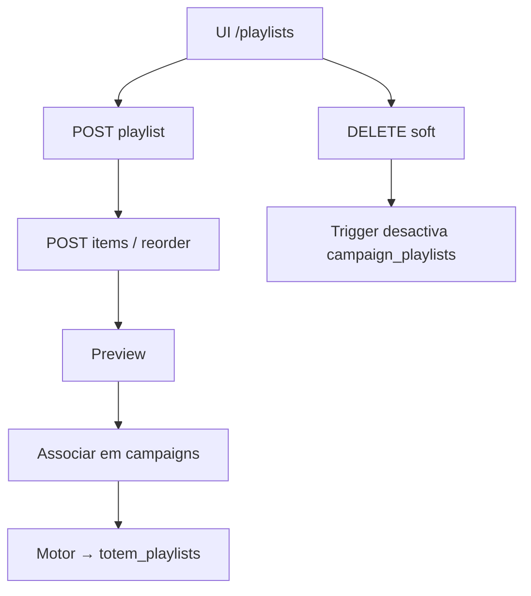
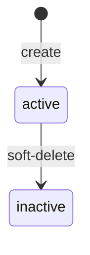

# `playlists` — Playlists

| Campo | Valor |
|-------|-------|
| **Slug** | `playlists` |
| **Modos** | Pro / Lite avançado (`requireModule('playlists_advanced')`) |
| **Atores** | admin, gerente_marketing, subscriber (write); visualizador (UI read) |
| **UI** | `/playlists` |
| **API** | `/api/playlists` |
| **Status** | active |
| **Profundidade** | L2 |
| **Última revisão** | 2026-08-09 |

---

## 1. Visão e escopo

### Propósito
Composição ordenada de mídias do anunciante, reutilizável em várias campanhas; superfície de preview, campanhas ligadas e exposição na rede.

### Dentro do escopo
- CRUD playlist + soft-delete (`is_active=false`)
- CRUD / reorder de `playlist_items`
- Preview, listagem de campanhas da playlist, exposure
- Escopo e ownership por subscriber

### Fora do escopo
- Engine gerada (`/api/playlist-engine`, `totem_playlists`) — vizinha, mesmo `requireModule` no boot
- Direct media no totem (`publish-totem`)
- Smart Playlist / Playlist Mix (módulos distintos)

### Vocabulário
| Termo | Significado |
|-------|-------------|
| playlist | registo em `playlists` com `subscriber_id` NOT NULL |
| `playlist_items` | ordem (`order_index`) + `display_seconds` |
| `playlists_advanced` | id do módulo de instalação (≠ slug pasta) |
| soft-delete | `is_active=false` (+ trigger em `campaign_playlists`) |

---

## 2. Requisitos (EARS)

| ID | Tipo | Requisito |
|----|------|-----------|
| REQ-PLS-001 | Ubiquitous | Cada playlist deve pertencer a um `subscriber_id`. |
| REQ-PLS-002 | Ubiquitous | Itens só podem referenciar mídias do mesmo anunciante. |
| REQ-PLS-003 | Event-driven | Quando se apaga uma playlist, o sistema deve soft-desactivar e desligar associações activas em campanhas (trigger). |
| REQ-PLS-004 | State-driven | Enquanto `is_active=false`, a playlist não deve aparecer na listagem padrão. |
| REQ-PLS-005 | Unwanted | Utilizador non-admin não deve ler/alterar playlist fora do seu ownership/escopo. |
| REQ-PLS-006 | Optional | Onde solicitado, o sistema deve expor preview, campanhas ligadas e exposure na rede. |

---

## 3. Regras de negócio

### RN-PLS-001 — Subscriber obrigatório

```text
RN-PLS-001 — Subscriber obrigatório
Quando: create playlist
Se: sempre
Então: subscriber_id NOT NULL
Excepto: —
Motivo: Cadeia comercial Lite/Pro
```

### RN-PLS-002 — Soft-delete

```text
RN-PLS-002 — Soft-delete
Quando: DELETE /api/playlists/:id
Se: sucesso
Então: is_active=false (não hard delete)
Excepto: —
Motivo: Histórico e FKs de campanha
```

### RN-PLS-003 — Mídia elegível no item

```text
RN-PLS-003 — Mídia elegível no item
Quando: POST item
Se: mídia de outro subscriber ou status fora do conjunto aceite no service
Então: rejeitar
Excepto: —
Motivo: Consistência de conteúdo (ver lacuna vs CHECK medias)
```

### RN-PLS-004 — Duração

```text
RN-PLS-004 — Duração
Quando: criar/actualizar item
Se: imagem → default 10s; vídeo/áudio → 0 (usa duração do ficheiro)
Então: API fala em ms; DB em display_seconds
Excepto: —
Motivo: Contrato API vs schema
```

### RN-PLS-005 — Write roles

```text
RN-PLS-005 — Write roles
Quando: POST/PUT/DELETE/reorder playlist
Se: role ∈ admin|gerente_marketing|subscriber
Então: permitido (com ownership)
Excepto: POST media item pode depender só de ownership no service (sem authorizeRole na rota)
Motivo: Anunciante edita as próprias playlists
```

### RN-PLS-006 — Listagem activa

```text
RN-PLS-006 — Listagem activa
Quando: GET /api/playlists
Se: default
Então: filtrar is_active=true
Excepto: flags admin explícitas se existirem
Motivo: Omitir playlists mortas do fluxo
```

---

## 4. Fluxos

### Composição


### Fluxos de erro
| ID | Gatilho | Resultado |
|----|---------|-----------|
| FX-PLS-E01 | Módulo `playlists_advanced` off | 403 |
| FX-PLS-E02 | Mídia de outro subscriber | 4xx |
| FX-PLS-E03 | Fora de ownership | 403 / 404 |
| FX-PLS-E04 | Playlist inactiva na listagem default | omitida |

---

## 5. Estados

| Campo | Valores canónicos |
|-------|-------------------|
| `playlists.is_active` | `true` / `false` (sem CHECK de status editorial) |
| `playlist_items.order_index` | ≥ 0 |
| `playlist_items.display_seconds` | default 10 |
| engine relacionada `totem_playlists.status` | `active`, `paused`, `invalidated` (fora do CRUD) |



---

## 6. Critérios de aceite

### AC-PLS-001 (P0)

```text
DADO subscriber A autenticado
QUANDO criar playlist e adicionar mídia do A
ENTÃO playlist e itens persistem e aparecem em GET /api/playlists
```

### AC-PLS-002 (P0)

```text
DADO playlist activa ligada a campanha
QUANDO DELETE playlist
ENTÃO is_active=false e associação activa em campaign_playlists é desligada pelo trigger
```

### AC-PLS-003 (P0)

```text
DADO mídia do subscriber B
QUANDO tentar adicionar à playlist do subscriber A
ENTÃO operação rejeitada
```

### AC-PLS-004 (P1)

```text
DADO instalação sem playlists_advanced
QUANDO GET /api/playlists
ENTÃO 403 requireModule
```

---

## 7. Dependências e referências

### Módulos
- [`subscribers`](../subscribers/MODULO.md), [`media-library`](../media-library/MODULO.md)
- [`campaigns`](../campaigns/MODULO.md) — consumidor N:M
- [`quick-publish`](../quick-publish/MODULO.md) — cria playlists
- [`dispatcher`](../dispatcher/MODULO.md), [`playlist-mix`](../playlist-mix/MODULO.md), [`smart-playlist`](../smart-playlist/MODULO.md)

### Código de referência
- `backend/src/routes/playlists.ts`
- `backend/src/services/playlistService.ts`
- `backend/src/validators/playlist.validators.ts`
- `frontend/src/pages/Playlists/Playlists.tsx`
- `database/smartchannel-db-v2-refactored-part3-tables-dependent.sql` (`playlists`, `playlist_items`)
- `database/smartchannel-db-v2-refactored-part5-tables-relationships.sql` (`campaign_playlists`)

### Lacunas conhecidas
- Id do módulo instalação = `playlists_advanced` ≠ slug documental `playlists`.
- Service aceita status de mídia `published`/`active` que o CHECK de `medias` pode não listar.
- POST de media item sem `authorizeRole` na rota (só ownership no service).
- Soft delete playlist vs hard delete campaign.
- Doc antiga misturava `/totem-playlists` e engine com este CRUD — superfícies distintas.
