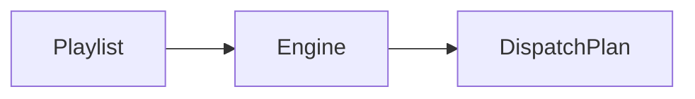

# `playlists` — Playlists

| Campo | Valor |
|-------|-------|
| **Slug** | `playlists` |
| **Modos** | Pro (preset) |
| **Atores** | admin, marketing, técnico |
| **UI** | `/playlists, /totem-playlists` |
| **API** | `/api/playlists, /api/playlist-engine` |
| **Status** | active |
| **Última revisão** | 2026-08-09 |

---

## 1. Visão e escopo

### Propósito
Composição avançada de playlists e associação a totens/campanhas.

### Dentro do escopo
- CRUD playlist
- Itens ordenados
- Engine de geração

### Fora do escopo
- Direct media simples

### Vocabulário
| Termo | Significado |
|-------|-------------|
| playlist_engine | gera fila efectiva por totem |

---

## 2. Requisitos (EARS)

| ID | Tipo | Requisito |
|----|------|-----------|
| REQ-PL-001 | Ubiquitous | Playlist deve manter ordem estável dos itens. |

---

## 3. Regras de negócio

### RN-PL-001 — Ordem

```text
RN-PL-001 — Ordem
Quando: Gerar dispatch
Se: playlist activa
Então: respeitar order dos itens
Excepto: —
Motivo: Previsibilidade
```

---

## 4. Fluxos



---

## 5. Estados

| Estado | Significado | Transições típicas |
|--------|-------------|--------------------|
| active | usada pelo engine | → inactive |

---

## 6. Critérios de aceite

### AC-PL-001 (P0)

```text
DADO playlist com order 1..n
QUANDO gerar plano
ENTÃO sequência reflecte order
```

---

## 7. Dependências e referências

### Módulos relacionados
- [`campaigns`](../campaigns/MODULO.md)
- [`dispatcher`](../dispatcher/MODULO.md)
- [`media-library`](../media-library/MODULO.md)

### Referências
- —
