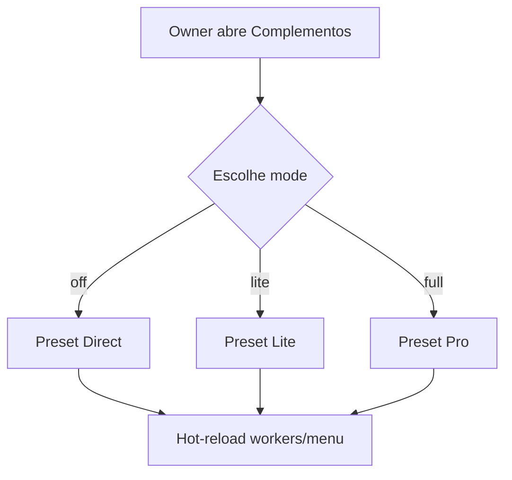

# `product-modes` — Modos de produto

| Campo | Valor |
|-------|-------|
| **Slug** | `product-modes` |
| **Modos** | all |
| **Atores** | owner_system, admin_sql |
| **UI** | `/settings/system-modules` |
| **API** | `PUT /api/installation/multi-agency` |
| **Status** | active |
| **Última revisão** | 2026-08-09 |

---

## 1. Visão e escopo

### Propósito
Define o perfil da instalação: Direct Totem (off), Multi Lite (lite) ou Multi Pro (full), aplicando o preset de módulos.

### Dentro do escopo
- Alternar mode off|lite|full
- Aplicar presets de installation.modules
- Impedir Direct + multi-agência simultâneos

### Fora do escopo
- Apagar dados comerciais (isso é commercial-purge)
- Permissões por utilizador (flag_smart_*)

### Vocabulário
| Termo | Significado |
|-------|-------------|
| mode | off | lite | full |
| Direct Totem | mode=off, UI mínima, uma org |
| Multi Lite | várias orgs + anunciantes sem ERP |
| Multi Pro | agência completa com planos/billing/OTA |

---

## 2. Requisitos (EARS)

| ID | Tipo | Requisito |
|----|------|-----------|
| REQ-MOD-001 | Ubiquitous | A instalação deve estar sempre num único mode válido: off, lite ou full. |
| REQ-MOD-002 | Event-driven | Quando o owner altera o mode, o sistema deve aplicar o preset de módulos correspondente. |
| REQ-MOD-003 | Unwanted | O sistema não deve permitir Direct Totem e multi-agência activos ao mesmo tempo. |
| REQ-MOD-004 | Unwanted | A mudança para mode=off não deve apagar dados comerciais automaticamente. |

---

## 3. Regras de negócio

### RN-MOD-001 — Mutua exclusão Direct/Multi

```text
RN-MOD-001 — Mutua exclusão Direct/Multi
Quando: Owner muda o mode
Se: escolhe off
Então: multi_agency e UI comercial ficam off; direct_totem_mode on
Excepto: —
Motivo: Produto mono vs rede
```

### RN-MOD-002 — OFF sem purge

```text
RN-MOD-002 — OFF sem purge
Quando: Owner escolhe Direct (off)
Se: existem dados Lite/Pro
Então: dados permanecem; purge é acção separada
Excepto: —
Motivo: Segurança operacional
```

### RN-MOD-003 — Só owner/admin_sql

```text
RN-MOD-003 — Só owner/admin_sql
Quando: Utilizador abre Complementos
Se: role ≠ owner_system/admin_sql
Então: menu/API de mode é negado
Excepto: —
Motivo: Governança
```

---

## 4. Fluxos



---

## 5. Estados

| Estado | Significado | Transições típicas |
|--------|-------------|--------------------|
| off | Direct Totem | → lite|full |
| lite | Multi Lite | → off|full |
| full | Multi Pro | → off|lite |

---

## 6. Critérios de aceite

### AC-MOD-001 (P0)

```text
DADO instalação em lite
QUANDO owner muda para off
ENTÃO UI Direct activa e APIs de plans/billing respondem MODULE_DISABLED
```

### AC-MOD-002 (P0)

```text
DADO dados comerciais existentes
QUANDO owner muda para off
ENTÃO nenhuma tabela comercial é apagada
```

---

## 7. Dependências e referências

### Módulos relacionados
- [`system-modules`](../system-modules/MODULO.md)

### Referências
- `docs/manuais/03-MODULOS-E-FORMAS-DE-TRABALHO.md`
- `backend/src/policy/installationModules.ts`
