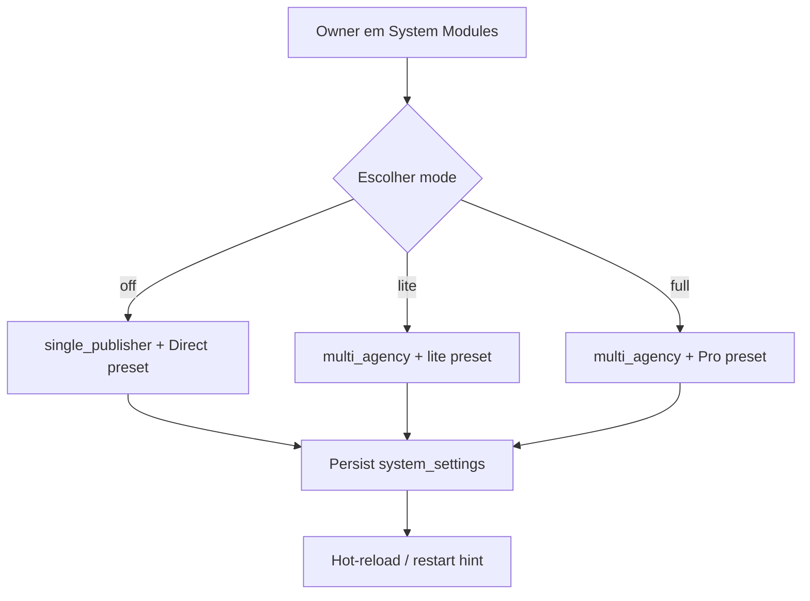

# `product-modes` — Modos de produto

| Campo | Valor |
|-------|-------|
| **Slug** | `product-modes` |
| **Modos** | all (define os outros) |
| **Atores** | owner_system, admin_sql |
| **UI** | `/settings/system-modules` (switch multi-agência) |
| **API** | `PUT /api/installation/multi-agency`, `GET /api/installation/modules` |
| **Status** | active |
| **Profundidade** | L2 |
| **Última revisão** | 2026-08-09 |

---

## 1. Visão e escopo

### Propósito
Master switch do perfil da instalação: **Direct (off)** · **Lite** · **Pro (full)** — sem tabela dedicada; estado em `system_settings`.

### Dentro do escopo
- Alternar `mode: off | lite | full`
- Aplicar presets de módulos (`buildCoreOperationPreset`, lite, full)
- Profile `single_publisher` vs `multi_agency`
- Heal de inconsistências lite

### Fora do escopo
- Toggle fino por módulo (UI partilhada mas regras em `system-modules`)
- Purge comercial (acção separada)
- Feature flags por user (`users-access`)

### Vocabulário
| Termo | Significado |
|-------|-------------|
| mode `off` | Direct / core operation |
| mode `lite` | multi-agência sem billing/plans/OTA/analytics |
| mode `full` | Pro completo |
| profile | `single_publisher` \| `multi_agency` |
| locked module | sempre on (ex.: dispatcher_admin) |

---

## 2. Requisitos (EARS)

| ID | Tipo | Requisito |
|----|------|-----------|
| REQ-MOD-001 | Ubiquitous | A instalação deve expor um único mode efectivo off/lite/full. |
| REQ-MOD-002 | Event-driven | Quando mode=lite\|full, `direct_totem_mode` deve desligar. |
| REQ-MOD-003 | Event-driven | Quando mode=off, aplicar preset core e profile single_publisher. |
| REQ-MOD-004 | Unwanted | Desligar multi-agência não deve apagar dados comerciais. |
| REQ-MOD-005 | State-driven | Enquanto modules locked, devem permanecer enabled. |
| REQ-MOD-006 | Optional | Após mudança, workers podem hot-reload ou pedir restart. |

---

## 3. Regras de negócio

### RN-MOD-001 — Mutua exclusão Direct/Multi

```text
RN-MOD-001 — Mutua exclusão Direct/Multi
Quando: applyMultiAgencyMode lite|full
Se: sempre
Então: direct_totem_mode = false
Excepto: —
Motivo: Menus e gates incompatíveis
```

### RN-MOD-002 — OFF não apaga dados

```text
RN-MOD-002 — OFF não apaga dados
Quando: setMultiAgencyMode(off)
Se: existem subscribers/campanhas
Então: dados permanecem; módulos comerciais ficam disabled
Excepto: purge explícito
Motivo: Reversibilidade operacional
```

### RN-MOD-003 — Presets

```text
RN-MOD-003 — Presets
Quando: mudança de mode
Se: off → core; lite → subset; full → Pro
Então: escrever installation.modules conforme policy
Excepto: locked forçados on
Motivo: Consistência de catálogo
```

### RN-MOD-004 — Só owner/admin_sql

```text
RN-MOD-004 — Só owner/admin_sql
Quando: PUT multi-agency
Se: outro role
Então: 403
Excepto: —
Motivo: Mudança de produto
```

### RN-MOD-005 — Heal lite stale

```text
RN-MOD-005 — Heal lite stale
Quando: GET modules / apply
Se: lite com flags inconsistentes (subscribers/campaigns/devices)
Então: reconciliar preset lite
Excepto: —
Motivo: Evitar instalação a meio-gás
```

### RN-MOD-006 — Locked enforcement

```text
RN-MOD-006 — Locked enforcement
Quando: persistir modules
Se: módulo locked
Então: enabled=true sempre
Excepto: —
Motivo: Núcleo operacional
```

---

## 4. Fluxos



### Fluxos de erro
| ID | Gatilho | Resultado |
|----|---------|-----------|
| FX-MOD-E01 | Role insuficiente | 403 |
| FX-MOD-E02 | Dependências de módulo violadas | validação / heal |

---

## 5. Estados

| Mode | Profile | Direct | Comercial típico |
|------|---------|--------|------------------|
| off | single_publisher | on | off |
| lite | multi_agency | off | parcial |
| full | multi_agency | off | completo |

---

## 6. Critérios de aceite

### AC-MOD-001 (P0)

```text
DADO mode=off
QUANDO abrir app como admin
ENTÃO home Direct (/publish-totem) e menu comercial ausente
```

### AC-MOD-002 (P0)

```text
DADO mode=full
QUANDO PUT multi-agency off
ENTÃO dados comerciais intactos e direct_totem_mode activo
```

### AC-MOD-003 (P0)

```text
DADO mode=lite
QUANDO tentar aceder API billing
ENTÃO MODULE_DISABLED
```

---

## 7. Dependências e referências

### Módulos
- [`system-modules`](../system-modules/MODULO.md)
- [`direct-totem-mode`](../direct-totem-mode/MODULO.md)
- [`commercial-purge`](../commercial-purge/MODULO.md)
- todos os módulos gated

### Código de referência
- `backend/src/policy/installationModules.ts`
- `backend/src/services/installationModulesService.ts`
- `backend/src/routes/installationModules.ts`
- `frontend/src/pages/Settings/SystemModules.tsx`

### Lacunas conhecidas
- Backend `config/directTotemMode.ts` ainda lê **env** `DIRECT_TOTEM_MODE`; frontend usa **capabilities** — possível dessincronia.
- Boolean legado `enabled` mapeia só full/off (sem lite).
