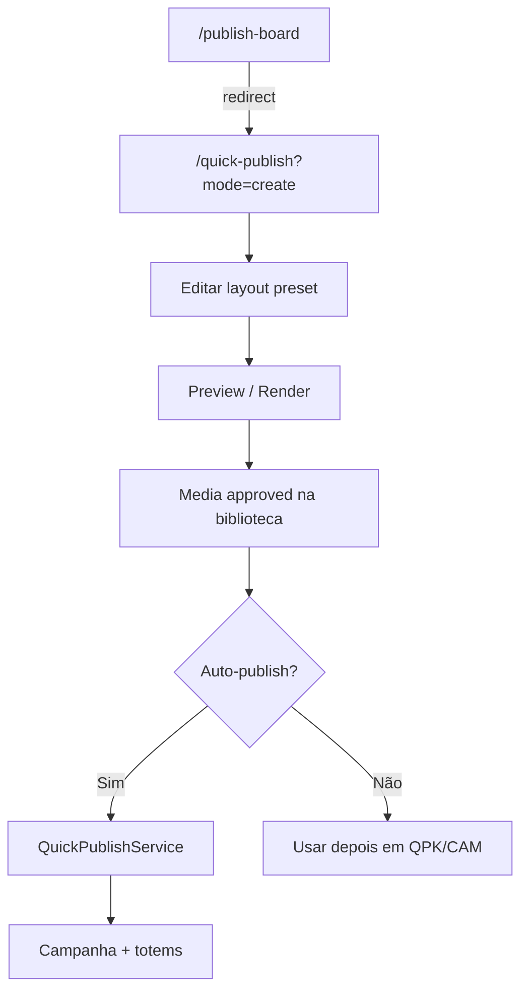
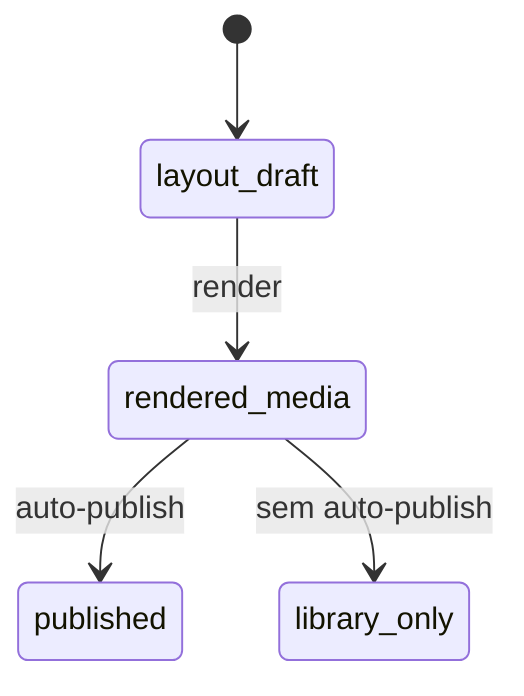

# `publish-board` — Criar conteúdo

| Campo | Valor |
|-------|-------|
| **Slug** | `publish-board` |
| **Modos** | Lite, Pro (API gated por `requireModule('quick_publish')`) |
| **Atores** | admin*, gerente_marketing, editoracao (write layout); read com auth + assert subscriber |
| **UI** | `/publish-board` → redirect para `/quick-publish?mode=create` |
| **API** | `/api/subscribers/:subscriberId/publish-board/*` (+ público `/api/publish-board/public-menu/:subscriberId`) |
| **Status** | active |
| **Profundidade** | L2 |
| **Última revisão** | 2026-08-09 |

---

## 1. Visão e escopo

### Propósito
Editor de layouts/presets por anunciante que gera artefacto (PNG/HTML/vídeo IA) na biblioteca de mídias e, opcionalmente, auto-publica via quick-publish.

### Dentro do escopo
- Layout por `(subscriber_id, preset)` em `publish_board_layouts`
- Preview / render / render-html / suggest-copy
- Queue vídeo IA + status de job
- Auto-publish (orquestra → `QuickPublishService`)
- Menu público (sem auth)

### Fora do escopo
- Reprodução no Player (consome mídia gerada)
- CRUD comercial genérico de campanhas
- Página Studio órfã não registada em rotas

### Vocabulário
| Termo | Significado |
|-------|-------------|
| preset | mesmos 5 do quick-publish (`menu`…`institutional`) |
| layout | JSON/config em `publish_board_layouts` |
| auto-publish | render → mídia approved → quick-publish |
| video AI job | `queued` \| `processing` \| `completed` \| `failed` |

---

## 2. Requisitos (EARS)

| ID | Tipo | Requisito |
|----|------|-----------|
| REQ-PBD-001 | Ubiquitous | O sistema deve persistir layout por anunciante e preset. |
| REQ-PBD-002 | Event-driven | Quando o render conclui, o sistema deve criar mídia na biblioteca com tags `publish-board` e preset, `status`/`approval_status` = `approved`. |
| REQ-PBD-003 | Event-driven | Quando auto-publish é pedido, o sistema deve orquestrar render (e IA quando aplicável) e chamar quick-publish. |
| REQ-PBD-004 | Unwanted | Utilizador sem acesso ao `subscriberId` não deve ler/alterar o board desse anunciante. |
| REQ-PBD-005 | Optional | Onde vídeo IA estiver disponível, o sistema deve enfileirar job e expor status. |
| REQ-PBD-006 | Optional | Onde menu público existir, o sistema deve servir `public-menu` sem autenticação. |

---

## 3. Regras de negócio

### RN-PBD-001 — Ownership do layout

```text
RN-PBD-001 — Ownership do layout
Quando: GET/PUT layout
Se: sempre
Então: chave (subscriber_id, preset) + assertSubscriberParamAccess
Excepto: —
Motivo: Isolamento por anunciante
```

### RN-PBD-002 — Mídia gerada aprovada

```text
RN-PBD-002 — Mídia gerada aprovada
Quando: render / render-html
Se: sucesso
Então: medias com tags publish-board (+ preset, auto-generated/html-live) e approved
Excepto: —
Motivo: Pronto para quick-publish sem aprovação manual
```

### RN-PBD-003 — Auto-publish via QPK

```text
RN-PBD-003 — Auto-publish via QPK
Quando: POST .../auto-publish
Se: layout válido
Então: (IA opcional, tipicamente não em preset menu) → renderToMediaHtml → QuickPublishService.publish
Excepto: —
Motivo: Um fluxo “criar e pôr no ar”
```

### RN-PBD-004 — Módulo partilhado

```text
RN-PBD-004 — Módulo partilhado
Quando: rotas autenticadas do board
Se: instalação
Então: requireModule('quick_publish') — não existe module id publish_board
Excepto: public-menu sem requireModule
Motivo: Mesmo complemento comercial de publicação rápida
```

### RN-PBD-005 — UI redirect

```text
RN-PBD-005 — UI redirect
Quando: navegar a /publish-board
Se: App.tsx
Então: PublishBoardRedirect → /quick-publish?mode=create
Excepto: PublishBoardStudio.tsx existe mas não está registado
Motivo: Uma superfície de criação na prática
```

### RN-PBD-006 — Write roles layout

```text
RN-PBD-006 — Write roles layout
Quando: PUT layout
Se: role ∉ admin|admin_sql|gerente_marketing|editoracao
Então: 403
Excepto: —
Motivo: Controlo editorial
```

---

## 4. Fluxos

### Criar e publicar


### Fluxos de erro
| ID | Gatilho | Resultado |
|----|---------|-----------|
| FX-PBD-E01 | Sem acesso ao subscriber | 403 |
| FX-PBD-E02 | `quick_publish` off | 403 (rotas auth) |
| FX-PBD-E03 | Video AI premiumRequired | job/erro de política |
| FX-PBD-E04 | Auto-publish sem totems elegíveis | falha no QPK a jusante |

---

## 5. Estados

| Campo | Valores canónicos |
|-------|-------------------|
| preset | `menu`, `promotion`, `ad`, `announcement`, `institutional` |
| `preferred_orientation` | `portrait`, `landscape` |
| video AI job | `queued`, `processing`, `completed`, `failed` |
| mídia gerada | `status`/`approval_status` = `approved` |



---

## 6. Critérios de aceite

### AC-PBD-001 (P0)

```text
DADO anunciante A e preset ad
QUANDO PUT layout e POST render
ENTÃO nasce mídia tagged publish-board com approved
```

### AC-PBD-002 (P0)

```text
DADO layout renderizável e totems elegíveis
QUANDO POST auto-publish
ENTÃO QuickPublish cria campanha/playlist e regenera totens
```

### AC-PBD-003 (P0)

```text
DADO utilizador abre /publish-board
QUANDO a rota resolve
ENTÃO URL fica /quick-publish?mode=create
```

### AC-PBD-004 (P1)

```text
DADO GET public-menu/:subscriberId
QUANDO sem token
ENTÃO responde menu público (política de exposição do serviço)
```

---

## 7. Dependências e referências

### Módulos
- [`quick-publish`](../quick-publish/MODULO.md) — auto-publish e UI hospedeira
- [`media-library`](../media-library/MODULO.md) — destino do artefacto
- [`subscribers`](../subscribers/MODULO.md), [`menu-catalog`](../menu-catalog/MODULO.md)
- [`campaigns`](../campaigns/MODULO.md) / [`playlists`](../playlists/MODULO.md) — criados indirectamente

### Código de referência
- `backend/src/routes/publish-board.ts`, `publish-board-public.ts`
- `backend/src/services/publishBoardService.ts`, `publishBoardRenderService.ts`, `publishBoardHtmlRenderService.ts`
- `backend/src/services/publishVideoAiQueueService.ts`, `autoPublishOrchestratorService.ts`
- `frontend/src/pages/QuickPublish/PublishBoardRedirect.tsx`, `QuickPublish.tsx` (`CreatePublishPanel`)
- `database/smartchannel-db-v2-refactored-part6-tables-other.sql` (`publish_board_layouts`)

### Lacunas conhecidas
- Não há `requireModule('publish_board')` — partilha `quick_publish`.
- `/publish-board` é redirect; `PublishBoardStudio.tsx` **@deprecated** (adiado) — canónico = quick-publish create.
- Registo duplicado possível em `registerCompactRoutes` + `registerExtendedApiRoutes`.
- Jobs vídeo IA em `audit_logs`, sem tabela dedicada de jobs.
