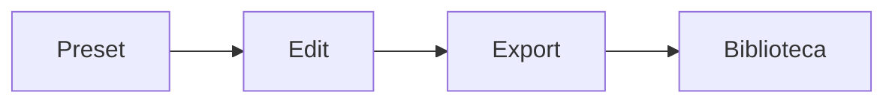

# `publish-board` — Criar conteúdo (publish-board)

| Campo | Valor |
|-------|-------|
| **Slug** | `publish-board` |
| **Modos** | Lite, Pro |
| **Atores** | marketing, admin, anunciante |
| **UI** | `/publish-board, /quick-publish?mode=create` |
| **API** | `/api/publish-board, /api/subscribers/:id/publish-board` |
| **Status** | active |
| **Última revisão** | 2026-08-09 |

---

## 1. Visão e escopo

### Propósito
Editor de layouts/presets (menu, promoção, anúncio) para gerar peças publicáveis.

### Dentro do escopo
- Presets
- Edição por anunciante
- Geração de mídia/artefacto

### Fora do escopo
- Reprodução no Player

### Vocabulário
| Termo | Significado |
|-------|-------------|
| preset | modelo de layout |

---

## 2. Requisitos (EARS)

| ID | Tipo | Requisito |
|----|------|-----------|
| REQ-PB-001 | Ubiquitous | Conteúdo criado deve ficar associado ao anunciante dono. |

---

## 3. Regras de negócio

### RN-PB-001 — Ownership

```text
RN-PB-001 — Ownership
Quando: Guardar board
Se: sempre
Então: subscriber_id obrigatório
Excepto: —
Motivo: Isolamento multi-tenant
```

---

## 4. Fluxos



---

## 5. Estados

| Estado | Significado | Transições típicas |
|--------|-------------|--------------------|
| editing | em edição | → published |
| published | disponível | — |

---

## 6. Critérios de aceite

### AC-PB-001 (P0)

```text
DADO anunciante A
QUANDO criar peça
ENTÃO peça não aparece no contexto do anunciante B
```

---

## 7. Dependências e referências

### Módulos relacionados
- [`subscribers`](../subscribers/MODULO.md)
- [`media-library`](../media-library/MODULO.md)
- [`menu-catalog`](../menu-catalog/MODULO.md)

### Referências
- —
