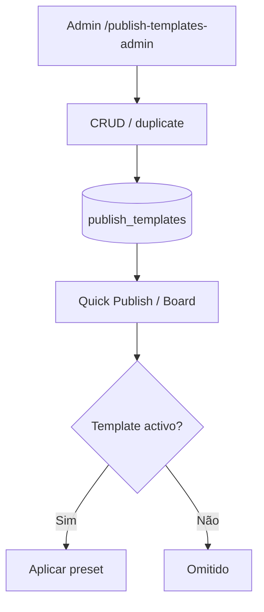

# `publish-templates` — Templates de publicação

| Campo | Valor |
|-------|-------|
| **Slug** | `publish-templates` |
| **Modos** | Lite, Pro |
| **Atores** | owner_system, admin_sql, admin |
| **UI** | `/publish-templates-admin` |
| **API** | `/api/publish-templates` |
| **Status** | active |
| **Profundidade** | L2 |
| **Última revisão** | 2026-08-09 |

---

## 1. Visão e escopo

### Propósito
Administração de templates/presets reutilizáveis no quick-publish e publish-board (menu, promoção, anúncio, etc.).

### Dentro do escopo
- Listar / featured / getById
- Criar, duplicar, actualizar (`PATCH`)
- Flags `featured`, `is_active`, orientação preferida
- Seed inicial de templates

### Fora do escopo
- Conteúdo final do anunciante (peças geradas)
- Gate de módulo próprio (usa `requireModule('quick_publish')`)

### Vocabulário
| Termo | Significado |
|-------|-------------|
| template | registo em `publish_templates` |
| preset | `menu` \| `promotion` \| `ad` \| `announcement` \| `institutional` |
| featured | destacado na UI de criação |
| preferred_orientation | `portrait` \| `landscape` |

---

## 2. Requisitos (EARS)

| ID | Tipo | Requisito |
|----|------|-----------|
| REQ-PT-001 | Ubiquitous | Templates activos devem ser listáveis por editores autorizados. |
| REQ-PT-002 | State-driven | Enquanto `is_active=false`, o template não deve aparecer no fluxo de criação. |
| REQ-PT-003 | Event-driven | Quando duplicate é pedido, o sistema deve criar cópia editável. |
| REQ-PT-004 | Unwanted | O sistema não deve expor templates sem módulo `quick_publish` activo. |
| REQ-PT-005 | Ubiquitous | Preset deve pertencer ao conjunto CHECK do schema. |
| REQ-PT-006 | Optional | Onde `featured=true`, a UI deve privilegiar esses templates. |

---

## 3. Regras de negócio

### RN-PT-001 — Inactivo oculto

```text
RN-PT-001 — Inactivo oculto
Quando: listar para criação
Se: is_active=false
Então: omitir
Excepto: —
Motivo: Controlo editorial
```


### RN-PT-002 — Gate quick_publish

```text
RN-PT-002 — Gate quick_publish
Quando: qualquer rota /api/publish-templates
Se: módulo off
Então: 403 MODULE_DISABLED
Excepto: —
Motivo: Complemento comercial
```


### RN-PT-003 — Preset válido

```text
RN-PT-003 — Preset válido
Quando: POST/PATCH
Se: preset fora do enum
Então: rejeitar
Excepto: —
Motivo: Integridade schema
```


### RN-PT-004 — Duplicate independente

```text
RN-PT-004 — Duplicate independente
Quando: POST :id/duplicate
Se: sucesso
Então: novo id; original intacto
Excepto: —
Motivo: Não partilhar estado
```


### RN-PT-005 — Featured subset

```text
RN-PT-005 — Featured subset
Quando: GET /featured
Se: sempre
Então: só activos destacados
Excepto: —
Motivo: UX de criação
```


---

## 4. Fluxos



---

## 5. Estados

| Campo | Valores |
|-------|---------|
| `is_active` | true / false |
| `featured` | true / false |
| `preset` | `menu`, `promotion`, `ad`, `announcement`, `institutional` |
| `preferred_orientation` | `portrait`, `landscape` |

---

## 6. Critérios de aceite

### AC-PT-001 (P0)

```text
DADO template is_active=false
QUANDO abrir criação quick-publish
ENTÃO template não aparece
```


### AC-PT-002 (P0)

```text
DADO mode/módulo quick_publish off
QUANDO GET /api/publish-templates
ENTÃO 403 MODULE_DISABLED
```


### AC-PT-003 (P0)

```text
DADO template activo
QUANDO POST :id/duplicate
ENTÃO novo registo listável e original inalterado
```


---

## 7. Dependências e referências

### Módulos
- [`quick-publish`](../quick-publish/MODULO.md), [`publish-board`](../publish-board/MODULO.md), [`menu-catalog`](../menu-catalog/MODULO.md)

### Código de referência
- `backend/src/routes/publish-templates.ts`
- `backend/src/services/publishTemplateService.ts`
- `frontend/src/pages/PublishTemplatesAdmin/PublishTemplatesAdmin.tsx`
- `frontend/src/config/publishTemplates.ts`
- `database/smartchannel-db-v2-refactored-part6-tables-other.sql` (`publish_templates`)
- `database/seeds-publish-templates-vx4.sql`

### Lacunas conhecidas
- Não há module flag `publish_templates` — gated por `quick_publish`.
- Config estática FE pode divergir temporariamente da API até refresh.
