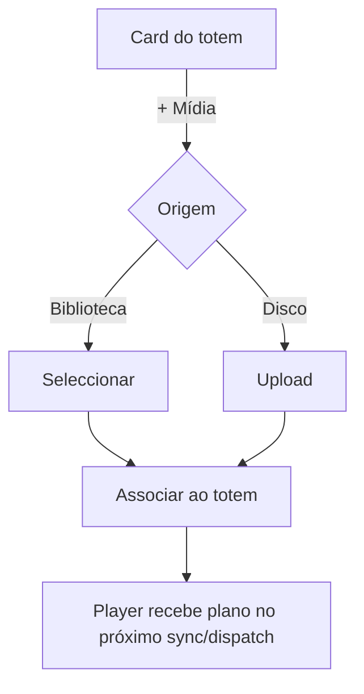
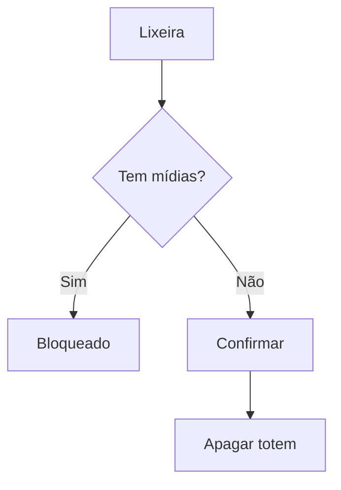

# `publish-totem` — Publicar em Totem

| Campo | Valor |
|-------|-------|
| **Slug** | `publish-totem` |
| **Modos** | Direct (menu principal); API disponível noutros modos |
| **Atores** | owner_system, admin_sql, admin, operator, publisher_user |
| **UI** | `/publish-totem, /publish-totem/:id` |
| **API** | `/api/totems, /api/simple-publish, totem direct media` |
| **Status** | active |
| **Última revisão** | 2026-08-09 |

---

## 1. Visão e escopo

### Propósito
Central operacional Direct: cards de totens, publicação de mídias, telemetria, diagnóstico e atalho a controlo remoto.

### Dentro do escopo
- Listar totens
- Adicionar mídia (biblioteca/upload)
- Ver reprodução e horário
- Diagnóstico ao vivo
- Habilitar/desabilitar/excluir
- Abrir remoto

### Fora do escopo
- Campanhas multi-anunciante
- Quick-publish comercial
- Planos/billing

### Vocabulário
| Termo | Significado |
|-------|-------------|
| UIN/Ativação | identidade do totem no Player |
| Device ID | id canónico UPPERCASE |
| lease de diagnóstico | janela temporária de amostras detalhadas |
| direct media | associação mídia↔totem sem campanha |

---

## 2. Requisitos (EARS)

| ID | Tipo | Requisito |
|----|------|-----------|
| REQ-PUB-001 | Ubiquitous | Cada card deve mostrar estado operacional Online/Offline/Erro/Pendente. |
| REQ-PUB-002 | Event-driven | Quando o rato entra num card habilitado, o painel deve subscrever telemetria desse totem. |
| REQ-PUB-003 | Unwanted | Totem com mídias associadas não pode ser excluído. |
| REQ-PUB-004 | State-driven | Enquanto o totem estiver desabilitado, telemetria e diagnóstico devem ficar inactivos no card. |
| REQ-PUB-005 | Optional | O operador pode iniciar diagnóstico ao vivo por ~120s e expandir métricas. |

---

## 3. Regras de negócio

### RN-PUB-001 — Exclusão só sem mídias

```text
RN-PUB-001 — Exclusão só sem mídias
Quando: Operador clica excluir
Se: media_count_total > 0
Então: lixeira desactivada / exclusão bloqueada
Excepto: —
Motivo: Evitar órfãos
```

### RN-PUB-002 — Desabilitado sem telemetria

```text
RN-PUB-002 — Desabilitado sem telemetria
Quando: Totem isActive=false
Se: sempre
Então: card não inicia hover telemetry nem diagnóstico
Excepto: —
Motivo: Reduzir tráfego e ruído
```

### RN-PUB-003 — UIN de activação

```text
RN-PUB-003 — UIN de activação
Quando: Novo totem criado
Se: sempre
Então: exibe código de activação copiável usado pelo Player
Excepto: —
Motivo: Pareamento
```

### RN-PUB-004 — Diagnóstico opcional

```text
RN-PUB-004 — Diagnóstico opcional
Quando: Operador activa diagnóstico
Se: lease activo
Então: Player envia observation.sample sem alterar a fila
Excepto: —
Motivo: Observabilidade sob pedido
```

### RN-PUB-005 — Device ID canónico

```text
RN-PUB-005 — Device ID canónico
Quando: Qualquer tratamento de deviceId
Se: sempre
Então: valor TRIM + UPPER
Excepto: —
Motivo: Evitar mismatch case-sensitive
```

---

## 4. Fluxos

### Publicar mídia

### Excluir


---

## 5. Estados

| Estado | Significado | Transições típicas |
|--------|-------------|--------------------|
| Online | heartbeat recente | → Offline/Erro |
| Offline | sem presença | → Online |
| Desabilitado | isActive=false | → Habilitado |
| playing/idle/display_off/error | estado de reprodução no card | via telemetria |

---

## 6. Critérios de aceite

### AC-PUB-001 (P0)

```text
DADO totem online habilitado com mídia
QUANDO passar rato no card
ENTÃO mostra playing ou idle e chip de tempo real/fallback
```

### AC-PUB-002 (P0)

```text
DADO totem com 3 mídias
QUANDO tentar excluir
ENTÃO acção bloqueada
```

### AC-PUB-003 (P0)

```text
DADO diagnóstico activo com amostra
QUANDO clicar Exibir métricas
ENTÃO painel mostra ExoPlayer/saúde/dispositivo
```

---

## 7. Dependências e referências

### Módulos relacionados
- [`media-library`](../media-library/MODULO.md)
- [`totems`](../totems/MODULO.md)
- [`telemetry-heartbeat`](../telemetry-heartbeat/MODULO.md)
- [`remote-control`](../remote-control/MODULO.md)
- [`player-ad`](../player-ad/MODULO.md)

### Referências
- `docs/manuais/07-MANUAL-PUBLICAR-EM-TOTEM.md`
- `frontend/src/pages/PublishTotem/PublishTotem.tsx`
