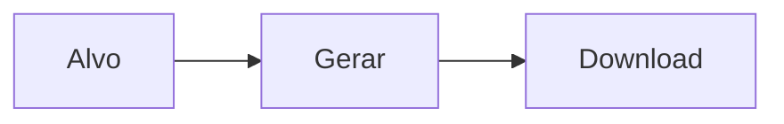

# `qr-codes` — QR-Codes

| Campo | Valor |
|-------|-------|
| **Slug** | `qr-codes` |
| **Modos** | Lite, Pro |
| **Atores** | admin |
| **UI** | `/qr-codes` |
| **API** | `/api/qrcodes, /api/qr-codes` |
| **Status** | active |
| **Última revisão** | 2026-08-09 |

---

## 1. Visão e escopo

### Propósito
Geração e gestão de QR codes ligados a campanhas/conteúdo.

### Dentro do escopo
- Gerar
- Listar
- Download

### Fora do escopo
- Pagamentos

### Vocabulário
| Termo | Significado |
|-------|-------------|
| qr | código QR |

---

## 2. Requisitos (EARS)

| ID | Tipo | Requisito |
|----|------|-----------|
| REQ-QR-001 | Ubiquitous | QR gerado deve manter URL/alvo estável. |

---

## 3. Regras de negócio

### RN-QR-001 — Alvo válido

```text
RN-QR-001 — Alvo válido
Quando: gerar QR
Se: alvo inválido
Então: rejeitar
Excepto: —
Motivo: Evitar links quebrados
```

---

## 4. Fluxos



---

## 5. Estados

| Estado | Significado | Transições típicas |
|--------|-------------|--------------------|
| active | válido | → revoked |

---

## 6. Critérios de aceite

### AC-QR-001 (P0)

```text
DADO alvo válido
QUANDO gerar
ENTÃO ficheiro/imagem disponível
```

---

## 7. Dependências e referências

### Módulos relacionados
- [`campaigns`](../campaigns/MODULO.md)

### Referências
- —
