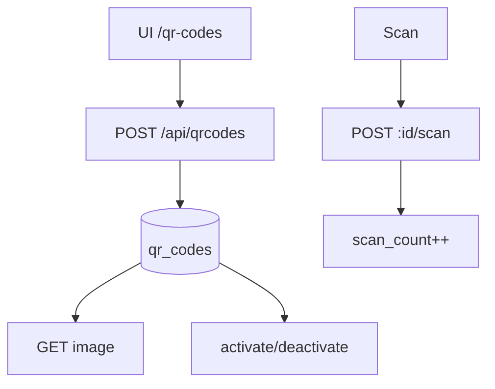

# `qr-codes` — QR-Codes

| Campo | Valor |
|-------|-------|
| **Slug** | `qr-codes` |
| **Modos** | Lite, Pro |
| **Atores** | admin |
| **UI** | `/qr-codes` |
| **API** | `/api/qrcodes (alias /api/qr-codes)` |
| **Status** | active |
| **Profundidade** | L2 |
| **Última revisão** | 2026-08-09 |

---

## 1. Visão e escopo

### Propósito
Geração e gestão de QR codes (url/text/wifi/…) com imagem, activate/deactivate, stats de scan e short links.

### Dentro do escopo
- CRUD + stats + scans + image
- Activate/deactivate (`is_active`)
- Alias de rota `/api/qr-codes`

### Fora do escopo
- Pagamentos
- Tabela de histórico de scans (ver lacunas)

### Vocabulário
| Termo | Significado |
|-------|-------------|
| qr_type | `url` \| `text` \| `wifi` \| `contact` \| `sms` \| `email` \| `phone` |
| ECL | `L` \| `M` \| `Q` \| `H` |
| is_active | activo / inactivo (não há status `revoked`) |

---

## 2. Requisitos (EARS)

| ID | Tipo | Requisito |
|----|------|-----------|
| REQ-QR-001 | Ubiquitous | QR gerado deve manter payload/alvo estável. |
| REQ-QR-002 | Unwanted | Alvo/tipo inválido deve ser rejeitado. |
| REQ-QR-003 | Event-driven | Quando deactivate, `is_active=false`. |
| REQ-QR-004 | Event-driven | Quando scan é registado, incrementar `scan_count` / `last_scan_at`. |
| REQ-QR-005 | Ubiquitous | GET image devolve representação visual. |
| REQ-QR-006 | Optional | Listagens por client/totem filtram pelo id. |

---

## 3. Regras de negócio

### RN-QR-001 — Alvo válido

```text
RN-QR-001 — Alvo válido
Quando: gerar QR
Se: payload inválido
Então: rejeitar
Excepto: —
Motivo: Evitar links quebrados
```


### RN-QR-002 — Soft revoke

```text
RN-QR-002 — Soft revoke
Quando: deactivate
Se: sempre
Então: is_active=false (sem coluna revoked)
Excepto: —
Motivo: Schema
```


### RN-QR-003 — Alias API

```text
RN-QR-003 — Alias API
Quando: cliente FE
Se: sempre
Então: pode usar /api/qr-codes
Excepto: —
Motivo: Compat
```


### RN-QR-004 — Type CHECK

```text
RN-QR-004 — Type CHECK
Quando: POST
Se: qr_type fora do enum
Então: rejeitar
Excepto: —
Motivo: Schema
```


### RN-QR-005 — Scans stub

```text
RN-QR-005 — Scans stub
Quando: GET :id/scans
Se: sem tabela qr_code_scans
Então: lista vazia/limitada
Excepto: —
Motivo: Lacuna DDL
```


---

## 4. Fluxos



---

## 5. Estados

| Campo | Valores |
|-------|---------|
| `is_active` | true / false |
| `qr_type` | url, text, wifi, contact, sms, email, phone |
| `error_correction_level` | L, M, Q, H |

---

## 6. Critérios de aceite

### AC-QR-001 (P0)

```text
DADO alvo url válido
QUANDO gerar QR
ENTÃO imagem disponível via GET image
```


### AC-QR-002 (P0)

```text
DADO QR activo
QUANDO POST deactivate
ENTÃO is_active=false
```


### AC-QR-003 (P0)

```text
DADO tipo inválido
QUANDO POST create
ENTÃO rejeitado
```


---

## 7. Dependências e referências

### Módulos
- [`campaigns`](../campaigns/MODULO.md), [`subscribers`](../subscribers/MODULO.md), [`tags`](../tags/MODULO.md)

### Código de referência
- `backend/src/routes/qrcodes.ts`
- `backend/src/services/qrcodeService.ts`
- `frontend/src/pages/QRCodes/QRCodes.tsx`
- schema part6 `qr_codes`, `short_links`

### Lacunas conhecidas
- Serviço comenta TODO: tabela `qr_code_scans` **não existe** no schema v2 — histórico de scans incompleto.
