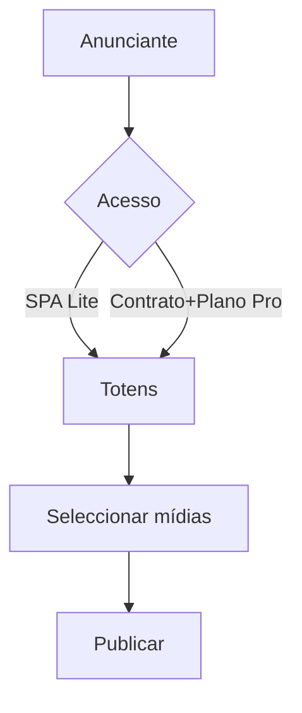

# `quick-publish` — Publicar em tela (quick-publish)

| Campo | Valor |
|-------|-------|
| **Slug** | `quick-publish` |
| **Modos** | Lite, Pro |
| **Atores** | admin, marketing, subscriber_user, comercial |
| **UI** | `/quick-publish` |
| **API** | `/api/quick-publish` |
| **Status** | active |
| **Última revisão** | 2026-08-09 |

---

## 1. Visão e escopo

### Propósito
Atalho comercial para publicar mídias de anunciante em totens elegíveis sem fluxo completo de campanha.

### Dentro do escopo
- Seleccionar anunciante
- Totens elegíveis
- Publicar

### Fora do escopo
- Editor de layout avançado (publish-board)
- Contratos no Lite

### Vocabulário
| Termo | Significado |
|-------|-------------|
| elegibilidade | totem alcançável via SPA ou plano/contrato |

---

## 2. Requisitos (EARS)

| ID | Tipo | Requisito |
|----|------|-----------|
| REQ-QP-001 | Ubiquitous | Só totens elegíveis para o anunciante podem ser alvo. |
| REQ-QP-002 | State-driven | No Lite a elegibilidade vem de SPA; no Pro também de contrato/plano. |

---

## 3. Regras de negócio

### RN-QP-001 — Sem SPA/plano

```text
RN-QP-001 — Sem SPA/plano
Quando: Anunciante sem acesso
Se: lista de totens
Então: lista vazia
Excepto: —
Motivo: Sem autorização comercial
```

### RN-QP-002 — Lite sem contrato obrigatório

```text
RN-QP-002 — Lite sem contrato obrigatório
Quando: mode=lite
Se: quick-publish
Então: contrato opcional
Excepto: —
Motivo: Ciclo curto Lite
```

---

## 4. Fluxos



---

## 5. Estados

| Estado | Significado | Transições típicas |
|--------|-------------|--------------------|
| rascunho | selecção | → publicado |
| publicado | conteúdo em fila/campanha | — |

---

## 6. Critérios de aceite

### AC-QP-001 (P0)

```text
DADO anunciante sem SPA no Lite
QUANDO abrir quick-publish
ENTÃO nenhum totem elegível
```

---

## 7. Dependências e referências

### Módulos relacionados
- [`subscribers`](../subscribers/MODULO.md)
- [`subscriber-publisher-access`](../subscriber-publisher-access/MODULO.md)
- [`plans`](../plans/MODULO.md)
- [`contracts`](../contracts/MODULO.md)
- [`media-library`](../media-library/MODULO.md)

### Referências
- `docs/manuais/02-GUIA-PRIMEIRA-VEZ-UTILIZADOR.md`
