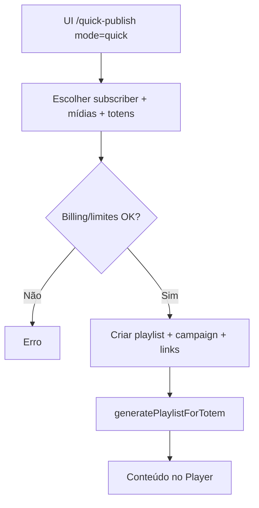
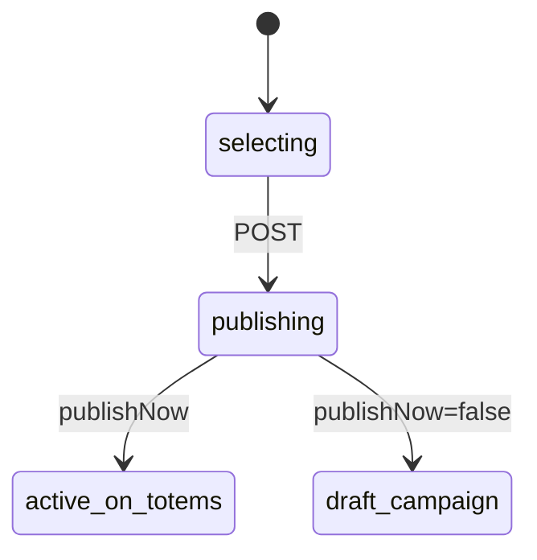

# `quick-publish` — Publicar em tela

| Campo | Valor |
|-------|-------|
| **Slug** | `quick-publish` |
| **Modos** | Lite, Pro (`requireModule('quick_publish')`) |
| **Atores** | admin*, owner_system, gerente_marketing, editoracao (API); UI também `subscriber_user` |
| **UI** | `/quick-publish` (modos `quick` \| `create`) |
| **API** | `POST /api/quick-publish` |
| **Status** | active |
| **Profundidade** | L2 |
| **Última revisão** | 2026-08-09 |

---

## 1. Visão e escopo

### Propósito
Atalho operacional: a partir de mídias já aprovadas, criar playlist + campanha + vínculos a publishers/totems e regenerar a playlist do totem.

### Dentro do escopo
- Publicação rápida (`publishNow`, presets, duração)
- Selecção de anunciante, totens (contrato **ou** SPA) e mídias aprovadas
- Guards de billing e limites de plano (`playlist` / `campaign`)
- Metadata `source: 'quick_publish'`

### Fora do escopo
- Editor de layout / render (modo `create` = superfície `publish-board`)
- CRUD genérico de campanhas/playlists (módulos próprios)
- Direct Totem Mode

### Vocabulário
| Termo | Significado |
|-------|-------------|
| quick-publish | orquestração atómica playlist+campaign+links |
| preset | `menu` \| `promotion` \| `ad` \| `announcement` \| `institutional` |
| `accessMode` | `contract_plan` \| `subscriber_publisher_access` |
| `publishNow` | default true — activa/publica de imediato |
| modo UI `create` | board embutido (não é o POST quick-publish) |

---

## 2. Requisitos (EARS)

| ID | Tipo | Requisito |
|----|------|-----------|
| REQ-QPK-001 | Ubiquitous | A publicação rápida deve criar playlist, itens, campanha e vínculos a totems/publishers no mesmo fluxo. |
| REQ-QPK-002 | Event-driven | Quando `publishNow` (default), o sistema deve deixar a campanha operacional e regenerar playlist dos totens. |
| REQ-QPK-003 | Ubiquitous | Só mídias activas do mesmo subscriber com `status` e `approval_status` = `approved` devem ser aceites. |
| REQ-QPK-004 | Unwanted | O sistema não deve publicar se billing/limites de plano bloquearem o anunciante. |
| REQ-QPK-005 | State-driven | Enquanto não houver totems elegíveis (contrato ou SPA), a publicação não deve completar com delivery. |
| REQ-QPK-006 | Optional | Onde `contractId` for omitido, o sistema deve resolver totens via SPA (`getTotemsBySubscriber`). |

---

## 3. Regras de negócio

### RN-QPK-001 — Mídias aprovadas

```text
RN-QPK-001 — Mídias aprovadas
Quando: POST /api/quick-publish
Se: mídia inactiva ou status/approval ≠ approved ou outro subscriber
Então: rejeitar
Excepto: —
Motivo: Só conteúdo pronto para ecrã
```

### RN-QPK-002 — Totens por contrato ou SPA

```text
RN-QPK-002 — Totens por contrato ou SPA
Quando: resolver alvos
Se: contractId → contrato active + totens do contrato; senão → SPA
Então: gravar campaign_totems / publishers e accessMode em metadata
Excepto: —
Motivo: Lite (SPA) vs Pro (plano/contrato)
```

### RN-QPK-003 — Billing e limites

```text
RN-QPK-003 — Billing e limites
Quando: antes do commit de criação
Se: assertSubscriberCanPublish ou limites playlist/campaign falham
Então: abortar
Excepto: —
Motivo: Enforcement comercial
```

### RN-QPK-004 — Artefactos criados

```text
RN-QPK-004 — Artefactos criados
Quando: publish bem-sucedido
Se: sempre
Então: playlists + playlist_items + campaigns + campaign_playlists + campaign_publishers + campaign_totems; audit action=quick_publish
Excepto: —
Motivo: Rastreabilidade e reutilização nos módulos CAM/PLS
```

### RN-QPK-005 — Regeneração de totem

```text
RN-QPK-005 — Regeneração de totem
Quando: após commit
Se: publishNow
Então: playlistEngine.generatePlaylistForTotem por totem (parcial permitido)
Excepto: falha parcial de regeneração pode não reverter o commit (lacuna operacional)
Motivo: Player recebe fila actualizada
```

### RN-QPK-006 — Roles API vs UI

```text
RN-QPK-006 — Roles API vs UI
Quando: POST
Se: role ∉ admin|admin_sql|owner_system|gerente_marketing|editoracao
Então: 403 na API
Excepto: UI lista subscriber_user — pode falhar no POST
Motivo: Controlo editorial no backend
```

---

## 4. Fluxos

### Publicar agora


### Fluxos de erro
| ID | Gatilho | Resultado |
|----|---------|-----------|
| FX-QPK-E01 | Mídia não aprovada | 4xx |
| FX-QPK-E02 | Sem totems elegíveis | 4xx |
| FX-QPK-E03 | Billing/limites | 4xx |
| FX-QPK-E04 | Role não autorizada na API | 403 |
| FX-QPK-E05 | Módulo `quick_publish` off | 403 |

---

## 5. Estados

| Campo / conceito | Valores canónicos |
|------------------|-------------------|
| preset | `menu`, `promotion`, `ad`, `announcement`, `institutional` |
| category_segment | `cardapio`, `promocao`, `anuncio`, `comunicado`, `institucional` |
| campaign criada | `status` `active` \| `draft`; `campaign_type=general`; `commercial_tier=standard` |
| UI mode | `quick` \| `create` |
| duração item | default 10000 ms (clamp 1000–300000) |



---

## 6. Critérios de aceite

### AC-QPK-001 (P0)

```text
DADO subscriber com mídias approved e totems via SPA/contrato
QUANDO POST /api/quick-publish com publishNow
ENTÃO nascem playlist+campanha activas e os totems regeneram fila
```

### AC-QPK-002 (P0)

```text
DADO mídia com approval_status=pending
QUANDO quick-publish
ENTÃO operação rejeitada sem criar campanha útil
```

### AC-QPK-003 (P0)

```text
DADO instalação sem módulo quick_publish
QUANDO POST /api/quick-publish
ENTÃO 403 requireModule
```

### AC-QPK-004 (P1)

```text
DADO role subscriber_user na UI
QUANDO POST (se não estiver nas roles API)
ENTÃO 403 — alinhar UI/API
```

---

## 7. Dependências e referências

### Módulos
- [`publish-board`](../publish-board/MODULO.md) — modo `create` / auto-publish chama este serviço
- [`campaigns`](../campaigns/MODULO.md), [`playlists`](../playlists/MODULO.md), [`media-library`](../media-library/MODULO.md)
- [`subscribers`](../subscribers/MODULO.md), [`subscriber-publisher-access`](../subscriber-publisher-access/MODULO.md)
- [`dispatcher`](../dispatcher/MODULO.md) / playlist engine

### Código de referência
- `backend/src/routes/quick-publish.ts`
- `backend/src/services/quickPublishService.ts`
- `backend/src/services/autoPublishOrchestratorService.ts`
- `frontend/src/pages/QuickPublish/QuickPublish.tsx`
- `frontend/src/utils/installationModuleAccess.ts` → `quick_publish`

### Lacunas conhecidas
- Sem tabela própria — tudo em entidades CAM/PLS.
- UI `subscriber_user` pode não coincidir com `authorizeRole` do POST.
- Regeneração por totem após commit: falha parcial vs rollback merece atenção operacional.
- Aba **Criar** na mesma página é domínio publish-board, não deste POST.
