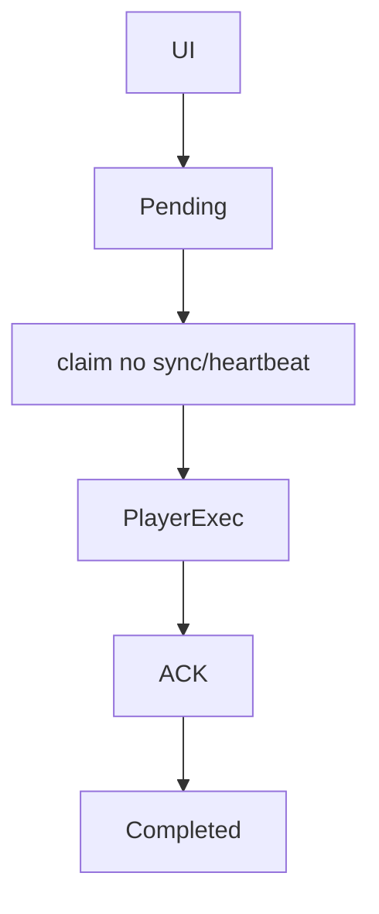

# `remote-control` — Controlo remoto

| Campo | Valor |
|-------|-------|
| **Slug** | `remote-control` |
| **Modos** | all |
| **Atores** | admin, técnico, operadores em Publicar |
| **UI** | `TotemRemoteControl em /publish-totem` |
| **API** | `POST /api/totems/:id/commands*; /api/player/command-result; pendingCommands no sync` |
| **Status** | active |
| **Última revisão** | 2026-08-09 |

---

## 1. Visão e escopo

### Propósito
Enfileirar e entregar comandos ao Player (restart, sync, screenshot, orientação, cache, display force).

### Dentro do escopo
- Criar comando
- Histórico
- Screenshots
- Entrega híbrida sync+heartbeat

### Fora do escopo
- SSH no aparelho

### Vocabulário
| Termo | Significado |
|-------|-------------|
| pending | à entrega |
| sent | entregue à espera de ACK |
| lease | janela de reentrega só para idempotentes |

---

## 2. Requisitos (EARS)

| ID | Tipo | Requisito |
|----|------|-----------|
| REQ-RMT-001 | Ubiquitous | Comandos devem ser entregues pelo sync de eventos quando houver tráfego; heartbeat é fallback. |
| REQ-RMT-002 | Unwanted | Comandos destrutivos (reboot/restart/config/purge/invalidate/screenshot) não devem ser reentregues automaticamente. |
| REQ-RMT-003 | Event-driven | Quando o Player confirma completed/failed, o comando deixa de ser elegível. |

---

## 3. Regras de negócio

### RN-RMT-001 — Idempotentes reentregáveis

```text
RN-RMT-001 — Idempotentes reentregáveis
Quando: sent sem ACK >60s
Se: tipo sync/display_force/ping
Então: até 3 reentregas
Excepto: —
Motivo: Fiabilidade sem efeito colateral
```

### RN-RMT-002 — Destrutivos one-shot

```text
RN-RMT-002 — Destrutivos one-shot
Quando: sent sem ACK
Se: reboot/restart/…
Então: não reclamar de novo
Excepto: —
Motivo: Evitar loop de reset
```

### RN-RMT-003 — Duplicata no Player

```text
RN-RMT-003 — Duplicata no Player
Quando: mesmo id já processado
Se: sempre
Então: ACK completed duplicate sem reexecutar
Excepto: —
Motivo: At-most-once
```

---

## 4. Fluxos



---

## 5. Estados

| Estado | Significado | Transições típicas |
|--------|-------------|--------------------|
| pending | na fila | → sent |
| sent | entregue | → completed/failed/timeout |
| completed | fim | — |
| failed | fim com erro | — |

---

## 6. Critérios de aceite

### AC-RMT-001 (P0)

```text
DADO comando sync_now pending
QUANDO player faz sync de eventos
ENTÃO recebe pendingCommands
```

### AC-RMT-002 (P0)

```text
DADO reboot sent sem ACK
QUANDO próximo claim
ENTÃO reboot não volta à fila automaticamente
```

---

## 7. Dependências e referências

### Módulos relacionados
- [`player-ad`](../player-ad/MODULO.md)
- [`telemetry-heartbeat`](../telemetry-heartbeat/MODULO.md)
- [`totems`](../totems/MODULO.md)

### Referências
- `docs/IMPLEMENTACAO_CONTROLE_REMOTO_P1.md`
- `docs/HISTORICO-TECNICO-2026-08-08.md`
