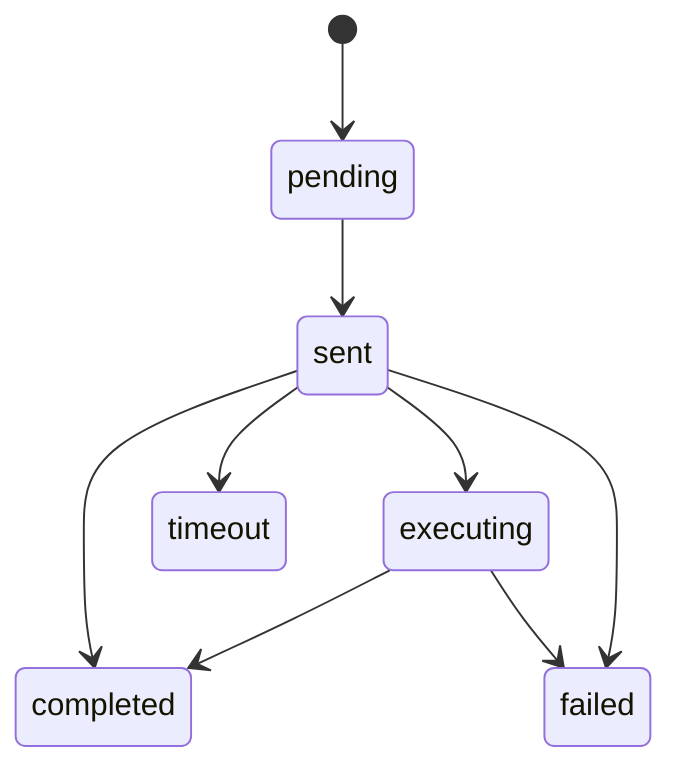

# `remote-control` — Controlo remoto

| Campo | Valor |
|-------|-------|
| **Slug** | `remote-control` |
| **Modos** | all |
| **Atores** | admin*; Player executa |
| **UI** | `TotemRemoteControl` em `/totems`, `/publish-totem` |
| **API** | `POST/GET /api/totems/:id/commands`, restart/screenshot/logs; Player: sync/HB + `/command-result` |
| **Status** | active |
| **Profundidade** | L2 |
| **Última revisão** | 2026-08-09 |

---

## 1. Visão e escopo

### Propósito
Enfileirar e entregar comandos ao Player (híbrido sync+heartbeat), com reentrega só de idempotentes e destrutivos at-most-once.

### Dentro do escopo
- Criar comandos (type + data)
- Histórico e status
- Restart / reboot / screenshot / sync / cache / display / config / logs
- Claim/pending delivery
- Retenção e prune screenshots

### Fora do escopo
- UI de diagnóstico de métricas (telemetria)
- Política OTA
- WebSocket dedicado de comando (futuro ADR)

### Vocabulário
| Termo | Significado |
|-------|-------------|
| pendingCommands | lote entregue em HB/sync |
| idempotente | refresh_dispatch, sync_now, content_version_check, display_force_*, ping |
| destrutivo / one-shot | reboot, restart*, purge, invalidate*, screenshot, config |
| claim | SELECT…FOR UPDATE que marca `sent` |

---

## 2. Requisitos (EARS)

| ID | Tipo | Requisito |
|----|------|-----------|
| REQ-RMT-001 | Event-driven | Quando o admin cria comando, o sistema deve persistir `remote_commands` pending. |
| REQ-RMT-002 | Ubiquitous | A entrega deve ser híbrida (sync rápido + heartbeat fallback). |
| REQ-RMT-003 | Unwanted | Tipos destrutivos não devem ser reentregues automaticamente. |
| REQ-RMT-004 | State-driven | Enquanto comando idempotente em `sent` >60s e retry&lt;3, pode ser reclamado. |
| REQ-RMT-005 | Event-driven | Quando o Player conclui, deve ACK via `/command-result` com HTTP 2xx. |
| REQ-RMT-006 | Unwanted | Totem `is_active=false` não deve aceitar novos comandos. |

---

## 3. Regras de negócio

### RN-RMT-001 — Entrega híbrida

```text
RN-RMT-001 — Entrega híbrida
Quando: Player faz sync ou heartbeat
Se: há pending claimáveis
Então: incluir pendingCommands na resposta
Excepto: —
Motivo: Baixa latência (sync) + resiliência (HB)
```

### RN-RMT-002 — Só idempotentes reentregáveis

```text
RN-RMT-002 — Só idempotentes reentregáveis
Quando: claimPendingCommands
Se: status=sent antigo
Então: reentregar APENAS tipos idempotentes (lista fechada)
Excepto: pending novos (primeira entrega)
Motivo: Evitar reboot loop
```

### RN-RMT-003 — Destrutivos one-shot (servidor)

```text
RN-RMT-003 — Destrutivos one-shot (servidor)
Quando: OR de reentrega
Se: tipo reboot/restart/purge/invalidate/screenshot/config
Então: NÃO incluir
Excepto: —
Motivo: At-most-once servidor
```

### RN-RMT-004 — At-most-once (player)

```text
RN-RMT-004 — At-most-once (player)
Quando: processar destrutivo
Se: sempre
Então: recibo em disco antes do efeito
Excepto: —
Motivo: Complementa RN-RMT-003
```

### RN-RMT-005 — ACK 2xx

```text
RN-RMT-005 — ACK 2xx
Quando: command-result
Se: HTTP não 2xx
Então: Player não deve assumir ACK consumido
Excepto: —
Motivo: Evitar perda silenciosa
```

### RN-RMT-006 — Totem inactivo

```text
RN-RMT-006 — Totem inactivo
Quando: createCommand
Se: !is_active
Então: falha
Excepto: —
Motivo: Não operar ecrã desabilitado
```

### RN-RMT-007 — Retenção

```text
RN-RMT-007 — Retenção
Quando: cleanup
Se: comandos terminal >30d; screenshots excesso
Então: apagar / prune (ex.: 20/totem)
Excepto: —
Motivo: Storage
```

---

## 4. Fluxos

```mermaid
flowchart TD
  A[Admin: POST command] --> B[remote_commands pending]
  B --> C{Player sync ou HB}
  C --> D[claim → sent]
  D --> E[pendingCommands no payload]
  E --> F[Player processa]
  F --> G[POST command-result]
  G --> H[completed|failed]
```

### Fluxos de erro
| ID | Gatilho | Resultado |
|----|---------|-----------|
| FX-RMT-E01 | Totem inactivo | create falha |
| FX-RMT-E02 | Timeout sem ACK | status timeout |
| FX-RMT-E03 | Reboot reaparece | servidor não reclama; player duplicate ACK |

---

## 5. Estados



CHECK: `pending|sent|executing|completed|failed|timeout`

**Nota:** path legado que escreve `executed` está fora do CHECK — dívida a limpar.

---

## 6. Critérios de aceite

### AC-RMT-001 (P0)

```text
DADO sync_now pending
QUANDO Player faz sync
ENTÃO recebe comando e pode ACK completed
```

### AC-RMT-002 (P0)

```text
DADO reboot já sent
QUANDO claim após 60s
ENTÃO reboot NÃO é reentregue
```

### AC-RMT-003 (P0)

```text
DADO totem is_active=false
QUANDO POST commands
ENTÃO rejeitado
```

### AC-RMT-004 (P1)

```text
DADO refresh_dispatch sent há >60s retry&lt;3
QUANDO claim
ENTÃO pode reentregar
```

---

## 7. Dependências e referências

### Módulos
- [`player-ad`](../player-ad/MODULO.md), [`totems`](../totems/MODULO.md)
- [`telemetry-heartbeat`](../telemetry-heartbeat/MODULO.md), [`publish-totem`](../publish-totem/MODULO.md)

### Código de referência
- `backend/src/services/remoteCommandService.ts`
- `backend/src/__tests__/unit/services/remoteCommandService.test.ts`
- `backend/src/routes/totems.ts` (REMOTE CONTROL)
- `backend/src/routes/player.ts`
- `frontend/src/components/TotemRemoteControl/TotemRemoteControl.tsx`
- schema part6 `remote_commands`, `remote_screenshots`
- ADR-0003

### Lacunas conhecidas
- “Lease” de reentrega na doc antiga = condição SQL em `sent`, não tabela.
- ~~Status legado `executed` em path HB~~ — **resolvido** (ACK → `completed`).
- Sync pode embutir command results além de `/command-result`.
