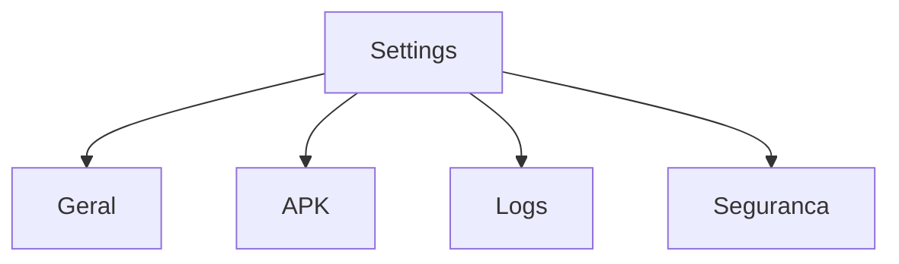

# `settings` — Configurações

| Campo | Valor |
|-------|-------|
| **Slug** | `settings` |
| **Modos** | all |
| **Atores** | owner/admin/operator; subset publisher/subscriber |
| **UI** | `/settings` |
| **API** | `/api/settings, /api/logs, /api/player-apk` |
| **Status** | active |
| **Última revisão** | 2026-08-09 |

---

## 1. Visão e escopo

### Propósito
Definições gerais, logs, APK, 2FA/senha; financeiro só fora do Direct.

### Dentro do escopo
- Abas gerais
- APK
- Logs
- Segurança

### Fora do escopo
- Complementos (página própria)

### Vocabulário
| Termo | Significado |
|-------|-------------|
| aba APK | central de download Player-AD |

---

## 2. Requisitos (EARS)

| ID | Tipo | Requisito |
|----|------|-----------|
| REQ-SET-001 | Ubiquitous | Settings deve expor a aba APK após Geral. |
| REQ-SET-002 | State-driven | Aba Financeiro oculta em Direct. |

---

## 3. Regras de negócio

### RN-SET-001 — APK por papel

```text
RN-SET-001 — APK por papel
Quando: download APK
Se: role não autorizada
Então: bloqueado
Excepto: —
Motivo: Controlo de distribuição
```

### RN-SET-002 — Financeiro Pro

```text
RN-SET-002 — Financeiro Pro
Quando: mode off
Se: Settings
Então: sem Financeiro
Excepto: —
Motivo: Preset
```

---

## 4. Fluxos



---

## 5. Estados

| Estado | Significado | Transições típicas |
|--------|-------------|--------------------|
| ok | config carregada | — |

---

## 6. Critérios de aceite

### AC-SET-001 (P0)

```text
DADO mode off
QUANDO abrir Settings
ENTÃO há APK; não há Financeiro
```

---

## 7. Dependências e referências

### Módulos relacionados
- [`player-apk-settings`](../player-apk-settings/MODULO.md)
- [`auth-security`](../auth-security/MODULO.md)
- [`billing`](../billing/MODULO.md)

### Referências
- `docs/instalacao/04-PLAYER-AD.md`
