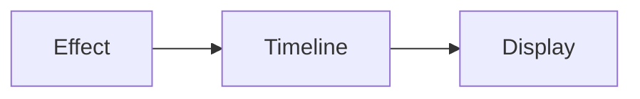

# `smart-display-fx` — SmartDisplayFX

| Campo | Valor |
|-------|-------|
| **Slug** | `smart-display-fx` |
| **Modos** | Lite/Pro opcional |
| **Atores** | admin |
| **UI** | `/smartdisplayfx` |
| **API** | `/api/smartdisplayfx/*` |
| **Status** | active |
| **Última revisão** | 2026-08-09 |

---

## 1. Visão e escopo

### Propósito
Efeitos visuais, regras, timelines e telemetria FX (complemento avançado).

### Dentro do escopo
- Effects
- Rules
- Timelines
- Sites

### Fora do escopo
- Núcleo Direct obrigatório

### Vocabulário
| Termo | Significado |
|-------|-------------|
| FX rule | regra visual |

---

## 2. Requisitos (EARS)

| ID | Tipo | Requisito |
|----|------|-----------|
| REQ-SFX-001 | Optional | Pode ser activado fora do master switch. |

---

## 3. Regras de negócio

### RN-SFX-001 — Não bloqueia publish core

```text
RN-SFX-001 — Não bloqueia publish core
Quando: FX off
Se: publicar mídia Direct
Então: continua possível
Excepto: —
Motivo: Desacoplamento
```

---

## 4. Fluxos



---

## 5. Estados

| Estado | Significado | Transições típicas |
|--------|-------------|--------------------|
| module_off | inactivo | → module_on |

---

## 6. Critérios de aceite

### AC-SFX-001 (P0)

```text
DADO módulo off
QUANDO core publish
ENTÃO funciona
```

---

## 7. Dependências e referências

### Módulos relacionados
- [`system-modules`](../system-modules/MODULO.md)

### Referências
- —
