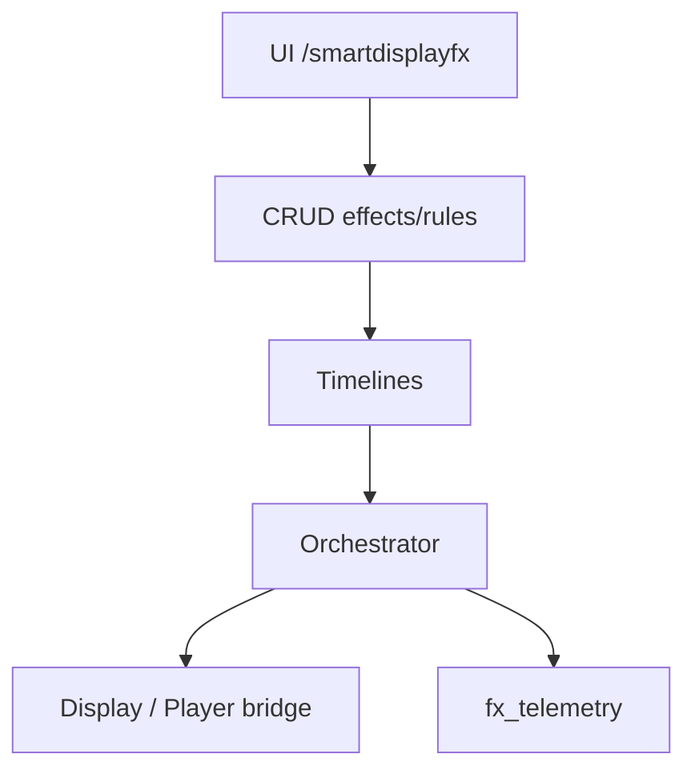
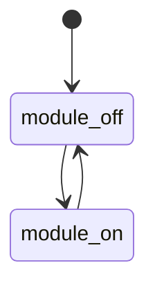

# `smart-display-fx` — SmartDisplayFX

| Campo | Valor |
|-------|-------|
| **Slug** | `smart-display-fx` |
| **Modos** | Lite/Pro (opcional) |
| **Atores** | admin |
| **UI** | `/smartdisplayfx` |
| **API** | `/api/smartdisplayfx/*, /effects, /rules, /timelines, /sites, /telemetry, /analytics` |
| **Status** | active |
| **Profundidade** | L2 |
| **Última revisão** | 2026-08-09 |

---

## 1. Visão e escopo

### Propósito
Complemento avançado de efeitos visuais, regras, timelines, sites e telemetria FX — activável via módulo `smart_display_fx` sem bloquear publish core.

### Dentro do escopo
- Effects, rules, timelines, sites
- Telemetry/analytics FX
- Orchestrator / message bridge
- Debug trigger e sync-time

### Fora do escopo
- Núcleo Direct obrigatório
- Substituir dispatcher de mídia

### Vocabulário
| Termo | Significado |
|-------|-------------|
| fx_effect / fx_rule / fx_timeline | entidades FX |
| fx_site | agrupamento espacial |
| telemetry.status | `success` \| `failed` |

---

## 2. Requisitos (EARS)

| ID | Tipo | Requisito |
|----|------|-----------|
| REQ-SFX-001 | Optional | Pode ser activado fora do master-switch multi-agency. |
| REQ-SFX-002 | Unwanted | Com FX off, publish core deve continuar. |
| REQ-SFX-003 | Ubiquitous | CRUD de effects/rules exige módulo on + role admin. |
| REQ-SFX-004 | Event-driven | Telemetry regista success/failed por execução. |
| REQ-SFX-005 | State-driven | Entidades `is_active=false` não entram no orchestrator. |
| REQ-SFX-006 | Optional | Timelines generate cria sequência a partir de regras. |

---

## 3. Regras de negócio

### RN-SFX-001 — Não bloqueia publish core

```text
RN-SFX-001 — Não bloqueia publish core
Quando: FX off
Se: publicar mídia Direct/Lite
Então: continua possível
Excepto: —
Motivo: Desacoplamento
```


### RN-SFX-002 — Gate capability

```text
RN-SFX-002 — Gate capability
Quando: UI /smartdisplayfx
Se: caps.smartDisplayFx false
Então: rota inacessível
Excepto: —
Motivo: Módulo opcional
```


### RN-SFX-003 — Active only

```text
RN-SFX-003 — Active only
Quando: orchestrator
Se: is_active=false
Então: ignorar entidade
Excepto: —
Motivo: Soft-off
```


### RN-SFX-004 — Sites↔totems

```text
RN-SFX-004 — Sites↔totems
Quando: associar totem
Se: totem inválido
Então: rejeitar
Excepto: —
Motivo: Integridade
```


### RN-SFX-005 — Telemetry audit

```text
RN-SFX-005 — Telemetry audit
Quando: trigger efeito
Se: sempre
Então: registar fx_telemetry
Excepto: —
Motivo: Ops
```


---

## 4. Fluxos



---

## 5. Estados

| Campo | Valores |
|-------|---------|
| module | on / off |
| entidades | `is_active` bool |
| fx_telemetry.status | `success`, `failed` |



---

## 6. Critérios de aceite

### AC-SFX-001 (P0)

```text
DADO módulo off
QUANDO publicar mídia core
ENTÃO funciona
```


### AC-SFX-002 (P0)

```text
DADO módulo off
QUANDO abrir /smartdisplayfx
ENTÃO bloqueado/oculto
```


### AC-SFX-003 (P0)

```text
DADO effect is_active=false
QUANDO correr orchestrator
ENTÃO efeito não aplica
```


---

## 7. Dependências e referências

### Módulos
- [`system-modules`](../system-modules/MODULO.md), [`totems`](../totems/MODULO.md), [`player-ad`](../player-ad/MODULO.md)

### Código de referência
- `backend/src/routes/smartdisplayfx*.ts`
- `backend/src/services/fxEffectService.ts`, `fxRuleService.ts`, `fxTimelineService.ts`, `fxOrchestratorService.ts`
- `frontend/src/pages/SmartDisplayFx/SmartDisplayFx.tsx`
- schema part2 `fx_effects`, `fx_rules`, `fx_timelines`; part6 `fx_sites`, `fx_telemetry`

### Lacunas conhecidas
- Complemento opcional; cobertura de testes E2E limitada face à superfície de API.
