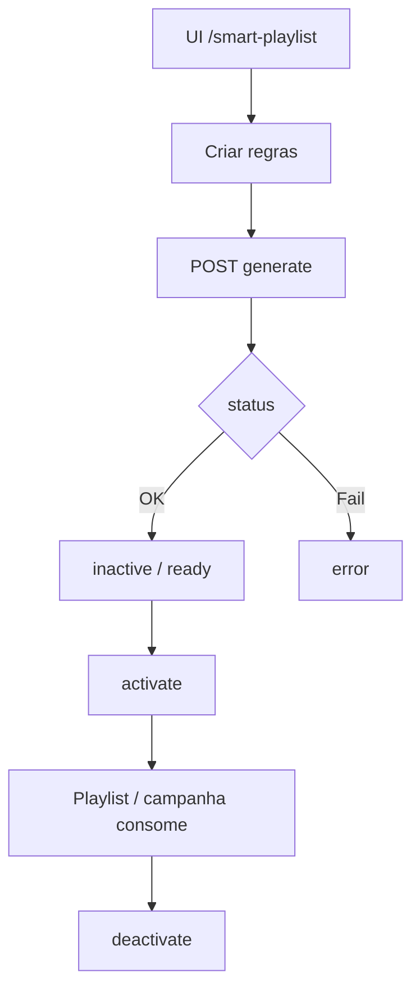
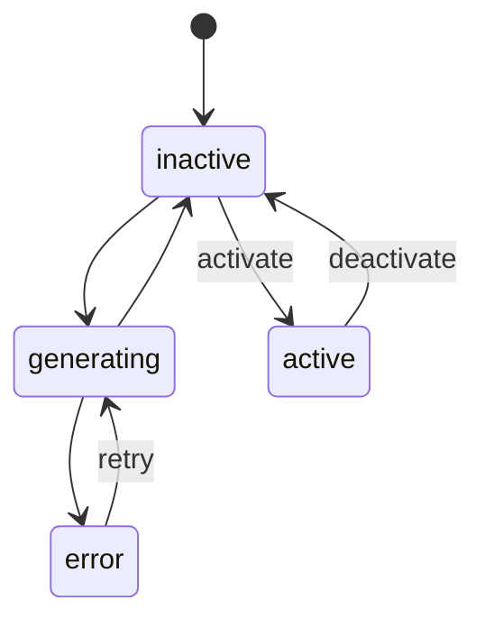

# `smart-playlist` — Smart Playlist

| Campo | Valor |
|-------|-------|
| **Slug** | `smart-playlist` |
| **Modos** | Pro |
| **Atores** | admin, gerente_marketing |
| **UI** | `/smart-playlist` |
| **API** | `/api/smart-playlist` |
| **Status** | active |
| **Profundidade** | L2 |
| **Última revisão** | 2026-08-09 |

---

## 1. Visão e escopo

### Propósito
Geração e gestão de playlists “inteligentes” (regras + geração assistida) por cliente/campanha/totem, com activação explícita.

### Dentro do escopo
- CRUD `smart_playlists`
- `generate` / `bulk-generate` / `test`
- `activate` / `deactivate`
- Listagens por client, campaign, totem; stats

### Fora do escopo
- Substituir aprovação humana / regras comerciais de campanha
- Engine Python legado (se existir doc antigo)

### Vocabulário
| Termo | Significado |
|-------|-------------|
| smart_playlist | registo em `smart_playlists` |
| `client_id` | FK legada = subscriber |
| status | `inactive` \| `active` \| `generating` \| `error` |

---

## 2. Requisitos (EARS)

| ID | Tipo | Requisito |
|----|------|-----------|
| REQ-SPL-001 | Optional | O sistema pode gerar sugestões; publicação efectiva exige activate/autorização. |
| REQ-SPL-002 | State-driven | Enquanto `status=generating`, novas gerações concorrentes devem ser controladas. |
| REQ-SPL-003 | Event-driven | Quando generate falha, o sistema deve marcar `error`. |
| REQ-SPL-004 | Unwanted | Activate não deve publicar conteúdo de outro subscriber. |
| REQ-SPL-005 | Ubiquitous | Listagens por client/campaign/totem devem filtrar pelo id pedido. |
| REQ-SPL-006 | Event-driven | Quando deactivate, status deve deixar de ser `active`. |

---

## 3. Regras de negócio

### RN-SPL-001 — Sugestão ≠ dispatch

```text
RN-SPL-001 — Sugestão ≠ dispatch
Quando: generate
Se: sempre
Então: não altera dispatch até activate + regras comerciais
Excepto: —
Motivo: Controlo editorial
```


### RN-SPL-002 — Máquina de status

```text
RN-SPL-002 — Máquina de status
Quando: activate/deactivate/generate
Se: transição inválida / erro
Então: rejeitar ou status=error
Excepto: —
Motivo: Observabilidade
```


### RN-SPL-003 — client_id = subscriber

```text
RN-SPL-003 — client_id = subscriber
Quando: CRUD
Se: sempre
Então: tratar client_id como anunciante
Excepto: —
Motivo: Schema legado
```


### RN-SPL-004 — Test sem side-effect

```text
RN-SPL-004 — Test sem side-effect
Quando: POST :id/test
Se: sempre
Então: avaliar sem activar em produção
Excepto: —
Motivo: Segurança operacional
```


### RN-SPL-005 — Bulk gera N

```text
RN-SPL-005 — Bulk gera N
Quando: POST /bulk-generate
Se: ids válidos
Então: gerar para o conjunto; falhas parciais reportadas
Excepto: —
Motivo: Ops em lote
```


---

## 4. Fluxos



---

## 5. Estados

| Campo | Valores |
|-------|---------|
| `status` | `inactive`, `active`, `generating`, `error` |



---

## 6. Critérios de aceite

### AC-SPL-001 (P0)

```text
DADO smart playlist gerada sem activate
QUANDO consultar dispatch do totem
ENTÃO plano não muda só pela sugestão
```


### AC-SPL-002 (P0)

```text
DADO generate com falha de dados
QUANDO POST generate
ENTÃO status=error e API reporta falha
```


### AC-SPL-003 (P0)

```text
DADO registo active
QUANDO POST deactivate
ENTÃO status deixa de ser active
```


---

## 7. Dependências e referências

### Módulos
- [`playlists`](../playlists/MODULO.md), [`campaigns`](../campaigns/MODULO.md), [`analytics-ai`](../analytics-ai/MODULO.md), [`dispatcher`](../dispatcher/MODULO.md)

### Código de referência
- `backend/src/routes/smart-playlist.ts`
- `backend/src/services/smartPlaylistService.ts`
- `backend/src/workers/advancedScheduleWorker.ts`
- `frontend/src/pages/SmartPlaylist/SmartPlaylist.tsx`
- schema part6 `smart_playlists`

### Lacunas conhecidas
- Coluna DB ainda `client_id` (= subscriber); API/FE aceitam **dual-read** `subscriberId || clientId` (Lacunas-MA).
- Qualidade da “IA” de geração pode ser parcial / heurística.
- Doc antiga pode referir engine Python descontinuado.
