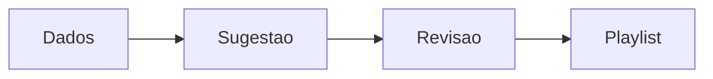

# `smart-playlist` — Smart Playlist

| Campo | Valor |
|-------|-------|
| **Slug** | `smart-playlist` |
| **Modos** | Pro |
| **Atores** | admin, marketing |
| **UI** | `/smart-playlist` |
| **API** | `/api/smart-playlist` |
| **Status** | active |
| **Última revisão** | 2026-08-09 |

---

## 1. Visão e escopo

### Propósito
Sugestões e playlists inteligentes assistidas.

### Dentro do escopo
- Sugestão de composição

### Fora do escopo
- Substitui aprovação humana obrigatória

### Vocabulário
| Termo | Significado |
|-------|-------------|
| smart suggestion | proposta automática |

---

## 2. Requisitos (EARS)

| ID | Tipo | Requisito |
|----|------|-----------|
| REQ-SPL-001 | Optional | O sistema pode sugerir playlists; a publicação continua sujeita a regras comerciais. |

---

## 3. Regras de negócio

### RN-SPL-001 — Sugestão ≠ publicação

```text
RN-SPL-001 — Sugestão ≠ publicação
Quando: gerar sugestão
Se: sempre
Então: não publica sem confirmação/autorização
Excepto: —
Motivo: Controlo editorial
```

---

## 4. Fluxos



---

## 5. Estados

| Estado | Significado | Transições típicas |
|--------|-------------|--------------------|
| suggested | proposta | → accepted/rejected |

---

## 6. Critérios de aceite

### AC-SPL-001 (P0)

```text
DADO sugestão gerada
QUANDO sem confirmação
ENTÃO dispatch não muda
```

---

## 7. Dependências e referências

### Módulos relacionados
- [`playlists`](../playlists/MODULO.md)
- [`analytics-ai`](../analytics-ai/MODULO.md)

### Referências
- —
