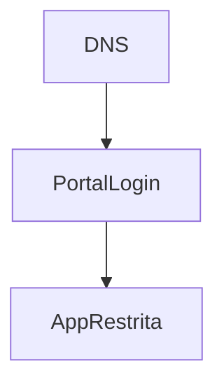

# `subscriber-portal` — Portal do anunciante

| Campo | Valor |
|-------|-------|
| **Slug** | `subscriber-portal` |
| **Modos** | Lite/Pro (opcional) |
| **Atores** | owner/admin_sql; publisher_user; subscriber_user |
| **UI** | `Complementos → Portal; /subscriber-login; /subscriber/*` |
| **API** | `settings portal.*; autenticação portal` |
| **Status** | active |
| **Última revisão** | 2026-08-09 |

---

## 1. Visão e escopo

### Propósito
Self-service por slug/subdomínio para organizações e anunciantes.

### Dentro do escopo
- Tenancy por slug
- Login portal
- Subset de funções

### Fora do escopo
- Mudar mode da instalação

### Vocabulário
| Termo | Significado |
|-------|-------------|
| slug | identificador de portal |
| subdomínio | publisher|subscriber.base |

---

## 2. Requisitos (EARS)

| ID | Tipo | Requisito |
|----|------|-----------|
| REQ-POR-001 | Optional | Portal pode ser activado sem ser o master switch. |

---

## 3. Regras de negócio

### RN-POR-001 — Isolamento portal

```text
RN-POR-001 — Isolamento portal
Quando: subscriber_user autentica
Se: sempre
Então: vê só o seu tenant
Excepto: —
Motivo: SaaS multi-tenant
```

---

## 4. Fluxos



---

## 5. Estados

| Estado | Significado | Transições típicas |
|--------|-------------|--------------------|
| portal_off | desligado | → portal_on |
| portal_on | activo | → portal_off |

---

## 6. Critérios de aceite

### AC-POR-001 (P0)

```text
DADO portal on
QUANDO login subscriber A
ENTÃO não acede dados de B
```

---

## 7. Dependências e referências

### Módulos relacionados
- [`subscribers`](../subscribers/MODULO.md)
- [`organization`](../organization/MODULO.md)
- [`system-modules`](../system-modules/MODULO.md)

### Referências
- `docs/manuais/04-MANUAL-ADMINISTRATIVO.md`
