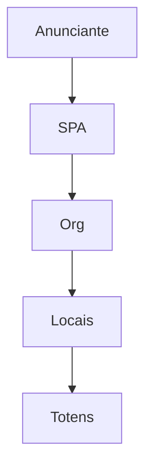

# `subscriber-publisher-access` — Anunciante ↔ Organização (SPA)

| Campo | Valor |
|-------|-------|
| **Slug** | `subscriber-publisher-access` |
| **Modos** | Lite (essencial), Pro (também aceite) |
| **Atores** | owner_system, admin_sql, admin |
| **UI** | `/subscriber-publisher-access` |
| **API** | `/api/subscriber-access` |
| **Status** | active |
| **Última revisão** | 2026-08-09 |

---

## 1. Visão e escopo

### Propósito
Vínculo directo anunciante→organização/rede (override). Caminho principal no Lite.

### Dentro do escopo
- Conceder/revogar acesso
- access_type=override

### Fora do escopo
- Substitui planos no Pro (é paralelo)

### Vocabulário
| Termo | Significado |
|-------|-------------|
| SPA | subscriber_publisher_access |
| override | acesso directo Lite |

---

## 2. Requisitos (EARS)

| ID | Tipo | Requisito |
|----|------|-----------|
| REQ-SPA-001 | Ubiquitous | No Lite, publicação comercial exige SPA activo para a org alvo. |
| REQ-SPA-002 | Event-driven | Quando SPA é revogado, totens da org deixam de ser elegíveis para esse anunciante. |

---

## 3. Regras de negócio

### RN-SPA-001 — Lite obrigatório

```text
RN-SPA-001 — Lite obrigatório
Quando: mode=lite e quick-publish
Se: sem SPA
Então: totens vazios
Excepto: —
Motivo: Autorização Lite
```

### RN-SPA-002 — Pro aceita SPA

```text
RN-SPA-002 — Pro aceita SPA
Quando: mode=full
Se: SPA presente
Então: engine pode usar SPA além de plano
Excepto: —
Motivo: Compatibilidade
```

---

## 4. Fluxos



---

## 5. Estados

| Estado | Significado | Transições típicas |
|--------|-------------|--------------------|
| granted | activo | → revoked |
| revoked | sem elegibilidade | → granted |

---

## 6. Critérios de aceite

### AC-SPA-001 (P0)

```text
DADO Lite sem SPA
QUANDO listar totens no quick-publish
ENTÃO lista vazia
```

---

## 7. Dependências e referências

### Módulos relacionados
- [`subscribers`](../subscribers/MODULO.md)
- [`organization`](../organization/MODULO.md)
- [`quick-publish`](../quick-publish/MODULO.md)

### Referências
- `docs/manuais/03-MODULOS-E-FORMAS-DE-TRABALHO.md`
