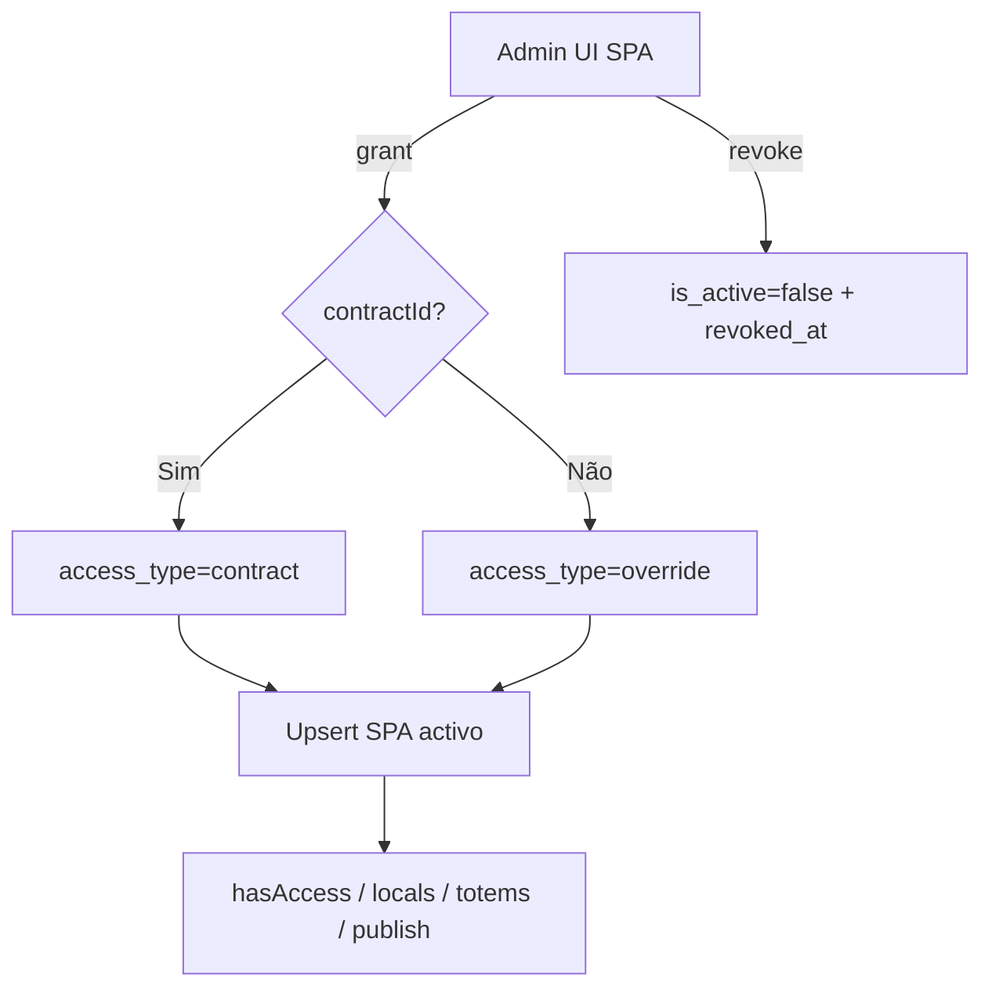
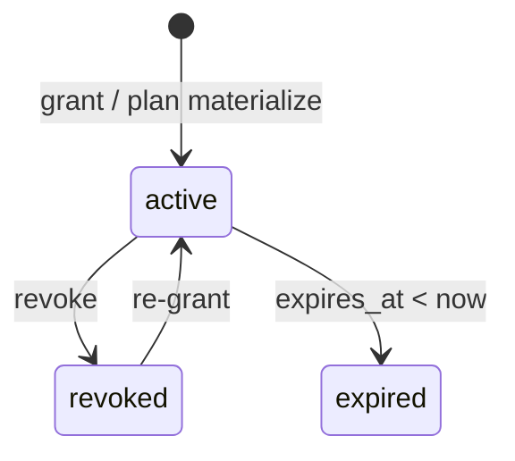

# `subscriber-publisher-access` — Anunciante ↔ Organização (SPA)

| Campo | Valor |
|-------|-------|
| **Slug** | `subscriber-publisher-access` |
| **Modos** | Lite, Pro (API gated por `requireModule('subscribers')`) |
| **Atores** | admin*, owner_system (grant); gerente_marketing (inspect); próprio subscriber (inspect próprio) |
| **UI** | `/subscriber-publisher-access`, `/subscriber-access-expiring` |
| **API** | `/api/subscriber-access` |
| **Status** | active |
| **Profundidade** | L2 |
| **Última revisão** | 2026-08-09 |

---

## 1. Visão e escopo

### Propósito
Vínculo anunciante → organização (publisher): materialização de plano (`access_type=plan`), contrato (`contract`) ou override manual Lite (`override`); base de elegibilidade de totens/locals sem inventário próprio.

### Dentro do escopo
- Grant / revoke de acesso
- Listagem e check `hasAccess`
- `plan_publisher_access` + reconcile
- View de acessos activos / expiring
- Fallback por contratos + plano quando a view SPA está vazia

### Fora do escopo
- CRUD de anunciantes ou publishers
- Inventário de locais/totens
- Substituição total do modelo de planos Pro (caminho paralelo: contrato + `plan_*_access`)

### Vocabulário
| Termo | Significado |
|-------|-------------|
| SPA | linha em `subscriber_publisher_access` |
| `access_type` | `plan` \| `contract` \| `override` |
| `revoked_at` / `expires_at` | fim de vigência |
| reconcile | alinhar SPA materializado com `plan_publisher_access` |
| view active | `subscriber_publisher_access_active` |

---

## 2. Requisitos (EARS)

| ID | Tipo | Requisito |
|----|------|-----------|
| REQ-SPA-001 | Ubiquitous | O sistema deve registar acesso anunciante↔publisher com `access_type` canónico. |
| REQ-SPA-002 | Event-driven | Quando se faz grant sem `contractId`, o sistema deve gravar `access_type='override'`. |
| REQ-SPA-003 | Event-driven | Quando se faz grant com `contractId`, o sistema deve gravar `access_type='contract'`. |
| REQ-SPA-004 | State-driven | Enquanto o acesso estiver revogado, expirado ou com subscriber/publisher inactivo, `hasAccess` deve falhar (salvo caminhos de plano activos). |
| REQ-SPA-005 | Unwanted | Utilizador sem role/inspect adequado não deve listar publishers de anunciante alheio. |
| REQ-SPA-006 | Optional | Onde existir `plan_publisher_access`, o sistema deve permitir reconcile para materializar/alinhar SPA. |

---

## 3. Regras de negócio

### RN-SPA-001 — Tipos de acesso

```text
RN-SPA-001 — Tipos de acesso
Quando: persistir SPA
Se: sempre
Então: access_type ∈ {plan, contract, override}
Excepto: —
Motivo: CHECK chk_subscriber_publisher_access_type
```

### RN-SPA-002 — Grant override vs contract

```text
RN-SPA-002 — Grant override vs contract
Quando: POST /api/subscriber-access/grant
Se: contractId presente → contract; ausente → override
Então: upsert/reactivar linha SPA
Excepto: —
Motivo: Lite override manual vs vínculo contratual
```

### RN-SPA-003 — hasAccess composto

```text
RN-SPA-003 — hasAccess composto
Quando: check_subscriber_publisher_access
Se: SPA directo activo OU (contrato active + plan_publisher_access)
Então: acesso verdadeiro
Excepto: expirado/revogado/inactivo
Motivo: Unificar Lite override e Pro plano
```

### RN-SPA-004 — Revoke

```text
RN-SPA-004 — Revoke
Quando: POST .../revoke
Se: linha existe
Então: is_active=false, revoked_at=now, notes append
Excepto: role revoke sem owner_system (só admin/admin_sql na rota)
Motivo: Auditoria de fim de vínculo
```

### RN-SPA-005 — View activa

```text
RN-SPA-005 — View activa
Quando: listagens “activas”
Se: is_active, revoked_at IS NULL, não expirado, subscriber e publisher activos
Então: incluir na view subscriber_publisher_access_active
Excepto: fallback service deriva de contratos+plano se view vazia
Motivo: Fonte operacional de elegibilidade
```

### RN-SPA-006 — Compact força publisher

```text
RN-SPA-006 — Compact força publisher
Quando: operações em instalação compact
Se: resolveCompactScopedPublisherId aplica
Então: escopo ao publisher owner
Excepto: —
Motivo: Single-publisher
```

---

## 4. Fluxos

### Grant / revoke


### Fluxos de erro
| ID | Gatilho | Resultado |
|----|---------|-----------|
| FX-SPA-E01 | Sem role grant/revoke | 403 |
| FX-SPA-E02 | Módulo subscribers off | 403 requireModule |
| FX-SPA-E03 | Inspect anunciante alheio sem permissão | 403 |
| FX-SPA-E04 | Reconcile falha parcial | log; request pode não falhar |

---

## 5. Estados

| Campo | Valores canónicos |
|-------|-------------------|
| `access_type` | `plan`, `contract`, `override` |
| `is_active` | `true` / `false` |
| `expires_at` | NULL ou ≥ `granted_at` |
| `revoked_at` | NULL ou ≥ `granted_at` |



---

## 6. Critérios de aceite

### AC-SPA-001 (P0)

```text
DADO anunciante A e publisher P sem vínculo
QUANDO admin faz grant sem contractId
ENTÃO existe SPA access_type=override activo e hasAccess(A,P)=true
```

### AC-SPA-002 (P0)

```text
DADO SPA activo A↔P
QUANDO admin revoga
ENTÃO is_active=false, revoked_at preenchido e hasAccess directo falha
```

### AC-SPA-003 (P0)

```text
DADO contrato active + plan_publisher_access para P
QUANDO check sem linha SPA override
ENTÃO hasAccess pode ser true via caminho plano
```

### AC-SPA-004 (P1)

```text
DADO instalação com subscribers off
QUANDO chamar /api/subscriber-access
ENTÃO 403 requireModule
```

---

## 7. Dependências e referências

### Módulos
- [`subscribers`](../subscribers/MODULO.md) — dono do vínculo; mesmo `requireModule`
- [`organization`](../organization/MODULO.md) — publisher
- [`plans`](../plans/MODULO.md) / [`contracts`](../contracts/MODULO.md)
- [`campaigns`](../campaigns/MODULO.md), [`quick-publish`](../quick-publish/MODULO.md) — consumidores de elegibilidade

### Código de referência
- `backend/src/routes/subscriber-access.ts`
- `backend/src/services/subscriberAccessService.ts`
- `backend/src/services/reconcileService.ts`
- `frontend/src/pages/SubscriberPublisherAccess/SubscriberPublisherAccess.tsx`
- `frontend/src/pages/SubscriberAccessExpiring/SubscriberAccessExpiring.tsx`
- `database/smartchannel-db-v2-refactored-part5-tables-relationships.sql` (`subscriber_publisher_access`, `plan_publisher_access`)
- `database/smartchannel-db-v2-refactored-part9-triggers-functions.sql` (`check_subscriber_publisher_access`)
- `database/smartchannel-db-v2-refactored-part10-*.sql` (view active) / `part14-reconcile.sql`

### Lacunas conhecidas
- Grant permite `owner_system`; revoke **não**.
- `gerente_marketing` pode inspecionar via API, mas UI SPA está restrita a admins em `rolePermissions`.
- `/subscriber-access-expiring` pode não ter entrada explícita em `rolePermissions`.
- Expiring filtra em memória após carregar `isActive:true`.
- Falhas de reconcile após plan-publisher podem ser só logadas.
- Não existe módulo de instalação id `subscriber-publisher-access` — partilha `subscribers`.
