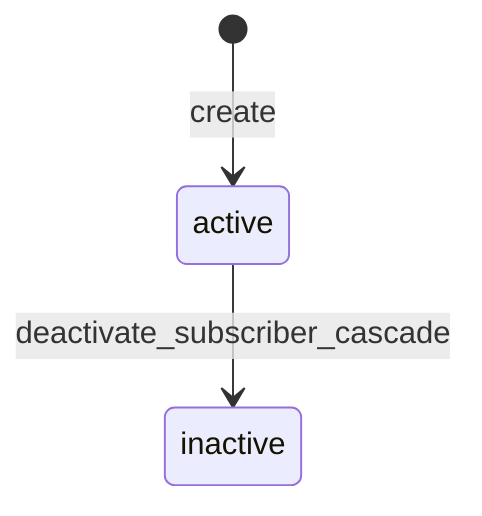

# `subscribers` — Anunciantes

| Campo | Valor |
|-------|-------|
| **Slug** | `subscribers` |
| **Modos** | Lite, Pro (`requireModule('subscribers')`; off em Direct puro) |
| **Atores** | admin*, owner_system, operador_faturamento, operador_comercial; portal tenant (próprio subscriber) |
| **UI** | `/subscribers` (+ contratos aninhados); redirect `/clients` → `/subscribers` |
| **API** | `/api/subscribers` (+ `/api/clients` deprecated) |
| **Status** | active |
| **Profundidade** | L2 |
| **Última revisão** | 2026-08-09 |

---

## 1. Visão e escopo

### Propósito
Cadastro canónico de anunciantes (subscribers): base para SPA, contratos, campanhas, playlists, mídia Lite/Pro e portal.

### Dentro do escopo
- CRUD anunciante (soft cascade no delete)
- Contratos aninhados / criação com `create_subscriber_with_contracts`
- Locals / totems / smart-tvs alcançáveis via SPA ou plano
- Stats e validação de limites (plano, storage, totem)
- Isolamento portal / tenant

### Fora do escopo
- Inventário físico de totens (pertencem a locals/publishers)
- Grant/revoke SPA detalhado (ver `subscriber-publisher-access`)
- Billing detalhado (rotas `subscriber-billing` / módulo `billing`)

### Vocabulário
| Termo | Significado |
|-------|-------------|
| subscriber / anunciante | registo em `subscribers` |
| `portal_slug` | slug único parcial para portal |
| `is_active` | soft-off do anunciante |
| cascade deactivate | procedure `deactivate_subscriber_cascade` |

---

## 2. Requisitos (EARS)

| ID | Tipo | Requisito |
|----|------|-----------|
| REQ-SUB-001 | Ubiquitous | O anunciante deve existir antes de SPA, contrato, campanha ou quick-publish. |
| REQ-SUB-002 | Ubiquitous | Nome deve ser único; email (se preenchido) e `portal_slug` devem respeitar unicidade. |
| REQ-SUB-003 | Event-driven | Quando o anunciante é desactivado, o sistema deve executar cascade comercial (campanhas, playlists, mídias, SPA, contratos elegíveis). |
| REQ-SUB-004 | State-driven | Enquanto o tenant for portal de um subscriber, listagens/detalhe devem restringir-se a esse anunciante. |
| REQ-SUB-005 | Unwanted | Utilizador fora do escopo tenant/portal não deve ler/alterar anunciante alheio. |
| REQ-SUB-006 | Optional | Onde houver plano/contrato, o sistema deve expor validação de limites (`plan-limits`, `storage`, `totem-access`). |

---

## 3. Regras de negócio

### RN-SUB-001 — Unicidade de identidade

```text
RN-SUB-001 — Unicidade de identidade
Quando: create/update
Se: name, email ou portal_slug colidem
Então: rejeitar (índices uq_subscribers_*)
Excepto: email NULL permitido
Motivo: Identidade comercial e portal
```

### RN-SUB-002 — Create com roles comerciais

```text
RN-SUB-002 — Create com roles comerciais
Quando: POST /api/subscribers
Se: role ∉ admin|admin_sql|owner_system|operador_faturamento|operador_comercial
Então: 403
Excepto: —
Motivo: Controlo de onboarding comercial
```

### RN-SUB-003 — Soft cascade

```text
RN-SUB-003 — Soft cascade
Quando: DELETE /api/subscribers/:id
Se: sempre (caminho de serviço)
Então: chamar deactivate_subscriber_cascade (desactiva conteúdo + SPA; contratos draft/active → terminated)
Excepto: —
Motivo: Evitar órfãos comerciais activos
```

### RN-SUB-004 — Locals via SPA

```text
RN-SUB-004 — Locals via SPA
Quando: GET /:id/locals
Se: acesso activo em subscriber_publisher_access (não expirado/revogado)
Então: devolver locals dos publishers alcançados
Excepto: —
Motivo: Anunciante não “dona” locals; alcança via vínculo
```

### RN-SUB-005 — Totems por contrato (compact/Pro)

```text
RN-SUB-005 — Totems por contrato
Quando: GET /:id/totems com contractId (caminho plano)
Se: contrato active + plan_publisher_access + plan_local_access
Então: listar totens elegíveis
Excepto: caminhos só-SPA sem contractId
Motivo: Elegibilidade comercial Pro
```

### RN-SUB-006 — Limite 0 = ilimitado

```text
RN-SUB-006 — Limite 0 = ilimitado
Quando: validate plan-limits
Se: maxLimit === 0 ou undefined
Então: tratar como ilimitado
Excepto: —
Motivo: Semântica de planos no código actual
```

---

## 4. Fluxos

### Onboarding
```mermaid
flowchart TD
  A[UI /subscribers] -->|POST| B{Role comercial?}
  B -->|Não| X[403]
  B -->|Sim| C[Validar name/email/slug]
  C --> D{contracts[]?}
  D -->|Sim| E[create_subscriber_with_contracts]
  D -->|Não| F[INSERT subscribers]
  E --> G[SPA / contratos / conteúdo]
  F --> G
```

### Fluxos de erro
| ID | Gatilho | Resultado |
|----|---------|-----------|
| FX-SUB-E01 | Nome/email/slug duplicado | 4xx |
| FX-SUB-E02 | Fora de escopo tenant/portal | 403 / 404 |
| FX-SUB-E03 | Módulo `subscribers` off | 403 requireModule |
| FX-SUB-E04 | Create sem role comercial | 403 |

---

## 5. Estados

| Campo | Valores canónicos |
|-------|-------------------|
| `is_active` | `true` / `false` (sem enum `status` em `subscribers`) |
| contratos relacionados | `draft`, `active`, `expired`, `terminated`, `cancelled` |
| cascade terminate | contratos `draft`\|`active` → `terminated` |



---

## 6. Critérios de aceite

### AC-SUB-001 (P0)

```text
DADO instalação com módulo subscribers activo
QUANDO admin cria anunciante com nome único
ENTÃO registo aparece em GET /api/subscribers e /subscribers
```

### AC-SUB-002 (P0)

```text
DADO anunciante activo com campanhas/playlists
QUANDO DELETE /api/subscribers/:id
ENTÃO cascade desactiva conteúdo relacionado e o anunciante fica is_active=false
```

### AC-SUB-003 (P0)

```text
DADO utilizador portal do subscriber A
QUANDO GET /api/subscribers
ENTÃO só vê o anunciante A
```

### AC-SUB-004 (P1)

```text
DADO nome já existente
QUANDO POST create
ENTÃO rejeição por unicidade
```

---

## 7. Dependências e referências

### Módulos
- [`subscriber-publisher-access`](../subscriber-publisher-access/MODULO.md) — vínculo org
- [`contracts`](../contracts/MODULO.md) / [`plans`](../plans/MODULO.md)
- [`campaigns`](../campaigns/MODULO.md), [`playlists`](../playlists/MODULO.md), [`media-library`](../media-library/MODULO.md)
- [`quick-publish`](../quick-publish/MODULO.md), [`subscriber-portal`](../subscriber-portal/MODULO.md)

### Código de referência
- `backend/src/routes/subscribers.ts`
- `backend/src/services/subscriberService.ts`
- `backend/src/middleware/subscriberIsolation.middleware.ts`, `subscriberParamAccess.middleware.ts`
- `frontend/src/pages/Subscribers/Subscribers.tsx`
- `database/smartchannel-db-v2-refactored-part2-tables-base.sql` (`subscribers`)
- `database/smartchannel-db-v2-refactored-part9-triggers-functions.sql` (`deactivate_subscriber_cascade`)

### Lacunas conhecidas
- PUT/DELETE **sem** `authorizeRole` — qualquer autenticado que passe tenant/portal scope pode mutar.
- Create roles não incluem `gerente_marketing`, mas a UI lista `/subscribers` para marketing.
- Comentários FE antigos (“sem /api/subscribers no compacto”) podem estar desactualizados.
