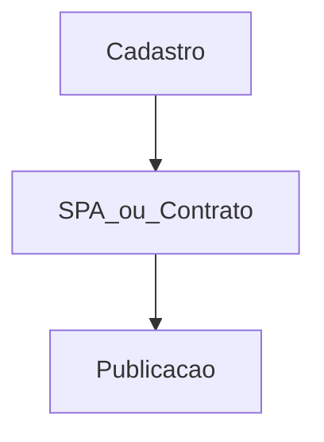

# `subscribers` — Anunciantes

| Campo | Valor |
|-------|-------|
| **Slug** | `subscribers` |
| **Modos** | Lite, Pro |
| **Atores** | owner/admin, comercial, marketing |
| **UI** | `/subscribers` |
| **API** | `/api/subscribers` |
| **Status** | active |
| **Última revisão** | 2026-08-09 |

---

## 1. Visão e escopo

### Propósito
Cadastro de anunciantes (subscribers) que publicam conteúdo na rede de organizações.

### Dentro do escopo
- CRUD anunciante
- Associação a conteúdo

### Fora do escopo
- Inventário de totens

### Vocabulário
| Termo | Significado |
|-------|-------------|
| subscriber | anunciante |

---

## 2. Requisitos (EARS)

| ID | Tipo | Requisito |
|----|------|-----------|
| REQ-SUB-001 | Ubiquitous | Anunciante precisa existir antes de SPA/contrato/campanha. |

---

## 3. Regras de negócio

### RN-SUB-001 — Ordem comercial

```text
RN-SUB-001 — Ordem comercial
Quando: tentar publicar sem anunciante
Se: sempre
Então: fluxo bloqueado
Excepto: —
Motivo: Cadeia comercial
```

---

## 4. Fluxos



---

## 5. Estados

| Estado | Significado | Transições típicas |
|--------|-------------|--------------------|
| active | operacional | → inactive |

---

## 6. Critérios de aceite

### AC-SUB-001 (P0)

```text
DADO sem anunciante
QUANDO quick-publish
ENTÃO não inicia publicação
```

---

## 7. Dependências e referências

### Módulos relacionados
- [`subscriber-publisher-access`](../subscriber-publisher-access/MODULO.md)
- [`contracts`](../contracts/MODULO.md)
- [`campaigns`](../campaigns/MODULO.md)

### Referências
- `docs/manuais/02-GUIA-PRIMEIRA-VEZ-UTILIZADOR.md`
