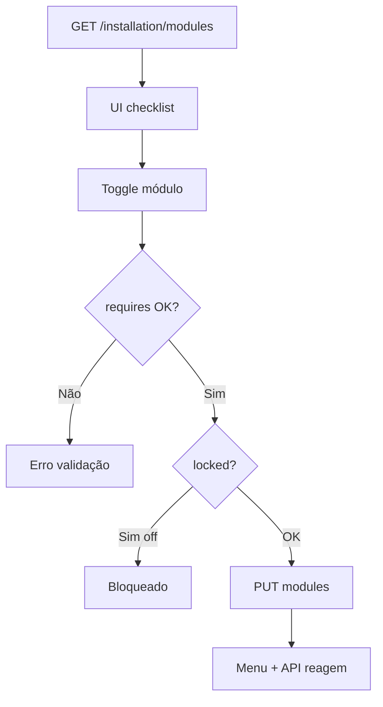

# `system-modules` — Complementos do sistema

| Campo | Valor |
|-------|-------|
| **Slug** | `system-modules` |
| **Modos** | all |
| **Atores** | owner_system, admin_sql |
| **UI** | `/settings/system-modules` |
| **API** | `/api/installation/modules`, portal, commercial-purge* |
| **Status** | active |
| **Profundidade** | L2 |
| **Última revisão** | 2026-08-09 |

---

## 1. Visão e escopo

### Propósito
Catálogo e enforcement dos **módulos de instalação** (`installation.modules`): enable/disable, dependências, locked, portal e checklist.

### Dentro do escopo
- GET/PUT modules
- Validação de `requires`
- Locked modules
- Portal (slug, DNS Cloudflare, SSL, sync)
- Preview/execução purge (superfície partilhada com `commercial-purge`)

### Fora do escopo
- Master switch off/lite/full (detalhe normativo em `product-modes`)
- `flag_smart_*` por utilizador
- Implementação de cada feature module

### Vocabulário
| Termo | Significado |
|-------|-------------|
| installation module | entrada do catálogo `INSTALLATION_MODULE_CATALOG` |
| locked | não desligável |
| `MODULE_DISABLED` | código 403 do middleware |
| requires | dependências entre módulos |

---

## 2. Requisitos (EARS)

| ID | Tipo | Requisito |
|----|------|-----------|
| REQ-SYS-001 | Ubiquitous | API de features deve respeitar `requireModule` quando o prefixo estiver gated. |
| REQ-SYS-002 | Unwanted | Módulos locked não podem ser desligados. |
| REQ-SYS-003 | Event-driven | Quando se activa um módulo, as dependências `requires` devem estar satisfeitas. |
| REQ-SYS-004 | Ubiquitous | Instalação modules ≠ user flags. |
| REQ-SYS-005 | Event-driven | Quando módulo disabled, menu e API devem omitir/bloquear. |
| REQ-SYS-006 | Optional | Portal pode sincronizar DNS/SSL sob roles owner/admin_sql. |

---

## 3. Regras de negócio

### RN-SYS-001 — Locked always on

```text
RN-SYS-001 — Locked always on
Quando: persistir modules
Se: módulo locked (core_publish, organization, dispatcher_admin, …)
Então: enforceLockedModules força enabled
Excepto: —
Motivo: Núcleo não negociável
```

### RN-SYS-002 — Dependências

```text
RN-SYS-002 — Dependências
Quando: PUT modules
Se: requires não satisfeitos
Então: validação falha
Excepto: —
Motivo: Evitar feature órfã
```

### RN-SYS-003 — MODULE_DISABLED

```text
RN-SYS-003 — MODULE_DISABLED
Quando: request a rota gated
Se: módulo off
Então: 403 code=MODULE_DISABLED
Excepto: rotas núcleo (media/totems/publishers/users)
Motivo: Enforcement servidor
```

### RN-SYS-004 — Ortogonal a flags

```text
RN-SYS-004 — Ortogonal a flags
Quando: documentar/autorizar
Se: flag_smart_*
Então: não substitui installation module
Excepto: menus que exigem ambos
Motivo: Dois eixos
```

### RN-SYS-005 — Roles

```text
RN-SYS-005 — Roles
Quando: mutações /api/installation/*
Se: ∉ owner_system|admin_sql
Então: 403
Excepto: —
Motivo: Mudança de superfície de produto
```

### RN-SYS-006 — Purge separado

```text
RN-SYS-006 — Purge separado
Quando: commercial-purge
Se: dryRun default / frase de confirmação
Então: não confundir com disable de módulos
Excepto: —
Motivo: Operação destrutiva explícita
```

---

## 4. Fluxos



---

## 5. Estados

| Estado módulo | Significado |
|---------------|-------------|
| enabled | feature disponível |
| disabled | menu omitido + API 403 |
| locked+enabled | permanente |

---

## 6. Critérios de aceite

### AC-SYS-001 (P0)

```text
DADO campaigns disabled
QUANDO GET /api/campaigns
ENTÃO 403 MODULE_DISABLED
```

### AC-SYS-002 (P0)

```text
DADO tentar desligar dispatcher_admin
QUANDO PUT modules
ENTÃO permanece enabled
```

### AC-SYS-003 (P0)

```text
DADO activar módulo com requires em falta
QUANDO PUT
ENTÃO rejeitado
```

---

## 7. Dependências e referências

### Módulos
- [`product-modes`](../product-modes/MODULO.md)
- [`commercial-purge`](../commercial-purge/MODULO.md)
- [`subscriber-portal`](../subscriber-portal/MODULO.md)

### Código de referência
- `backend/src/policy/installationModules.ts`
- `backend/src/middleware/moduleAuth.middleware.ts`
- `backend/src/routes/installationModules.ts`
- `frontend/src/utils/installationModuleAccess.ts`
- `frontend/src/pages/Settings/SystemModules.tsx`
- `installation_purge_runs` / schedules (schema part2)

### Lacunas conhecidas
- Precedência toggle individual vs master switch / heal lite precisa disciplina operacional.
- Comentário confuso em PATH_MODULE_RULES sobre system-modules↔organization.
