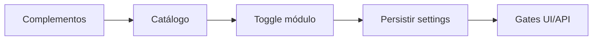

# `system-modules` — Complementos do sistema

| Campo | Valor |
|-------|-------|
| **Slug** | `system-modules` |
| **Modos** | all |
| **Atores** | owner_system, admin_sql |
| **UI** | `/settings/system-modules` |
| **API** | `/api/installation/*` |
| **Status** | active |
| **Última revisão** | 2026-08-09 |

---

## 1. Visão e escopo

### Propósito
Painel de módulos de instalação (catálogo, opções avançadas, portal, purge). Distinto das flags por utilizador.

### Dentro do escopo
- Ligar/desligar módulos não locked
- Ver catálogo e presets
- Acesso a portal e purge

### Fora do escopo
- CRUD de utilizadores
- flag_smart_*

### Vocabulário
| Termo | Significado |
|-------|-------------|
| installation.modules | JSON de módulos activos |
| locked | módulo que não pode ser desligado (ex. dispatcher_admin) |
| flag_smart_* | permissões por utilizador |

---

## 2. Requisitos (EARS)

| ID | Tipo | Requisito |
|----|------|-----------|
| REQ-SYS-001 | Ubiquitous | O catálogo de módulos deve distinguir núcleo, comercial e ops. |
| REQ-SYS-002 | Unwanted | Módulos locked não devem ser desligados pela UI. |
| REQ-SYS-003 | Event-driven | Quando um módulo muda, rotas protegidas por requireModule devem reflectir o novo estado. |

---

## 3. Regras de negócio

### RN-SYS-001 — Separação instalação vs flags

```text
RN-SYS-001 — Separação instalação vs flags
Quando: Admin gere menus
Se: sempre
Então: Complementos controlam produto; flags controlam menu fino do utilizador
Excepto: —
Motivo: Evitar ambiguidade
```

### RN-SYS-002 — Dispatcher locked

```text
RN-SYS-002 — Dispatcher locked
Quando: Qualquer mode
Se: sempre
Então: dispatcher_admin permanece on
Excepto: —
Motivo: Operação e suporte
```

---

## 4. Fluxos



---

## 5. Estados

| Estado | Significado | Transições típicas |
|--------|-------------|--------------------|
| enabled | módulo on | → disabled |
| disabled | módulo off / 403 MODULE_DISABLED | → enabled |
| locked | sempre on | — |

---

## 6. Critérios de aceite

### AC-SYS-001 (P0)

```text
DADO mode lite
QUANDO chamar GET /api/plans
ENTÃO 403 MODULE_DISABLED
```

### AC-SYS-002 (P0)

```text
DADO mode off
QUANDO owner vê Complementos
ENTÃO pode alternar para lite/full
```

---

## 7. Dependências e referências

### Módulos relacionados
- [`product-modes`](../product-modes/MODULO.md)

### Referências
- `docs/manuais/03-MODULOS-E-FORMAS-DE-TRABALHO.md`
- `docs/manuais/04-MANUAL-ADMINISTRATIVO.md`
