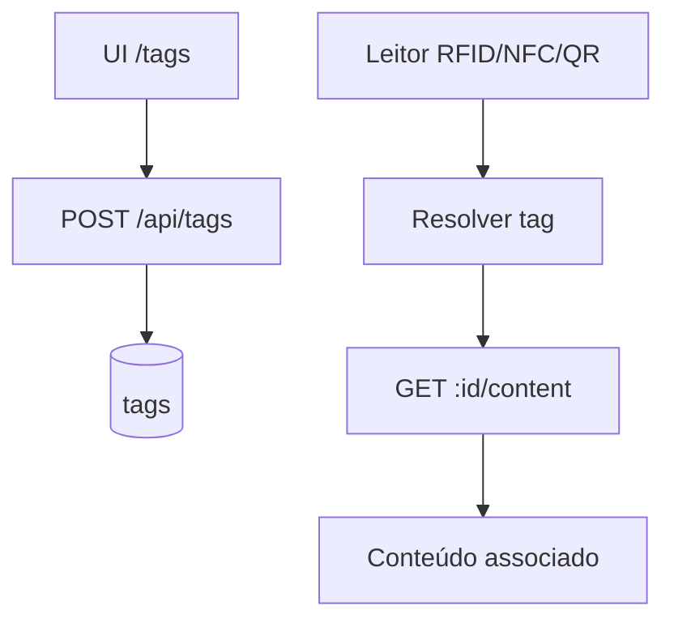

# `tags` — Tags (interacção RFID/NFC/QR)

| Campo | Valor |
|-------|-------|
| **Slug** | `tags` |
| **Modos** | all (menu típico Lite/Pro) |
| **Atores** | admin |
| **UI** | `/tags` |
| **API** | `/api/tags` |
| **Status** | active |
| **Profundidade** | L2 |
| **Última revisão** | 2026-08-09 |

---

## 1. Visão e escopo

### Propósito
Gestão de tags físicas de interacção (`RFID`/`NFC`/`QR`/`barcode`) associadas a publisher/subscriber — **não** é um sistema genérico de labels de mídia.

### Dentro do escopo
- `GET/POST /api/tags`, `GET /:tagId/content`, `DELETE`
- UI `TagsManager` em `/tags`
- Campos `tag_value`, `tag_name`, `is_active`

### Fora do escopo
- ACL por tag
- Taxonomia editorial de biblioteca de mídias

### Vocabulário
| Termo | Significado |
|-------|-------------|
| tag_type (schema) | `RFID`, `NFC`, `QR`, `barcode`, `unknown` |
| tag_value | valor lido do dispositivo |
| content | payload associado (serviço) |

---

## 2. Requisitos (EARS)

| ID | Tipo | Requisito |
|----|------|-----------|
| REQ-TAG-001 | Ubiquitous | Tags devem poder ser listadas no escopo publisher/subscriber. |
| REQ-TAG-002 | Unwanted | Publicação de mídia não deve exigir tag. |
| REQ-TAG-003 | Event-driven | Quando DELETE, tag deixa de resolver content. |
| REQ-TAG-004 | State-driven | Enquanto `is_active=false`, tag não deve disparar conteúdo operativo. |
| REQ-TAG-005 | Ubiquitous | `tag_type` deve respeitar CHECK do schema. |
| REQ-TAG-006 | Optional | GET content devolve associação se existir. |

---

## 3. Regras de negócio

### RN-TAG-001 — Opcional na publicação

```text
RN-TAG-001 — Opcional na publicação
Quando: publicar sem tags
Se: sempre
Então: permitido
Excepto: —
Motivo: Não bloquear operação
```


### RN-TAG-002 — Escopo tenant

```text
RN-TAG-002 — Escopo tenant
Quando: listar tags
Se: publisher/subscriber
Então: filtrar pelo contexto
Excepto: —
Motivo: Multi-tenant
```


### RN-TAG-003 — Tipo físico

```text
RN-TAG-003 — Tipo físico
Quando: POST
Se: tipo inválido
Então: rejeitar
Excepto: —
Motivo: CHECK schema
```


### RN-TAG-004 — Inactiva

```text
RN-TAG-004 — Inactiva
Quando: leitura runtime
Se: is_active=false
Então: não entrega content
Excepto: —
Motivo: Soft-off
```


### RN-TAG-005 — Identidade

```text
RN-TAG-005 — Identidade
Quando: lookup
Se: tag_value
Então: único no escopo quando aplicável
Excepto: —
Motivo: Evitar colisão
```


---

## 4. Fluxos



---

## 5. Estados

| Campo | Valores |
|-------|---------|
| `is_active` | true / false |
| `tag_type` | `RFID`, `NFC`, `QR`, `barcode`, `unknown` |

---

## 6. Critérios de aceite

### AC-TAG-001 (P0)

```text
DADO tag activa com content
QUANDO GET :tagId/content
ENTÃO devolve associação
```


### AC-TAG-002 (P0)

```text
DADO publicação de mídia
QUANDO sem criar tag
ENTÃO permitido
```


### AC-TAG-003 (P0)

```text
DADO tag is_active=false
QUANDO resolver content operativo
ENTÃO não entrega
```


---

## 7. Dependências e referências

### Módulos
- [`organization`](../organization/MODULO.md), [`subscribers`](../subscribers/MODULO.md), [`qr-codes`](../qr-codes/MODULO.md) (QR editorial ≠ tag física)

### Código de referência
- `backend/src/routes/tags.ts`
- `backend/src/services/tagService.ts`
- `frontend/src/components/TagsManager/TagsManager.tsx`
- schema part6 `tags`

### Lacunas conhecidas
- **Adiado (FEATURE_DEFERRED):** API `/api/tags` responde 501; menu e rota FE ocultos/redirect até alinhar schema↔serviço e reactivar em versão futura.
- **Desalinhamento schema↔serviço:** service/UI usam tipos lowercase (`qr_code`) e campos (`description`/`content_id`) que o DDL v2 não espelha 1:1.
- Doc L1 antigo falava em “etiquetas de mídia” — incorrecto face ao código.
