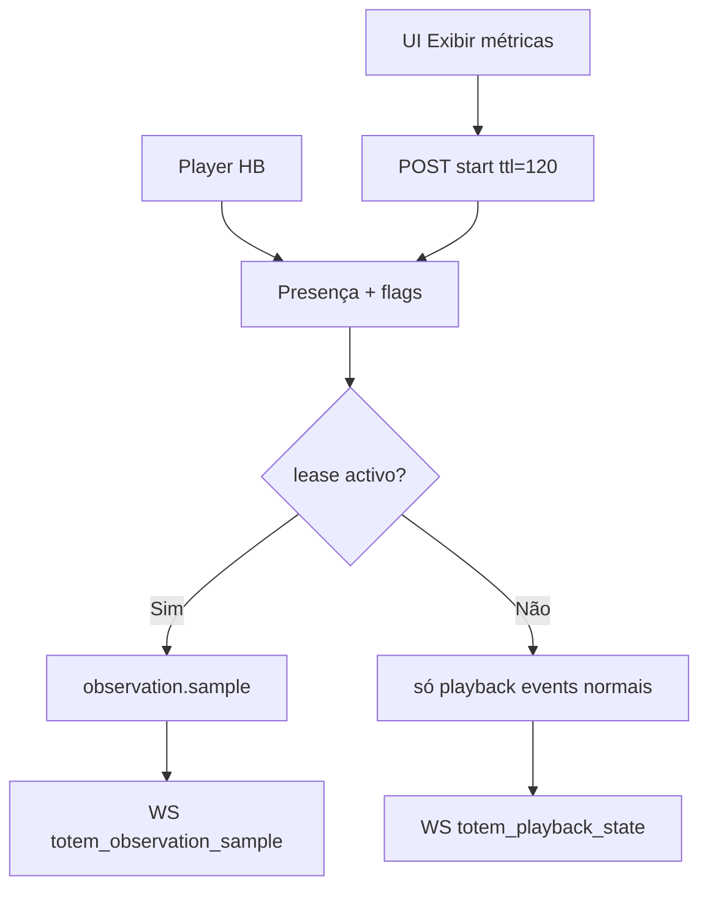

# `telemetry-heartbeat` — Telemetria e heartbeat

| Campo | Valor |
|-------|-------|
| **Slug** | `telemetry-heartbeat` |
| **Modos** | all |
| **Atores** | Player; operadores (cards / diagnóstico) |
| **UI** | cards `PublishTotem` + `TotemPlaybackStatus`; WS playback |
| **API** | `/api/player/heartbeat|sync|events/*`; `/api/totems/:id/playback-state`; telemetry-observation start/renew/stop |
| **Status** | active |
| **Profundidade** | L2 |
| **Última revisão** | 2026-08-09 |

---

## 1. Visão e escopo

### Propósito
Presença do dispositivo, estado de reprodução em tempo quase-real, eventos idempotentes e **observação sob pedido** (lease).

### Dentro do escopo
- Heartbeat + clock drift
- Ingestão de playback events / batch
- `totem_playback_state` + WS
- Leases de observação (TTL 60–120s)
- Hover subscribe vs métricas expandidas

### Fora do escopo
- Comandos remotos (só partilha canal HB/sync)
- Rollups diários operacionais (função DB manual)

### Vocabulário
| Termo | Significado |
|-------|-------------|
| heartbeat | presença + flags (needsDispatch, pendingCommands, observation, ota) |
| playback state | linha quente `playing|ended|error` |
| lease | `telemetry_observation_leases` |
| observation.sample | amostra detalhada ExoPlayer/saúde |
| event_uid | idempotência de evento |

---

## 2. Requisitos (EARS)

| ID | Tipo | Requisito |
|----|------|-----------|
| REQ-TEL-001 | Ubiquitous | O Player deve enviar heartbeat periódico com presença e flags. |
| REQ-TEL-002 | Event-driven | Quando há eventos de playback, o sistema deve upsert estado e emitir WS. |
| REQ-TEL-003 | Optional | O operador pode iniciar lease de observação 60–120s. |
| REQ-TEL-004 | State-driven | Enquanto lease activo e não expirado, o Player deve amostrar. |
| REQ-TEL-005 | Unwanted | Observação não deve alterar a fila de conteúdo. |
| REQ-TEL-006 | Event-driven | Eventos duplicados (mesmo event_uid) devem ser idempotentes. |

---

## 3. Regras de negócio

### RN-TEL-001 — Estado normal ≠ observação

```text
RN-TEL-001 — Estado normal ≠ observação
Quando: hover no card
Se: subscribe_playback_state
Então: recebe estado WS/REST sem abrir lease
Excepto: botão Exibir métricas → start lease
Motivo: Custo de amostra só sob pedido
```

### RN-TEL-002 — TTL e intervalo

```text
RN-TEL-002 — TTL e intervalo
Quando: start/renew observation
Se: sempre
Então: ttlSeconds 60–120 (API default 90 se omitido); intervalSeconds 1–30 (default 5)
Excepto: UI Publicar pede ttl=120
Motivo: Limitar carga
```

### RN-TEL-003 — Player só com lease válido

```text
RN-TEL-003 — Player só com lease válido
Quando: HB devolve telemetryObservation
Se: active && !expired
Então: job de sample
Excepto: —
Motivo: Opt-in
```

### RN-TEL-004 — Clock drift

```text
RN-TEL-004 — Clock drift
Quando: heartbeat
Se: device clock presente
Então: calcular/serverReceivedAtMs + clockDriftMs
Excepto: —
Motivo: Corrigir timelines
```

### RN-TEL-005 — Totem activo scoped

```text
RN-TEL-005 — Totem activo scoped
Quando: start observation
Se: totem inactivo ou fora de escopo
Então: rejeitar
Excepto: —
Motivo: Segurança e ruído
```

### RN-TEL-006 — Idempotência eventos

```text
RN-TEL-006 — Idempotência eventos
Quando: ingest batch/event
Se: (totem_id, event_uid) já existe
Então: no-op / upsert seguro
Excepto: —
Motivo: Retries de rede
```

### RN-TEL-007 — Hover debounce

```text
RN-TEL-007 — Hover debounce
Quando: UI hover telemetry
Se: sempre
Então: debounce ~250ms; unsubscribe grace ~900ms
Excepto: —
Motivo: Evitar storm WS
```

### RN-TEL-008 — Fallback REST

```text
RN-TEL-008 — Fallback REST
Quando: WS down
Se: card subscrito
Então: poll REST ~10s; reconcile ~15s se connected
Excepto: —
Motivo: Resiliência UI
```

---

## 4. Fluxos



---

## 5. Estados

| Domínio | Valores |
|---------|---------|
| presença | online / offline |
| playback | playing / ended / error |
| WS UI | connecting / connected / disconnected |
| lease | active / expired |

---

## 6. Critérios de aceite

### AC-TEL-001 (P0)

```text
DADO totem online a reproduzir
QUANDO hover no card habilitado
ENTÃO chip mostra playing/idle sem abrir lease
```

### AC-TEL-002 (P0)

```text
DADO Exibir métricas
QUANDO start observation
ENTÃO HB reflecte lease e UI recebe samples; fila inalterada
```

### AC-TEL-003 (P0)

```text
DADO ttl expirado
QUANDO Player HB
ENTÃO para de amostrar
```

### AC-TEL-004 (P1)

```text
DADO mesmo event_uid duas vezes
QUANDO batch ingest
ENTÃO uma só aplicação de estado
```

---

## 7. Dependências e referências

### Módulos
- [`publish-totem`](../publish-totem/MODULO.md), [`player-ad`](../player-ad/MODULO.md)
- [`remote-control`](../remote-control/MODULO.md), [`totems`](../totems/MODULO.md)

### Código de referência
- `backend/src/services/playbackTelemetryService.ts`
- `backend/src/services/dispatcherRouter.ts`
- `frontend/src/hooks/useTotemPlaybackTelemetry.ts`
- `frontend/src/components/TotemPlaybackStatus/TotemPlaybackStatus.tsx`
- `database/smartchannel-db-v2-refactored-part18-playback-telemetry.sql`

### Lacunas conhecidas
- “Lease 120s” simplificado: API default 90; UI 120; interval default 5.
