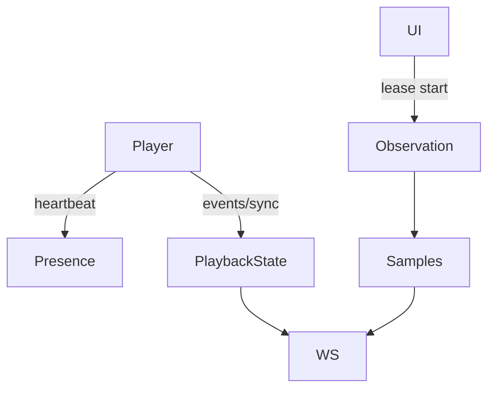

# `telemetry-heartbeat` — Telemetria e heartbeat

| Campo | Valor |
|-------|-------|
| **Slug** | `telemetry-heartbeat` |
| **Modos** | all |
| **Atores** | Player-AD; admin/técnico (monitorização) |
| **UI** | `cards Publicar; dashboard; WS totem_playback_state / observation_sample` |
| **API** | `/api/player/heartbeat, /api/player/sync, /api/player/events*, observation leases` |
| **Status** | active |
| **Última revisão** | 2026-08-09 |

---

## 1. Visão e escopo

### Propósito
Presença, estado actual de reprodução, eventos históricos e observação detalhada sob pedido.

### Dentro do escopo
- Heartbeat adaptativo
- Eventos play start/end
- Sync unificado
- Leases de observação
- Broadcast WS

### Fora do escopo
- Logs de SO Android

### Vocabulário
| Termo | Significado |
|-------|-------------|
| presence | online via heartbeat |
| playback state | now playing |
| observation sample | métricas detalhadas |

---

## 2. Requisitos (EARS)

| ID | Tipo | Requisito |
|----|------|-----------|
| REQ-TEL-001 | Ubiquitous | Estado normal de mídia actualiza por eventos/WS independente do diagnóstico. |
| REQ-TEL-002 | Optional | Observação detalhada só com lease activo e totem habilitado. |
| REQ-TEL-003 | Unwanted | Telemetria de totem inactivo deve ser rejeitada/ignorada na UI. |

---

## 3. Regras de negócio

### RN-TEL-001 — Hover subscreve

```text
RN-TEL-001 — Hover subscreve
Quando: rato no card habilitado
Se: sempre
Então: subscribe_playback_state
Excepto: —
Motivo: Economia de tráfego
```

### RN-TEL-002 — Lease 120s

```text
RN-TEL-002 — Lease 120s
Quando: start observation
Se: sempre
Então: Player só amostra enquanto lease válido
Excepto: —
Motivo: Custo de rede
```

### RN-TEL-003 — Clock drift

```text
RN-TEL-003 — Clock drift
Quando: deviceClock no heartbeat
Se: sempre
Então: anotar serverReceivedAtMs e clockDriftMs
Excepto: —
Motivo: Diagnóstico de agenda
```

---

## 4. Fluxos



---

## 5. Estados

| Estado | Significado | Transições típicas |
|--------|-------------|--------------------|
| connected_ws | tempo real | → fallback_rest |
| lease_active | diagnóstico | → expired |
| stale | estado velho | → fresh |

---

## 6. Critérios de aceite

### AC-TEL-001 (P0)

```text
DADO card com lease e amostra
QUANDO Exibir métricas
ENTÃO mostra posição/buffer/heap
```

### AC-TEL-002 (P0)

```text
DADO totem desabilitado
QUANDO hover
ENTÃO sem telemetria activa
```

---

## 7. Dependências e referências

### Módulos relacionados
- [`player-ad`](../player-ad/MODULO.md)
- [`publish-totem`](../publish-totem/MODULO.md)
- [`totems`](../totems/MODULO.md)

### Referências
- `docs/HISTORICO-TECNICO-2026-08-08.md`
- `docs/manuais/07-MANUAL-PUBLICAR-EM-TOTEM.md`
