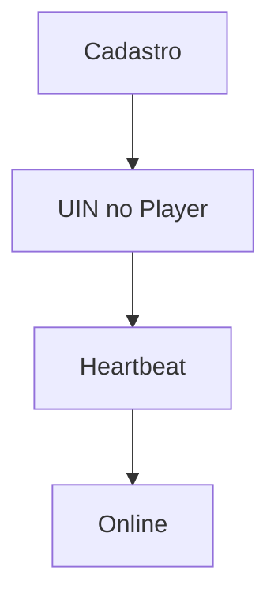

# `totems` — Totens / ecrãs

| Campo | Valor |
|-------|-------|
| **Slug** | `totems` |
| **Modos** | all |
| **Atores** | admin, técnico, publisher |
| **UI** | `/totems, /totems/status, /totems/config, /publish-totem` |
| **API** | `/api/totems` |
| **Status** | active |
| **Última revisão** | 2026-08-09 |

---

## 1. Visão e escopo

### Propósito
Inventário e estado dos totens: identidade (UIN/device), heartbeat, settings e now_playing.

### Dentro do escopo
- CRUD totem
- Status online
- player_settings
- activação

### Fora do escopo
- Reprodução local (Player-AD)

### Vocabulário
| Termo | Significado |
|-------|-------------|
| UIN | identificador de activação |
| device_id | canónico UPPER |
| heartbeat | presença periódica |

---

## 2. Requisitos (EARS)

| ID | Tipo | Requisito |
|----|------|-----------|
| REQ-TOT-001 | Ubiquitous | Totem deve ter UIN único e pertencer a um local. |
| REQ-TOT-002 | Ubiquitous | device_id armazenado deve ser canónico (trim+upper) quando presente. |
| REQ-TOT-003 | Event-driven | Quando chega heartbeat válido, status tende a Online e last_heartbeat actualiza. |

---

## 3. Regras de negócio

### RN-TOT-001 — Device ID canónico

```text
RN-TOT-001 — Device ID canónico
Quando: criar/atualizar/lookup
Se: device_id informado
Então: normalizar UPPER(TRIM)
Excepto: —
Motivo: Evitar falhas de pareamento
```

### RN-TOT-002 — isActive

```text
RN-TOT-002 — isActive
Quando: isActive=false
Se: telemetria UI Direct
Então: desliga observação no card
Excepto: —
Motivo: Operação controlada
```

---

## 4. Fluxos



---

## 5. Estados

| Estado | Significado | Transições típicas |
|--------|-------------|--------------------|
| pending_activation | aguardando player | → online/offline |
| online | heartbeat ok | → offline/error |
| offline | sem heartbeat | → online |
| maintenance/error/syncing | estados especiais | → online/offline |

---

## 6. Critérios de aceite

### AC-TOT-001 (P0)

```text
DADO device_id 'abc'
QUANDO guardar
ENTÃO persistido como 'ABC'
```

---

## 7. Dependências e referências

### Módulos relacionados
- [`locals`](../locals/MODULO.md)
- [`telemetry-heartbeat`](../telemetry-heartbeat/MODULO.md)
- [`player-ad`](../player-ad/MODULO.md)

### Referências
- `docs/manuais/07-MANUAL-PUBLICAR-EM-TOTEM.md`
