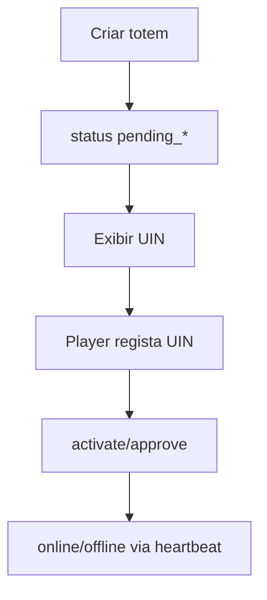
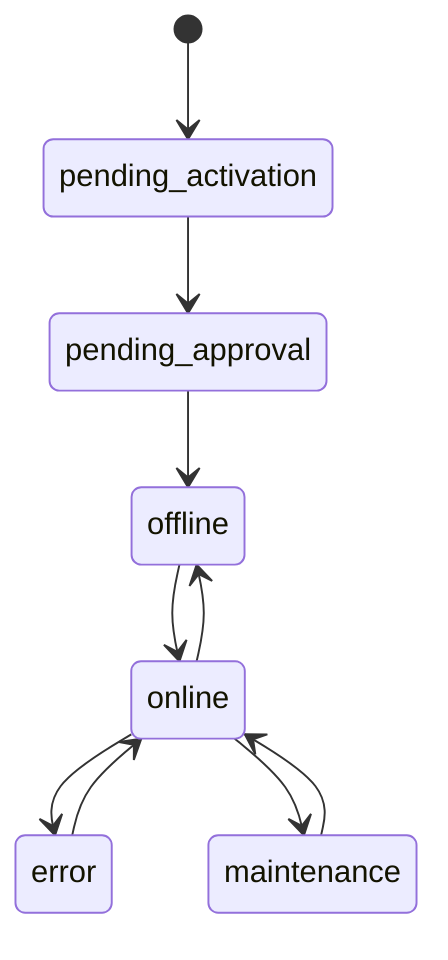

# `totems` — Totens / ecrãs

| Campo | Valor |
|-------|-------|
| **Slug** | `totems` |
| **Modos** | all (Direct via publish-totem; inventário em `/totems`) |
| **Atores** | admin*, operator; create compact = admin/admin_sql/owner_system |
| **UI** | `/totems` (+ filtros query); publicação em `/publish-totem` |
| **API** | `/api/totems` (núcleo — sem `requireModule`) |
| **Status** | active |
| **Profundidade** | L2 |
| **Última revisão** | 2026-08-09 |

---

## 1. Visão e escopo

### Propósito
Cadastro e lifecycle do ecrã físico/lógico: UIN, device_id, local, estado de rede, mídias direct, activação e operações admin.

### Dentro do escopo
- CRUD totens (escopo por publisher/subscriber)
- Activação / aprovação / force-online
- Mídias direct (`/:id/medias`, reorder, activate)
- Comandos remotos, screenshots, logs (superfície partilhada com `remote-control`)
- Telemetry observation start/renew/stop
- Lookup por UIN

### Fora do escopo
- UI cards Direct (detalhe UX em `publish-totem`)
- Protocolo Player ( `player-ad` )
- Smart TVs como entidade distinta (`devices-smart-tvs`)

### Vocabulário
| Termo | Significado |
|-------|-------------|
| UIN | código de activação do Player |
| `device_id` | id canónico `TRIM+UPPER` |
| `is_active` | cadastro habilitado |
| `status` | presença/rede (`online`/`offline`/…) |
| forced online | `forced_online_until` sobrescreve presença na listagem |
| direct media | item em playlist/associação direct do totem |

---

## 2. Requisitos (EARS)

| ID | Tipo | Requisito |
|----|------|-----------|
| REQ-TOT-001 | Ubiquitous | Cada totem deve pertencer a um `local_id` (logo a um publisher). |
| REQ-TOT-002 | Ubiquitous | `device_id` deve ser normalizado UPPER(TRIM). |
| REQ-TOT-003 | Event-driven | Quando o Player activa com UIN válido, o totem deve sair de pending. |
| REQ-TOT-004 | State-driven | Enquanto `is_active=false`, operações de observação/remoto devem respeitar bloqueios de scoped activo. |
| REQ-TOT-005 | Unwanted | Utilizador fora do escopo publisher/subscriber não deve ler/alterar o totem. |
| REQ-TOT-006 | Optional | Admin pode forçar online até um instante (`forced_online_until`). |

---

## 3. Regras de negócio

### RN-TOT-001 — Device ID canónico

```text
RN-TOT-001 — Device ID canónico
Quando: create/update/lookup por device
Se: sempre
Então: normalizeDeviceId = TRIM + UPPER
Excepto: —
Motivo: Evitar mismatch case-sensitive Player↔API
```

### RN-TOT-002 — UIN normalizado

```text
RN-TOT-002 — UIN normalizado
Quando: activação / GET /uin/:uin
Se: sempre
Então: aplicar normalizeTotemUin
Excepto: —
Motivo: Pareamento fiável
```

### RN-TOT-003 — Escopo de leitura

```text
RN-TOT-003 — Escopo de leitura
Quando: GET list/detail
Se: utilizador scoped
Então: totemReadAccess filtra publisher/subscriber
Excepto: super-admins
Motivo: Multi-tenant
```

### RN-TOT-004 — Forced online

```text
RN-TOT-004 — Forced online
Quando: listagem
Se: forced_online_until > now
Então: apresentar como online independentemente do heartbeat
Excepto: expirado → comportamento normal
Motivo: Janela de manutenção/diagnóstico
```

### RN-TOT-005 — Create roles compact

```text
RN-TOT-005 — Create roles compact
Quando: POST /api/totems (instalação compact)
Se: role ∉ admin|admin_sql|owner_system
Então: create negado
Excepto: perfis não-compact com getTotemCreateRoles alargado
Motivo: Controlo de inventário
```

### RN-TOT-006 — Itens activos com mídia activa

```text
RN-TOT-006 — Itens activos com mídia activa
Quando: listar mídias do totem para plano
Se: item inactivo ou mídia inactiva
Então: excluir do join operacional
Excepto: vistas admin de auditoria
Motivo: Player só recebe conteúdo válido
```

### RN-TOT-007 — Comandos / approve só admin

```text
RN-TOT-007 — Comandos / approve só admin
Quando: approve, force-online, commands sensíveis
Se: role não admin*
Então: 403
Excepto: —
Motivo: Operações privilegiadas
```

---

## 4. Fluxos

### Activação


### Fluxos de erro
| ID | Gatilho | Resultado |
|----|---------|-----------|
| FX-TOT-E01 | Fora de escopo | 403 |
| FX-TOT-E02 | UIN inválido | 404 |
| FX-TOT-E03 | Totem inactivo + observation | bloqueado (`requireActiveScopedTotem`) |

---

## 5. Estados

| Campo | Valores |
|-------|---------|
| `status` | `pending_activation`, `pending_approval`, `offline`, `online`, `error`, `maintenance`, `syncing` |
| `is_active` | bool (cadastro) |



**Nota UI:** distinguir `is_active` (habilitado no cadastro) de `status` (rede).

---

## 6. Critérios de aceite

### AC-TOT-001 (P0)

```text
DADO totem criado
QUANDO Player usa UIN correcto
ENTÃO totem deixa pending e fica associável a device_id
```

### AC-TOT-002 (P0)

```text
DADO device_id "abc"
QUANDO persistir
ENTÃO armazenado como "ABC"
```

### AC-TOT-003 (P0)

```text
DADO utilizador da org B
QUANDO GET totem da org A
ENTÃO 403 ou omitido
```

### AC-TOT-004 (P1)

```text
DADO forced_online_until no futuro
QUANDO listar totens
ENTÃO aparece online
```

---

## 7. Dependências e referências

### Módulos
- [`locals`](../locals/MODULO.md), [`organization`](../organization/MODULO.md)
- [`publish-totem`](../publish-totem/MODULO.md), [`telemetry-heartbeat`](../telemetry-heartbeat/MODULO.md)
- [`remote-control`](../remote-control/MODULO.md), [`player-ad`](../player-ad/MODULO.md)
- [`dispatcher`](../dispatcher/MODULO.md)

### Código de referência
- `backend/src/routes/totems.ts`
- `backend/src/services/totemService.ts`
- `backend/src/utils/normalizeDeviceId.ts`, `totemCreateRoles.ts`
- `frontend/src/pages/Totems/Totems.tsx`
- schema part3 `totems`, part5 playlists items

### Lacunas conhecidas
- Menu `/totems/status` e `/totems/config` sem Route em `App.tsx`.
- Joi `totem.validation.ts` legado (`clientId`) vs rotas actuais.
- Em Pro, menu pode exigir `flag_smart_0`.
