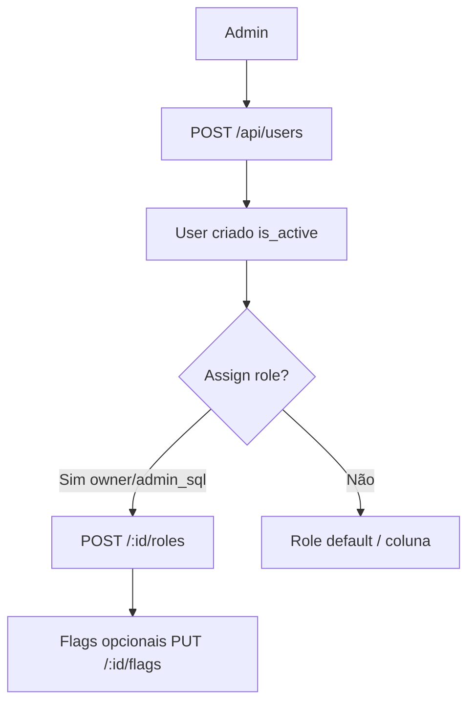

# `users-access` — Usuários e acessos

| Campo | Valor |
|-------|-------|
| **Slug** | `users-access` |
| **Modos** | all |
| **Atores** | owner_system, admin_sql, admin (assign roles: owner/admin_sql) |
| **UI** | `/users` |
| **API** | `/api/users`, `/api/roles`, `/api/permissions` |
| **Status** | active |
| **Profundidade** | L2 |
| **Última revisão** | 2026-08-09 |

---

## 1. Visão e escopo

### Propósito
Gerir contas, roles, flags de feature (`flag_smart_*`) e permissões — separado dos **complementos de instalação** (`system-modules`).

### Dentro do escopo
- CRUD users
- Assign/remove roles
- GET/PUT flags por user
- CRUD roles e permissions (admin)

### Fora do escopo
- Login / JWT / sessões (`auth-security`)
- Toggle de módulos de instalação (`system-modules`)
- Portal do anunciante (contas subscriber dedicadas noutro fluxo)

### Vocabulário
| Termo | Significado |
|-------|-------------|
| `user_type` | `system_user` \| `subscriber_user` \| `publisher_user` |
| role | papel operacional (coluna +/ou `user_roles`) |
| `flag_smart_N` | feature flag por utilizador (0–9) |
| tenant XOR | no máximo um vínculo tenant/publisher/subscriber |

---

## 2. Requisitos (EARS)

| ID | Tipo | Requisito |
|----|------|-----------|
| REQ-USR-001 | Ubiquitous | Utilizador deve obedecer CHECK de exclusividade tenant/publisher/subscriber. |
| REQ-USR-002 | Unwanted | Roles não-admin não devem CRUD users. |
| REQ-USR-003 | Unwanted | Só owner_system/admin_sql devem assign roles. |
| REQ-USR-004 | Ubiquitous | Flags válidas devem pertencer ao conjunto VALID_FLAGS. |
| REQ-USR-005 | State-driven | Enquanto Direct, o picker de roles deve oferecer o subconjunto Direct. |
| REQ-USR-006 | Ubiquitous | `flag_smart_*` não controla instalação modules (e vice-versa). |

---

## 3. Regras de negócio

### RN-USR-001 — Tenant XOR

```text
RN-USR-001 — Tenant XOR
Quando: INSERT/UPDATE users
Se: sempre
Então: chk_users_tenant_logic — vínculos exclusivos
Excepto: —
Motivo: Evitar identidade ambígua
```

### RN-USR-002 — CRUD admin

```text
RN-USR-002 — CRUD admin
Quando: /api/users mutações
Se: role ∉ admin|admin_sql|owner_system
Então: 403
Excepto: —
Motivo: Controlo de contas
```

### RN-USR-003 — Assign roles restrito

```text
RN-USR-003 — Assign roles restrito
Quando: POST /:id/roles
Se: role ∉ admin_sql|owner_system
Então: 403
Excepto: —
Motivo: Elevação de privilégio
```

### RN-USR-004 — Flags ≠ installation modules

```text
RN-USR-004 — Flags ≠ installation modules
Quando: decidir menu/API module gate
Se: flag_smart_* 
Então: NÃO substitui requireModule / installation.modules
Excepto: menus Pro que combinam ambos
Motivo: Dois eixos ortogonais
```

### RN-USR-005 — owner_system bypass menu

```text
RN-USR-005 — owner_system bypass menu
Quando: canAccess
Se: owner_system
Então: bypass role checks de menu (exceto gates de instalação)
Excepto: MODULE_DISABLED na API
Motivo: Superuser operacional
```

### RN-USR-006 — VALID_ROLES / VALID_FLAGS

```text
RN-USR-006 — VALID_ROLES / VALID_FLAGS
Quando: assign role ou flag
Se: valor fora da lista
Então: rejeitar
Excepto: —
Motivo: Contrato fechado com UI
```

---

## 4. Fluxos

### Criar utilizador e role


### Fluxos de erro
| ID | Gatilho | Resultado |
|----|---------|-----------|
| FX-USR-E01 | Role inválida | 400 |
| FX-USR-E02 | Operator tenta assign role | 403 |
| FX-USR-E03 | Violação tenant XOR | erro DB/serviço |

---

## 5. Estados

| Campo | Valores |
|-------|---------|
| `is_active` | bool |
| `email_verified` | bool |
| `user_type` | system_user / subscriber_user / publisher_user |
| flags | `flag_smart_0` … `flag_smart_9` |

---

## 6. Critérios de aceite

### AC-USR-001 (P0)

```text
DADO admin_sql
QUANDO criar user e assign role operator
ENTÃO user autentica com permissões de operator
```

### AC-USR-002 (P0)

```text
DADO admin (não admin_sql)
QUANDO tentar POST /users/:id/roles
ENTÃO 403
```

### AC-USR-003 (P0)

```text
DADO Direct Totem Mode
QUANDO abrir picker de roles em /users
ENTÃO só roles do subconjunto Direct
```

### AC-USR-004 (P1)

```text
DADO user com flag_smart_2
QUANDO módulo dispatcher desligado na instalação
ENTÃO API dispatcher continua MODULE_DISABLED
```

---

## 7. Dependências e referências

### Módulos
- [`auth-security`](../auth-security/MODULO.md)
- [`system-modules`](../system-modules/MODULO.md) — eixo ortogonal
- [`direct-totem-mode`](../direct-totem-mode/MODULO.md)
- [`product-modes`](../product-modes/MODULO.md)

### Código de referência
- `backend/src/routes/users.ts`, `roles.ts`, `permissions.ts`
- `backend/src/services/userService.ts`
- `frontend/src/pages/Users/Users.tsx`, `UserRolePicker.tsx`
- `frontend/src/utils/rolePermissions.ts`
- schema part2 `users`, `user_flags`; part5 roles/permissions

### Lacunas conhecidas
- ~~Sub-rotas menu `/users/roles|flags`~~ — **removidas** (Lacunas-MA).
- **Fonte canónica de role:** JWT/auth usa coluna `users.role` (`authService`); permissões N:M finas usam `user_roles`/`permissions`. Não confundir os dois eixos.
