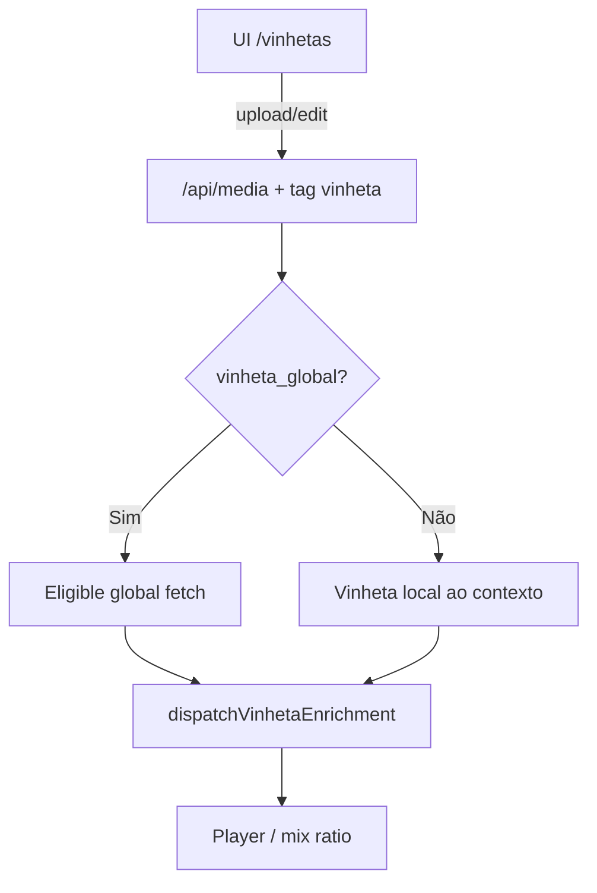
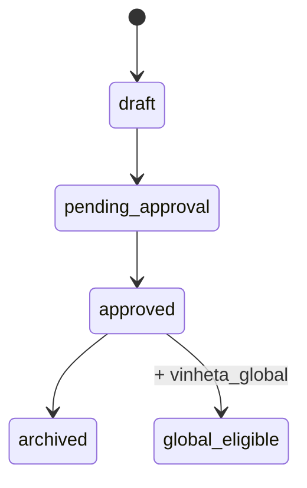

# `vinhetas` — Biblioteca de vinhetas

| Campo | Valor |
|-------|-------|
| **Slug** | `vinhetas` |
| **Modos** | Lite, Pro (UI); sem módulo/`requireModule` próprio |
| **Atores** | admin*, gerente_marketing, editoracao, visualizador (+ client access na UI) |
| **UI** | `/vinhetas` |
| **API** | `/api/media` (domínio por tags — sem `/api/vinhetas`) |
| **Status** | active |
| **Profundidade** | L2 |
| **Última revisão** | 2026-08-09 |

---

## 1. Visão e escopo

### Propósito
Vista filtrada da biblioteca de mídias para conteúdos com tag `vinheta`, intercaláveis no dispatch/player (ratio propagandas:vinheta).

### Dentro do escopo
- Listar / upload / editar / apagar via `mediaApi` com tag `vinheta`
- Tag opcional `vinheta_global` (só com `vinheta`) para anexar a dispatches do anunciante
- Enrichment no dispatcher (`dispatchVinhetaEnrichment`)

### Fora do escopo
- API REST dedicada ou `requireModule('vinhetas')`
- Publicação Direct pura (sem domínio comercial de tags)
- Pastas locais do Player `vinhetas/` como fonte do servidor (legado player-side)

### Vocabulário
| Termo | Significado |
|-------|-------------|
| vinheta | mídia com tag `vinheta` (`VINHETA_TAG`) |
| vinheta global | tags `vinheta` + `vinheta_global` |
| ratio mix | default 3 propagandas por vinheta (`DEFAULT_FALLBACK_PROPAGANDAS_PER_VINHETA`) |
| cacheBucket vinhetas | bucket de enrichment no dispatch |

---

## 2. Requisitos (EARS)

| ID | Tipo | Requisito |
|----|------|-----------|
| REQ-VIN-001 | Ubiquitous | Vinhetas devem ser mídias da biblioteca com tag `vinheta`. |
| REQ-VIN-002 | Ubiquitous | `vinheta_global` só faz sentido em conjunto com `vinheta`. |
| REQ-VIN-003 | Event-driven | Quando o dispatcher monta plano com enrichment, vinhetas globais elegíveis devem poder ser anexadas. |
| REQ-VIN-004 | State-driven | Enquanto a mídia não estiver activa e em status aprovado/publicado (caminho global), não deve entrar no fetch de vinhetas globais. |
| REQ-VIN-005 | Unwanted | O sistema não deve expor CRUD paralelo fora de `/api/media` para este domínio. |
| REQ-VIN-006 | Optional | Onde o mix directo aplicar, o sistema deve respeitar o ratio propagandas:vinheta configurado/default. |

---

## 3. Regras de negócio

### RN-VIN-001 — Tag obrigatória

```text
RN-VIN-001 — Tag obrigatória
Quando: classificar conteúdo como vinheta
Se: sempre
Então: medias.tags contém 'vinheta'
Excepto: —
Motivo: Domínio sem tabela própria
```

### RN-VIN-002 — Global implica vinheta

```text
RN-VIN-002 — Global implica vinheta
Quando: marcar vinheta_global
Se: sem tag vinheta
Então: inválido / não usar como global
Excepto: —
Motivo: Contrato em vinhetaTags.ts
```

### RN-VIN-003 — Fetch global

```text
RN-VIN-003 — Fetch global
Quando: carregar vinhetas globais para dispatch
Se: status IN ('approved','published') e activa e tags @> {vinheta, vinheta_global}
Então: candidata ao enrichment
Excepto: —
Motivo: Só conteúdo pronto
```

### RN-VIN-004 — UI = media-library

```text
RN-VIN-004 — UI = media-library
Quando: operações em /vinhetas
Se: sempre
Então: mediaApi getAll/update/delete/upload (+ filtros de tag)
Excepto: —
Motivo: Reutilizar quotas, MIME e escopo de medias
```

### RN-VIN-005 — Ratio no mix

```text
RN-VIN-005 — Ratio no mix
Quando: mix directo propagandas/vinhetas
Se: sem override
Então: default 3:1 (propagandas por vinheta)
Excepto: configuração explícita noutros caminhos
Motivo: Constante em dispatchPlaylistDirectMix
```

### RN-VIN-006 — Sem gate de módulo dedicado

```text
RN-VIN-006 — Sem gate de módulo dedicado
Quando: instalaçãoModuleAccess para /vinhetas
Se: path sem mapping de complemento próprio
Então: acesso por roles UI + media API policies
Excepto: —
Motivo: Domínio transversal, não complemento instalável
```

---

## 4. Fluxos

### Gestão e consumo


### Fluxos de erro
| ID | Gatilho | Resultado |
|----|---------|-----------|
| FX-VIN-E01 | MIME/size inválido no upload | 400 media |
| FX-VIN-E02 | Fora de escopo subscriber/publisher | 403 / lista vazia |
| FX-VIN-E03 | Sem tag vinheta | não aparece nesta UI / não enriquece como vinheta |

---

## 5. Estados

| Campo | Valores canónicos |
|-------|-------------------|
| tags | inclui `vinheta`; opcional `vinheta_global` |
| `status` (UI edit) | `draft`, `pending_approval`, `approved`, `rejected`, `archived` |
| fetch global | `approved`, `published` (+ `is_active`) |
| `approval_status` | alinhado a media-library |



---

## 6. Critérios de aceite

### AC-VIN-001 (P0)

```text
DADO upload válido na UI /vinhetas
QUANDO grava mídia
ENTÃO registo em medias contém tag vinheta e aparece na listagem da página
```

### AC-VIN-002 (P0)

```text
DADO mídia com tags vinheta+vinheta_global approved/published activa
QUANDO dispatch com enrichment
ENTÃO pode ser anexada como vinheta global do anunciante
```

### AC-VIN-003 (P0)

```text
DADO mídia sem tag vinheta
QUANDO listar domínio vinhetas
ENTÃO não aparece como vinheta
```

---

## 7. Dependências e referências

### Módulos
- [`media-library`](../media-library/MODULO.md) — armazenamento real
- [`dispatcher`](../dispatcher/MODULO.md), [`playlist-mix`](../playlist-mix/MODULO.md)
- [`player-ad`](../player-ad/MODULO.md) — consumo / pastas locais legadas
- [`subscribers`](../subscribers/MODULO.md) — escopo comercial

### Código de referência
- `frontend/src/pages/Vinhetas/Vinhetas.tsx`
- `backend/src/utils/vinhetaTags.ts`
- `backend/src/services/dispatchVinhetaEnrichment.ts`
- `backend/src/services/dispatchPlaylistDirectMix.ts` (ratio default)
- `backend/src/routes/media.ts` / `mediaService.ts`
- schema `medias` em `database/smartchannel-db-v2-refactored-part3-tables-dependent.sql`

### Lacunas conhecidas
- **UI-only wrapper** — sem rota `/api/vinhetas`.
- Sem entrada em `installationModuleAccess` para complemento dedicado.
- ~~CHECK/status `published`~~ — **resolvido** (filtros só `approved`).
- Pastas `vinhetas/` no Player não alimentam o plano no servidor.
