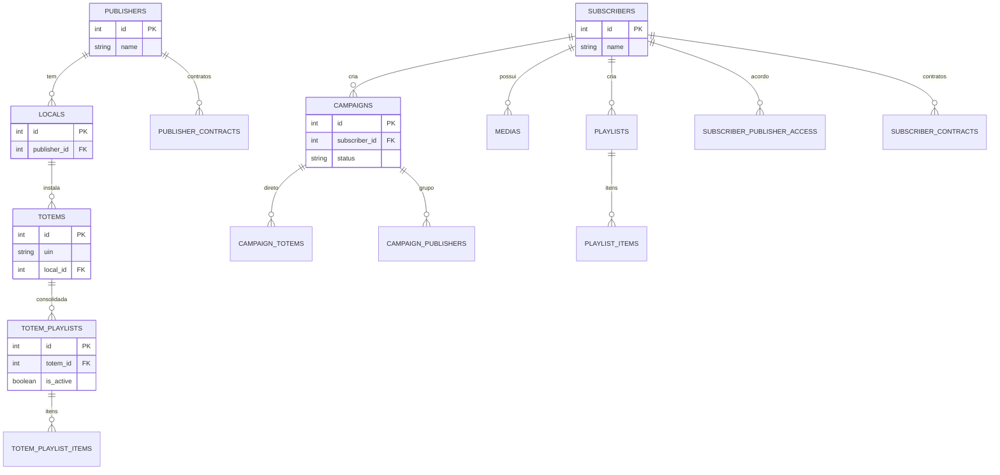
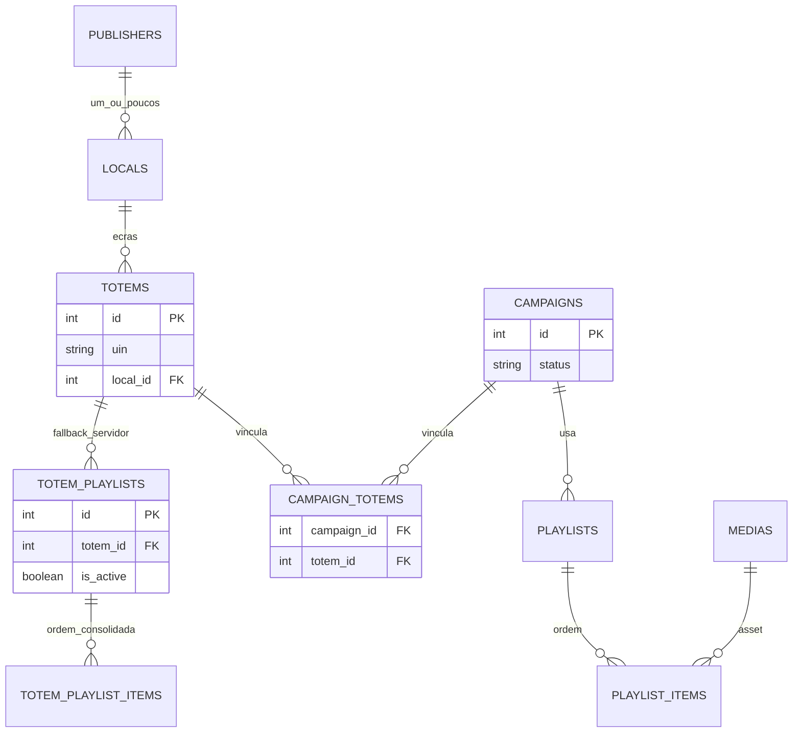
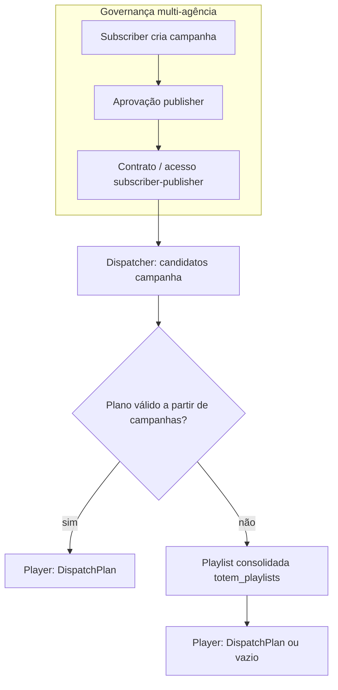
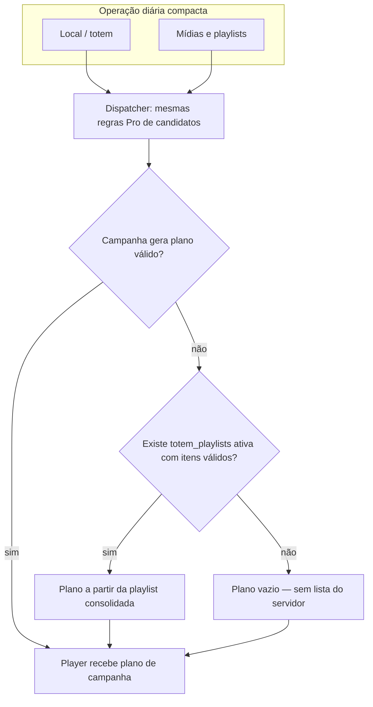
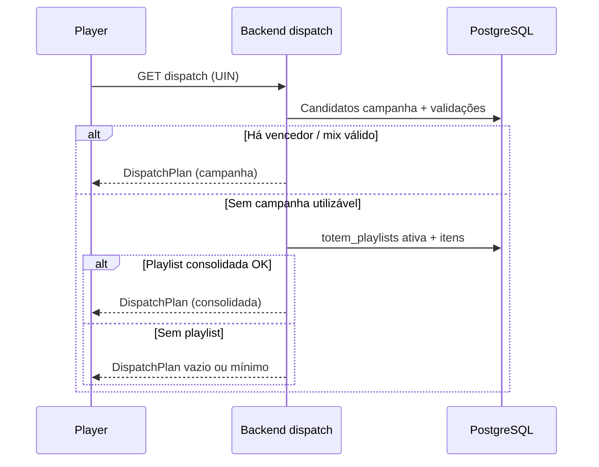

# TotemDigital (monousuário): E.R. e fluxo — antes vs depois

Este documento coloca **lado a lado** o modelo de dados e o fluxo operacional do **SmartSignage Pro (multi-agência)** e a visão **TotemDigital monousuária**: o **mesmo núcleo físico** no PostgreSQL (totem, mídia, playlist consolidada, dispatch), com **menos entidades visíveis** no dia a dia e **menos passos de governança**. O instalador e o seed orientam-se para um único publisher/subscriber “padrão” (ex.: `database/carga-inicial-v6.sql`).

**Comportamento atual do dispatcher (TotemDigital):** candidatos vindos das **regras Pro de campanha**; se não houver plano válido a partir de campanhas, o servidor usa **apenas** a **playlist consolidada ativa** do totem (`totem_playlists` / itens associados). **Não** há montagem de plano pelo backend a partir de pastas locais `propagandas`/`vinhetas` no servidor. Se também não houver playlist consolidada utilizável, o plano pode ficar **vazio** — o player continua a poder usar **cache** ou **vinheta local** como política do cliente, mas isso **não** é um terceiro nível gerado pelo dispatcher.

### Diagrama ER completo do schema (PNG)

Os diagramas Mermaid abaixo são **resumos conceituais**. Para **todas** as tabelas do schema v2 (geradas a partir dos `database/smartchannel-db-v2-refactored-part*.sql`):

- [SmartSignage-ER-sistema-completo.png](../diagrams/SmartSignage-ER-sistema-completo.png) — visão por ficheiros `part` (panorama).
- [SmartSignage-ER-sistema-completo-detalhe.png](../diagrams/SmartSignage-ER-sistema-completo-detalhe.png) — um nó por tabela + parte das FKs (melhor com **zoom**).

**TotemDigital no PNG:** concentre o zoom nos nós que fecham o ciclo operacional deste documento — por exemplo `totems`, `totem_playlists`, `totem_playlist_items`, `campaigns`, `campaign_totems`, `medias`, `playlists`, `playlist_items`, `locals`, `publishers`. Regeneração dos PNG: ver índice em [`docs/README.md`](../README.md) (secção “Diagramas (PNG)”).

---

## 1. Modelo entidade-relacionamento (conceitual)

### 1.1 SmartSignage Pro — multi-agência (governança completa)

Foco nas entidades que aparecem na **operação e no billing** entre anunciantes e donos de mídia.

### 1.2 TotemDigital — monousuário (mesmo núcleo, menos superfície operacional)

Na prática diária, o operador pensa em **local → totem → conteúdo**. Subscriber e publisher **existem na BD** (integridade e APIs), mas o produto compacto evita **múltiplas agências**, **filas de aprovação** e **billing cruzado** como foco da UI. A **playlist consolidada** (`totem_playlists`) é o **único fallback de servidor** quando não há campanha válida.

**Leitura:** o diagrama “depois” **não** apaga tabelas Pro; resume o que o operador TotemDigital toca com frequência. Campanhas e mix continuam a ser a **origem rica de candidatos** quando usadas.

---

## 2. Fluxo operacional — dispatch até ao player

### 2.1 Pro — ciclo com governança multi-entidade

Mesma **cadeia técnica** de plano no servidor que no monousuário: **campanha → playlist consolidada → plano vazio**. A diferença está nas **etapas humanas e contratuais** antes do conteúdo chegar ao dispatcher.

Documentação antiga referia um **terceiro nível** no servidor (montar plano a partir de pastas `propagandas`/`vinhetas`); **o dispatcher deixou de o fazer** — o fallback de servidor é **só** a playlist consolidada do totem.

### 2.2 TotemDigital — mesmo motor, menos passos visíveis

### 2.3 Sequência resumida (API do player)

---

## 3. Alinhamento com o código

| Tema | Onde |
|------|------|
| Fallback servidor | `backend/src/services/dispatcherTotemService.ts` — campanha → `getFallbackPlanFromTotemPlaylist` (ou equivalente) — **sem** `getDefaultAdPlan` por disco |
| Playlist por totem | Tabelas `totem_playlists`, `totem_playlist_items` |
| Seed monousuário | `database/carga-inicial-v6.sql` |
| Modo compacto | Flags `TOTEMDIGITAL_COMPACT` (backend) e `REACT_APP_TOTEMDIGITAL_COMPACT` (frontend) para esconder superfície Pro e manter operação essencial |

---

## 4. Documentação relacionada

- [Workflows](./04-workflows.md) — inclui cadeia de fallback do dispatcher
- [Recursos e regras](./05-recursos-regras.md) — totem sem campanha e plano vazio
- [Arquitetura](./01-arquitetura.md) — visão geral dos componentes
- [Introdução ao utilizador](../user/01-introducao.md) — Pro / TotemDigital e ligação aos PNG

---

## Próximos passos

- [Workflows](./04-workflows.md)
- [Recursos e regras](./05-recursos-regras.md)
